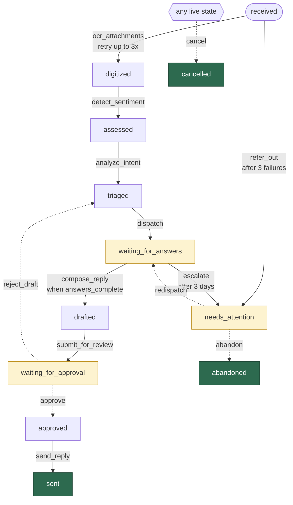
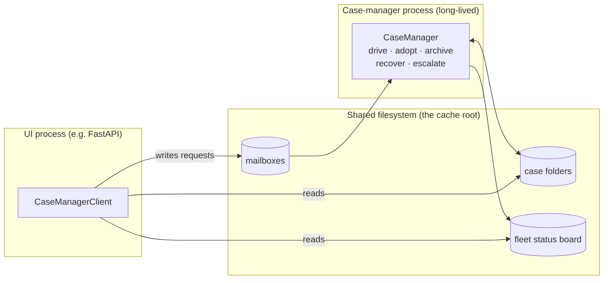

# From Ad-Hoc Pipelines to Cases

### A Developer's Introduction to `FolderBackedCase`, `CaseManager`, and `CaseManagerClient`

> **Audience.** Experienced Python developers joining a project built on these classes — especially
> those who have hand-built at least one hybrid batch/interactive document-processing system and
> remember what that cost. This is the *starter* document: it explains what problem this family
> solves, what it feels like to build on it, and where to go next. It deliberately does not catalog
> the object model; the source docstrings do that job well once you have this mental map.

---

## 1. The problem we keep solving

A large fraction of our custom AI application work has the same shape, whatever the industry:

- A **stream of input documents** arrives continuously — emails, PDFs, scans, photos, uploads.
- Each arrival kicks off a **multi-step transformation**: OCR, parsing, summarization, analysis,
  synthesis, pricing lookups, image generation.
- Some steps are **strictly automatable**; others require **human judgment** — review, correction,
  approval, selection.
- A **web UI** sits on top so people can watch progress, intervene, and approve.

We've shipped this pattern many times:

| Client | The recurring unit of work |
|---|---|
| Plumbing company "Nx" | A field **estimate**: typed or handwritten job details → materials pricing lookups → cost summary → human QA review → formal client document |
| Real estate services "SBx" | A **purchase transaction**: dozens of documents over weeks → scan/parse → flag non-compliance (missing signatures) → feed downstream, monitored by review staff |
| Apparel company "Bx" | A **catalog image**: shirt pattern + model blank → AI image merge → human selects the best render |
| Tile installer "EPx" | A **purchase-order conversion**: builder PDF → OCR → product-selection rules → generated work orders → expert manual adjustment |
| Financial services "Cx" | An **inquiry**: inbound email → sentiment and intent analysis → issues dispatched to departmental experts → composed reply → approval → send |

We call that recurring unit a **case**. Cases share a lifecycle profile: many are opened every day
(hundreds, not thousands), each lives for hours to weeks, and each eventually reaches a **terminal**
state. Users care intensely about the **live** pool — dozens to hundreds of cases at any moment —
and only occasionally about the archive of terminal ones.

### Why hand-rolling it keeps hurting

The technology patterns fight each other. Web frameworks are built for short request/response
interactions; they are poor hosts for driving job queues, monitoring long-running work, and
surviving restarts. So every project ends up gluing a batch library (Luigi, Celery, in-process
timers) to a web app with fragile, one-off code — often involving threading or multiprocessing
whose subtle bugs surface only under load, on budgets that never fund that testing.

Worse, these systems share a set of requirements that are rarely written down at build time and
therefore rarely built well:

- **Don't retain confidential information** longer than necessary.
- **Finishing one job beats being 20% done on five** — but every job must make progress.
- **One job's failure must not stop the others.**
- **Job status must be visible** — to users, operators, and developers.
- **Processing rules evolve**; the lifecycle must be easy to change safely.
- **Failed jobs must leave enough evidence to troubleshoot.**
- **Slow external dependencies** (OCR services, LLMs) are the norm, not the exception.
- **Abrupt shutdown must not corrupt anything** — restart should resume with minimal, isolated loss.
- **Scarce resources** (CPU, RAM, API rate limits) must throttle the pool's overall pace.

And a secondary cost: developer A's ad-hoc solution entangles *the pool* with *the case* so
thoroughly that developer B can't safely modify either.

This branch exists to make those properties the **default** rather than a heroic afterthought.

---

## 2. The core idea: a case is a folder with a state machine

The answer has three layers, and you meet them in this order:

1. **`FolderBackedCase`** — you subclass this to define *one* case type. A case is a finite state
   machine whose entire life — identity, current state, event history, working files, log — lives
   in **a single folder on disk**. No database.
2. **`CaseManager`** — runs a *fleet* of such cases inside a long-lived process: scheduling,
   throttling, archiving, crash recovery, escalation. You configure it with policies; you rarely
   subclass it.
3. **`CaseManagerClient`** — the thin companion your web/UI process uses to talk to the manager's
   territory: add cases, read status, fire human decisions.

Two design commitments explain almost everything else.

**The folder is the truth.** Every case folder is self-describing: a YAML identity record, an
append-only event log, an `assets/` playground of working files, and a per-case log file. The
system deliberately trades raw speed and data volume for something worth far more at our scale:
*a human — or an AI coding agent — can open the folder and understand the case.* Debugging a stuck
case means `ls` and `cat`, not database forensics. Because state is serialized as processing
proceeds, a process crash loses at most the step in flight; restart resumes from the folder.
Archiving a finished case is moving a directory.

**A case knows how to take one step; the manager decides which case steps next.** A
`FolderBackedCase` has no run loop. Its whole driving surface is *"attempt one forward
transition."* Fairness, concurrency, back-pressure, prioritization — those belong to the layer
above. This is the separation that ad-hoc builds always lose, and it is what lets you develop and
test a case type **in complete isolation** before any fleet exists.

---

## 3. A worked example: `InquiryCase`

We'll use the financial-services scenario ("Cx"): a customer emails an inquiry. The system must
OCR any attachments, detect the customer's sentiment, analyze intent and split out the issues to
address, dispatch those issues to departmental experts, compose a reply from their answers, get a
human reviewer's approval, and send it.

First decision: **the inquiry is the case.** One email thread in, one approved reply out.

Second decision: **the lifecycle.** Here is the whole state machine. Solid arrows are
**automated** triggers — the machinery fires them when their conditions permit. Dashed arrows are
**manual** triggers — nothing fires them but a human decision arriving from the UI.



> **Legend.** Solid arrow = automated (`--`) trigger, fired by the machinery when guards permit.
> Dashed arrow = manual (`==`) trigger, fired only by an explicit human/UI action. Green = terminal
> states. Amber = states where the case idles awaiting people.

Read the diagram like an operations story:

- `received → digitized → assessed → triaged → waiting_for_answers` is a **pure pipeline** — the
  case flows through unattended, throttled by the resource limits we'll declare shortly.
- At `waiting_for_answers` the case **parks**. Experts (via the UI) contribute answers over hours
  or days. The `compose_reply` edge is automated *but guarded*: it fires only once every issue has
  an answer. If three days pass first, the case **escapes on a timer** to `needs_attention` so it
  can never rot silently.
- `waiting_for_approval` is a **human gate**: the only ways out are the manual `approve` and
  `reject_draft` decisions. Rejection loops back to `triaged` for re-dispatch and redraft.
- OCR gets **three attempts** before the case diverts itself to `needs_attention` for human
  handling — a failure of one case, contained to that case.
- From anywhere, a human may `cancel`.

Notice what's *not* here: no queue topology, no thread pools, no cron schedule, no retry
decorators. The lifecycle *is* the design, and as you're about to see, it survives translation
into code almost verbatim.

---

## 4. Declaring the lifecycle: the state-chain DSL

A case type declares its FSM as a list of **chain strings** — a compact, Mermaid-flavoured DSL
that reads left to right as alternating states and connectors. Every chain is complete in
itself: it starts at a state and ends at a state (`stateA--trigger-->stateB`), optionally
stringing several connector/state pairs together when that reads well. A state may appear in as
many chains as needed; the parser merges them all into one graph. The diagram above is exactly
these chains:

```python
fsm_state_chains = [
    # The automated intake pipeline, one edge per chain.
    "^received--@FAIL<3#ocr_attachments~2m-->digitized",
    "digitized--detect_sentiment~30s-->assessed",
    "assessed--analyze_intent~1m-->triaged",
    "triaged--dispatch-->waiting_for_answers",

    # Once every issue has an expert answer, draft and hand to a human.
    "waiting_for_answers--answers_complete#compose_reply~1m-->drafted",
    "drafted--submit_for_review-->waiting_for_approval",

    # Human decisions (a chain may string several edges together).
    "waiting_for_approval==approve-->approved--send_reply~30s-->sent^",
    "waiting_for_approval==reject_draft-->triaged",

    # Error and aging flows.
    "received--@FAIL>=3#refer_out-->needs_attention",
    "waiting_for_answers--@DWELL>3d#escalate-->needs_attention",
    "needs_attention==redispatch-->waiting_for_answers",
    "needs_attention==abandon-->abandoned^",

    # From anywhere, a human may cancel.
    "*==cancel-->cancelled^",
]
```

The grammar, piece by piece:

| Syntax | Meaning |
|---|---|
| `^received` | Leading `^`: an **initial** state — where new cases begin. |
| `sent^` | Trailing `^`: a **terminal** state — entering it ends the case (and fires the retention/purge machinery, §6). |
| `A--trigger-->B` | An **automated** edge. The driving machinery may fire it unattended. |
| `A==trigger-->B` | A **manual** edge. It *never* auto-fires; the case simply waits. Firing it takes an explicit call — from a test, or a UI action relayed by the manager. |
| `answers_complete#compose_reply` | A **guard**: the edge fires only if `async def guard_answers_complete(self, tctx)` returns truthy. Guards are how an automated edge waits for a *data condition*. |
| `@DWELL>3d#escalate` | A **factual guard** the framework computes: true once the case has dwelt in the source state more than 3 days. A `>`-dwell edge allows for a guaranteed **timed escape** — the state can never be permanently stuck. |
| `@FAIL<3#ocr_attachments` | Another factual guard: true while fewer than 3 transition attempts have failed since entering this state. This is the **retry knob** — pair a `@FAIL<3` retry edge with a `@FAIL>=3` divert edge, as `received` does. |
| `ocr_attachments~2m` | A **soft timeout** on the trigger's work: past ~2 minutes it is flagged slow (and hard-aborted at a multiple of that). Annotate the steps you know are slow; the rest inherit a snappy default. |
| `*==cancel-->cancelled^` | A **wildcard**: this edge is injected from every non-terminal state. |

Two defaults are worth internalizing early because they encode the library's philosophy:

- **Auto-advance is opt-in** (`--` vs `==`). If you're unsure whether a step should run
  unattended, `==` is the fail-safe: the case waits rather than blowing past a human gate.
- **Retry is opt-in.** An automated edge with no `@FAIL` guard gets an implicit `@FAIL<1` — one
  attempt, then it stops trying and the failure is visible, rather than hammering a broken step
  forever. Declare `@FAIL<n` when retrying is what you *mean*.

The chains are parsed and validated **at class-definition time**: misspelled states, unreachable
states, dead-end non-terminals, and hook methods that match nothing all fail at import, not at
2 a.m. And because the DSL *is* the lifecycle, a code review of a processing-rule change is a
review of a dozen-line diff a domain expert can read.

---

## 5. The case class itself

Here is `InquiryCase`, trimmed but real — this exact skeleton (with the external service calls
stubbed) compiles and runs through its full lifecycle against the library today. Three class-level
declarations describe the design; named methods attach the behavior.

```python
from pydantic import BaseModel
from totodev_pub.file_mapped_pydantic_mixin import FileMappedPydanticMixin
from totodev_pub.folder_backed_case import FolderBackedCase


# -- The data contracts external systems care about (plain Pydantic V2 models) --

class InquiryAnalysis(BaseModel, FileMappedPydanticMixin):
    sentiment: str = "unknown"
    customer_objective: str = ""
    issues: list[str] = []


class ExpertAnswers(BaseModel, FileMappedPydanticMixin):
    answers: dict[str, str] = {}      # issue -> answer text


POST_TRIAGE = {"triaged", "waiting_for_answers", "drafted",
               "waiting_for_approval", "approved", "sent", "needs_attention"}


class InquiryCase(FolderBackedCase):
    """One customer inquiry, from inbound email to approved reply."""

    # 1. The lifecycle (the DSL from §4).
    fsm_state_chains = [
        "^received--@FAIL<3#ocr_attachments~2m-->digitized",
        "digitized--detect_sentiment~30s-->assessed",
        "assessed--analyze_intent~1m-->triaged",
        "triaged--dispatch-->waiting_for_answers",
        "waiting_for_answers--answers_complete#compose_reply~1m-->drafted",
        "drafted--submit_for_review-->waiting_for_approval",
        "waiting_for_approval==approve-->approved--send_reply~30s-->sent^",
        "waiting_for_approval==reject_draft-->triaged",
        "received--@FAIL>=3#refer_out-->needs_attention",
        "waiting_for_answers--@DWELL>3d#escalate-->needs_attention",
        "needs_attention==redispatch-->waiting_for_answers",
        "needs_attention==abandon-->abandoned^",
        "*==cancel-->cancelled^",
    ]

    # 2. The on-disk data objects other tiers may read — and WHEN they may trust them.
    asset_aliases = [
        {"path": "analysis.yaml", "loader": InquiryAnalysis,
         "states": POST_TRIAGE, "keep": True},
        {"path": "expert_answers.yaml", "loader": ExpertAnswers,
         "states": {"drafted", "waiting_for_approval", "approved"}},
        {"path": "reply_draft.md", "loader": lambda p: p.read_text(),
         "states": {"waiting_for_approval", "approved", "sent"}, "keep": True},
    ]

    # 3. Which capacity-constrained resources each step draws on.
    #    The case only NAMES them; the pool supplies the numeric limits.
    fsm_trigger_chokes = {
        "ocr_attachments": {"cpu"}, # on-server processing
        "detect_sentiment": {"llm"},
        "analyze_intent": {"llm"},
        "compose_reply": {"llm"},
    }

    # ---- Automated work: one `perform_<trigger>` per edge that does something ----

    async def perform_ocr_attachments(self, tctx):
        # Perform OCR extraction; write extracted text into the asset playground.
        self.case_assets.write("attachments/attachment-1.txt", ocr_text)

    async def perform_detect_sentiment(self, tctx):
        analysis = InquiryAnalysis.open(
            str(self.case_assets.asset_path("analysis.yaml")), without_lock=True)
        analysis.sentiment = await classify_sentiment(...)   # your LLM call
        analysis.save()

    async def perform_analyze_intent(self, tctx):
        analysis = InquiryAnalysis.open(
            str(self.case_assets.asset_path("analysis.yaml")), without_lock=True)
        analysis.customer_objective, analysis.issues = await extract_intent(...)
        analysis.save()

    async def perform_dispatch(self, tctx):
        self.log.info("dispatching issues to expert queues")
        # notify downstream expert queues...

    async def perform_compose_reply(self, tctx):
        answers = ExpertAnswers.open(
            str(self.case_assets.asset_path("expert_answers.yaml")), without_lock=True)
        body = await draft_reply(answers)                    # your LLM call
        self.case_assets.write("reply_draft.md", body.encode())

    async def perform_send_reply(self, tctx):
        await send_email(...)

    async def perform_refer_out(self, tctx):
        self.case_log_alert("intake failed 3x; referred for human handling")

    async def perform_escalate(self, tctx):
        self.case_log_alert("expert answers overdue (3 days)")

    # ---- Guards: fast, side-effect-free data conditions ----

    async def guard_answers_complete(self, tctx):
        path = self.case_assets.asset_path("expert_answers.yaml")
        if not path.exists():
            return False
        answers = ExpertAnswers.open(str(path), without_lock=True)
        analysis = self.case_assets.load_dataclass("analysis")
        return set(answers.answers) >= set(analysis.issues)

    # ---- Lifecycle hooks by naming convention ----

    async def on_enter_waiting_for_approval(self, tctx):
        self.log.info("draft ready for QA review")   # e.g. notify the review queue

    def on_terminating(self):
        # Last chance before the confidentiality purge: name what survives.
        self.case_keep_assets("assets/reply_draft.md")
```

What to notice:

**Behavior attaches by name.** `perform_<trigger>` is the work an edge does; `guard_<name>` is a
DSL guard; `on_enter_<state>` / `on_exit_<state>` and `before_<trigger>` / `after_<trigger>` are
also available. Every hook is `async` and takes one trigger-context argument (`tctx`), which
carries any kwargs the trigger call bundled — so `await case.approve(reviewer="dave")` delivers
`reviewer` to the hooks via `tctx.kwargs`. A hook name that matches nothing in the DSL is treated
as a typo and **fails at bind time** — the framework refuses to let a misspelled hook silently
be unreferenced.

**Raising is failing, and failing is data.** If `perform_ocr_attachments` raises, the transition
fails: the case stays in `received`, the failure is logged to the case's event log with enough
detail to troubleshoot, and the `@FAIL` count ticks up — which is exactly what the retry and
divert edges key on. You don't write retry loops; you declare retry *policy*.

**Assets are a contract, not a dumping ground.** `asset_aliases` names the files external systems
may read, the Pydantic model that loads each one, and — importantly — the **states in which each
is trustworthy**. `analysis.yaml` exists from early in the pipeline, but a reader asking for the
`analysis` alias before `triaged` gets a refusal instead of a half-written file. This is the
formal seam between your case's internals and every other tier.

**Chokes are declared, not enforced, here.** The case says "OCR work draws on the `ocr` resource."
Whether `ocr` means "at most 2 concurrent" is the *deployment's* decision, made in manager policy
(§8). The case type stays portable across environments with different capacities.

**The async contract.** Hooks run on a shared event loop alongside every other live case, so they
must await rather than block. When a library gives you no async API, wrap the call:
`await self.case_run_blocking(requests.get, url)`.

**A note on file locking.** `FileMappedPydanticMixin` files support cross-process locking, but
inside a hook you are already the case's single owner (the case holds a heartbeat *lease* on its
folder), so `without_lock=True` is the normal pattern for a case touching its own assets.

### Driving it: one step at a time

You almost never call triggers in a loop yourself — that's the manager's job — but understanding
the two calling channels explains the whole runtime model:

```python
case = InquiryCase.create_case_in_folder(folder, external_key="EMAIL-778812")
try:
    # Channel 1 — the sweep. Attempt ONE automated step; report, never raise.
    result = await case.case_advance()
    # result.progressed, result.trigger, result.final_state, result.exceptions

    # Channel 2 — a direct trigger call. This is how MANUAL edges fire
    # (and it raises on failure — fail-fast for the calling human's benefit).
    await case.approve(reviewer="dave")
finally:
    case.case_detach()   # release the lease when done with this live object
```

`case_advance()` is the non-throwing reporter a scheduler loops over thousands of times: it tries
the automated edges leaving the current state in declared order, fires the first one whose guards
permit, and folds any exception into the returned `AdvanceResult` instead of raising. A case
sitting at `waiting_for_approval` simply reports "nothing to do" on every sweep — parked, cheap,
and safe — until a human decision arrives through the other channel.

---

## 6. What lands on disk

After the lifecycle above runs to completion, the case folder looks like this (real output from
driving this class):

```
inq-0001/
├── case_record.yaml          # identity card: case_id, type, external_key, created, terminal
├── _keep.txt                 # retention manifest: what survives termination
├── .case.lease               # single-owner heartbeat lease (present while a process owns it)
├── assets/                   # the case's working-file playground
│   ├── analysis.yaml         #   kept (declared keep=True)
│   ├── reply_draft.md        #   kept (added in on_terminating)
│   └── ...                   #   attachments, expert answers: PURGED at termination
├── events/                   # append-only event log, one small YAML per event
│   ├── e001_CASE_CREATED@InquiryCase.yaml
│   ├── e002_CASE_STATE_ENTERED@received.yaml
│   ├── e003_CASE_TRIGGER_STARTED@ocr_attachments.yaml
│   ├── e004_CASE_STATE_ENTERED@digitized.yaml
│   ├── ...
│   └── e019_CASE_TERMINATED@sent.yaml
└── logs/
    └── case.log              # per-case log tee — every self.log line, stamped with state
```

This folder *is* the runtime answer to the unwritten-requirements list from §1:

- **Resumability.** Current state is derived from the event log; a process can die at any moment
  and a restart rebinds the folder and continues. The `.case.lease` file guarantees single
  ownership: a live owner heartbeats it, a crashed owner's lease lapses in seconds, and the fleet
  recovery sweep reclaims the case.
- **Troubleshooting.** A failed step logs a `CASE_TRANSITION_FAILED` event with the exception,
  trigger, and states involved; the case log carries the narrative. You debug by *reading the
  folder* — and so can an AI agent.
- **Visibility.** The event-log filenames alone tell the story at a glance. Note `e015` in this
  real run: a `CASE_ALERTED` event — the family's universal, type-agnostic "a human should look at
  this" marker, which observers can surface without knowing anything about your case type. Here
  the framework raised it itself (a naive sweep found `waiting_for_approval` had no automated way
  forward); your hooks raise their own via `case_log_alert()`, as `perform_refer_out` does.
- **Confidentiality.** Termination is two-phase: your `on_terminating()` hook calls
  `case_keep_assets()` to name the final artifacts to retain, then everything not matched in
  `_keep.txt` is **purged**. Customer attachments and intermediate scratch die with the live
  case, by default rather than by diligence.

---

## 7. Test one case before you build a fleet

Because a case binds to nothing but its folder, the intended workflow is to prove your case type
correct **in isolation, in pytest**, before running it in a pool via a manager:

```python
import pytest
from tests.case_test_utils import drive_to_completion

async def test_inquiry_reaches_approval_gate(tmp_path):
    case = InquiryCase.create_case_in_folder(tmp_path / "inq-1")
    try:
        await drive_to_completion(case)          # sweeps auto edges until parked
        assert case.case_state == "waiting_for_answers"

        write_expert_answers(case, {...})        # simulate the expert tier
        await drive_to_completion(case)
        assert case.case_state == "waiting_for_approval"

        await case.approve(reviewer="test")
        await drive_to_completion(case)
        assert case.case_is_terminal and case.case_state == "sent"
    finally:
        case.case_detach()
```

Guards and hooks are plain methods, so unit-test them directly. Time-based behavior doesn't need
real waiting: `case_dwell_secs` is an explicit override seam for faking the clock in tests. Stub
your external services, drive to each parked state, and assert on what's *on disk* — the same
inspection your operators will do in production.

Only when a single case is correct, understandable, and satisfactory do you move up a layer.

---

## 8. `CaseManager`: the fleet, conceptually

Everything in §§3–7 was one case. In production you have hundreds, and this is where the second
class takes over. `CaseManager` runs inside a long-lived process and owns a **cache root** — a
directory tree in which every managed case folder lives, organized into a live bucket, dated
terminal (archive) groupings, and a quarantine area for aberrant folders.

```python
manager = CaseManager.open(
    "/data/inquiries",
    register_types=[InquiryCase],
    concurrency_ceiling=25,          # at most 25 case steps in flight at once
    choke_limits={"cpu": 2, "llm": 8},   # the numbers behind the case's named chokes
    # fleet status board is on by default (§9); set enable_fleet_status_board=False to opt out
)
await manager.recover()              # reconcile disk state after any prior shutdown/crash
await manager.start()                # the continuous drive-and-maintain loop
```

You don't subclass it and you don't schedule anything. The manager's policy — persisted as a YAML
file inside the cache root, so a deployment's rules are themselves inspectable on disk — governs
its behavior. Conceptually, it does five jobs:

- **Drives the pool.** A pool driver sweeps `case_advance()` across every live case — biased
  toward *finishing* cases over starting new ones, within the concurrency ceiling, and holding
  steps back when their declared choke resources are exhausted. This is where "it's better to
  finish one job than be 20% into five," "every job progresses," and "respect the rate limits"
  stop being aspirations.
- **Admits new cases.** New work enters through a deliberate airlock: you stage a fully-formed
  case folder, then the manager **adopts** it — validates it, moves it into the live bucket,
  and adds it to the pool. Malformed folders are rejected into quarantine, never silently mixed in.
- **Retires finished ones.** When a case reaches a terminal state, the manager archives its folder
  into a dated grouping (the case's `archive_grouping_label()` decides which), using crash-safe
  ticketed moves — a kill -9 mid-archive is replayed, not corrupted.
- **Recovers and cleans.** On startup, `recover()` reconciles reality: lapsed leases are
  reclaimed, half-finished terminations are replayed, orphaned folders are adopted or
  quarantined. Periodic maintenance purges what retention policy says has expired.
- **Watches and escalates.** The manager notices cases that keep failing, stall too long, or are
  provably blocked, and emits **escalations** you can route to alerting. Optionally it maintains a
  **fleet status board** — a single file summarizing every case's state, refreshed continuously —
  which is what makes the UI tier's "show me everything" query cheap.

The reason the manager can be this capable and still be *configuration rather than code* is the
discipline the case class imposed: every case exposes the same shape (one-step advance, structural
"can this state auto-advance?" metadata, declared chokes, folder-is-truth persistence). The
sophistication lives in the library exactly once, instead of being re-invented — worse — per
project.

---

## 9. The two-process deployment: `CaseManagerClient`

All of this can run in a single process, but the system was designed for the deployment we
actually ship:



The two processes never talk directly — **the filesystem is the API**, in keeping with the
folder-is-truth philosophy. The web tier constructs a `CaseManagerClient` on the same cache root
and gets exactly the five interactions the UI needs:

```python
client = CaseManagerClient("/data/inquiries")

# (a) Add a new case: stage it, then ask the manager to adopt it.
staging = client.allocate_staging_folder()
case = InquiryCase.create_case_in_folder(staging / "case", external_key="EMAIL-778812")
case.case_detach()
handle = client.submit_adopt(staging / "case")
result = await client.wait_adopt(handle)

# (b) Pool overview for the dashboard: one cheap bulk read.
rows = client.read_fleet_status()        # {case_id: state, dwell, alerts, ...}

# (c) Granular detail about one case: a lock-free read-only view.
reader = client.reader(external_key="EMAIL-778812")
reader.case_state                        # "waiting_for_approval"
draft = reader.case_load_asset("reply_draft")   # trust-checked by state (§5)

# (d) Fire a human decision: queued via mailbox, executed by the manager.
handle = client.submit_fire(case_id=cid, trigger="approve",
                            trigger_kwargs={"reviewer": "dave"})
outcome = await client.wait_result(handle)

# (e) Occasionally, look up a closed case in the archive — same reader interface.
```

Three details make this safe rather than merely convenient:

- **Reads are lock-free.** `FolderBackedCaseReader` peeks at record, events, and assets without
  taking the case's lease — a dashboard poll can never wedge processing. The state-conditioned
  asset trust from §5 is enforced here too, so the UI can't render a file the case hasn't
  finished producing.
- **Writes go through a mailbox.** `submit_fire` drops a small request file into the manager's
  intake directory; the manager executes the trigger inside its own loop (where the lease,
  non-reentrancy, and choke rules all apply) and writes a result file the client polls. The web
  process never mutates a case it doesn't own.
- **Freshness is checked.** Mailbox submissions verify the manager's heartbeat manifest first, so
  a UI can tell users "the processing service is down" instead of silently queueing into the void.

Your FastAPI handlers become thin: validate input, stage or submit, return. All the hard
concurrency lives in one process, built once, in this library.

---

## 10. The developer's journey

Putting it all together, building a new system on this family follows a deliberate sequence —
each stage small, testable, and reviewable before the next:

1. **Name the case.** Decide what the recurring unit of work is for *this* project
   (`PlumbingEstimateCase`, `PurchaseTransactionCase`, `InquiryCase`...). If you can't say what
   "one" is, stop and resolve that first — everything else hangs on it.
2. **Draw the lifecycle.** States and triggers, and crucially: which transitions are automated
   (`--`) and which require a human (`==`). Add the aging (`@DWELL`) and failure (`@FAIL`) flows —
   the parts hand-built systems always omit.
3. **Name the data contracts.** The Pydantic-backed files external systems will read
   (`InquiryAnalysis`, `DocInconsistencies`, `ProductPricingList`...), and the states in which
   each is trustworthy.
4. **Mark the expensive steps.** Which triggers draw on limited resources (`ocr`, `llm`,
   `pricing_api`) — names only; capacities come later, from deployment policy.
5. **Write the case class** capturing decisions 2–4 as `fsm_state_chains`, `asset_aliases`, and
   `fsm_trigger_chokes`.
6. **Implement the hooks**: `perform_<trigger>`, `guard_<name>`, `on_enter_<state>`,
   `before_`/`after_`, `on_terminating`.
7. **Test the single case** to your satisfaction in pytest — parked states, retries, purge
   behavior — before introducing any fleet.

Then, and only then: point a `CaseManager` at a cache root with your deployment's policies, and
put a `CaseManagerClient` in your web tier.

### Where to go next

Continue with the second tutorial in this folder, *One Manager, Many Case Types*, which builds
on this example: how a single manager runs a heterogeneous fleet, and how a generic intake case
reclassifies itself into specialized lifecycles (spam vs. real inquiries).

The source is deliberately documentation-heavy, organized for exactly this journey:

- `totodev_pub/folder_backed_case.py` — the base class, laid out in labeled sections
  ("SECTION 1 — START HERE" is the subclass author's part; most case types need nothing else).
- `totodev_pub/folder_backed_case_support/state_chain_parser.py` — the authoritative, complete
  DSL grammar, including everything this tutorial simplified.
- `totodev_pub/folder_backed_case_support/aliased_asset_specs.py` — the full asset-declaration
  forms and trust semantics.
- `totodev_pub/case_manager.py` and `case_manager_support/case_manager_policy.py` — the fleet
  surface and every policy knob.
- `totodev_pub/case_manager_client.py` — the complete web-tier surface.
- `tests/` — working case types of every shape, and `tests/case_test_utils.py` for single-case
  driving helpers like `drive_to_completion()`.

The internals are genuinely sophisticated — leases and heartbeats, two-phase termination,
crash-safe ticketed moves, choke governors, non-reentrant trigger dispatch. The point of this
branch is that *you shouldn't have to be.* You describe your case's lifecycle in a dozen lines of DSL,
its data in Pydantic, and its appetites in a dict — and the properties our clients actually need,
the ones that used to cost weeks of fragile glue, come with the base class.
