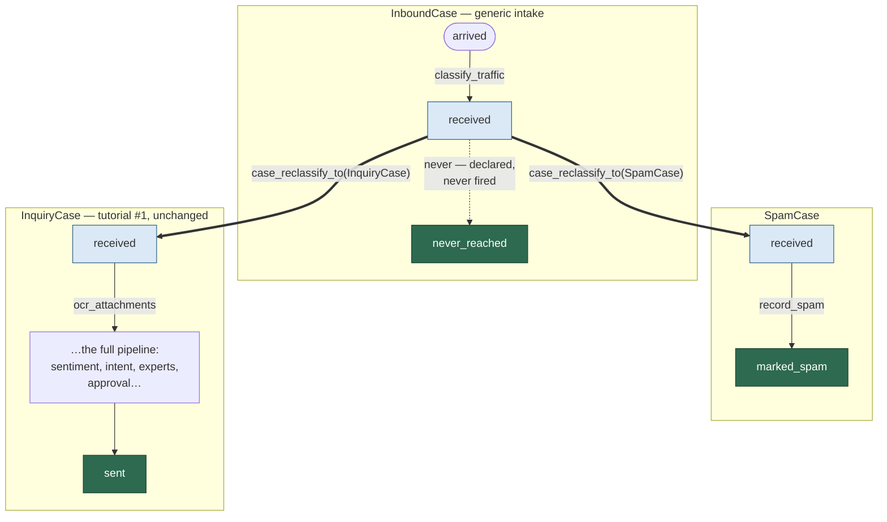

# One Manager, Many Case Types

### Heterogeneous Fleets and the Reclassification Pattern

> **Audience.** Readers of the first tutorial in this folder (*From Ad-Hoc Pipelines to Cases*).
> This one builds directly on its `InquiryCase` example and assumes you know the vocabulary:
> chains, triggers, assets, the live pool, adoption, termination. The theme here is a single
> idea with several consequences: **the `CaseManager` is agnostic to what your cases actually
> do** — and once you internalize that, some problems that look like framework problems turn
> out to be ordinary class-design problems.

---

## 1. The manager never reads your state machine

It's worth being precise about what the fleet layer does and doesn't know, because the whole
pattern in this tutorial falls out of it.

**What the manager (through its pool driver) sees of a case:**

- *"Take one step"* — `case_advance()`, uniform across every type.
- *"Could a step even fire here?"* — the structural `advanceable` flag, so it can slow its
  attention to cases parked at human gates.
- *"Are you finished?"* — terminal or live, so it can archive.
- *"What would this step consume?"* — the declared choke resources, so it can throttle.
- *The folder* — identity record, event log, lease — so it can recover, escalate, and report.

**What the manager never sees:** your states' names, your triggers' meanings, your guards, your
hooks, your assets' schemas. `InquiryCase` from the first tutorial could be replaced by a case
type for tile work orders and the manager's code path would not change by one branch.

The direct consequence: **a single manager runs a mixed fleet.** You register every case type the
deployment knows, and the pool happily interleaves them:

```python
manager = CaseManager.open(
    "/data/inquiries",
    register_types=[InboundCase, SpamCase, InquiryCase],   # a heterogeneous fleet
    concurrency_ceiling=25,
    choke_limits={"ocr": 2, "llm": 8},
)
```

A few practical notes about mixed fleets before we use one:

- **Choke limits are shared by name, fleet-wide.** If two case types both declare steps that
  draw on `"llm"`, they compete for the same 8 permits. That is usually exactly what you want —
  the rate limit protects a real external resource, not a case type.
- **The registry is how folders find their class.** Every case folder records its
  `case_object_type`; rehydration looks that name up among the registered types. This is the
  detail that makes everything in §5 work.
- **The fleet status board carries `case_type` per row**, so a mixed-fleet dashboard can group
  and filter without opening a single folder.

So far this is just convenient. It becomes a *design tool* the moment one stream of input needs
more than one lifecycle.

---

## 2. The wrinkle: the inquiry mailbox receives spam

Return to the financial-services scenario. The inbound email address that feeds `InquiryCase`
is public, and public mailboxes attract spam. Spam is not a special kind of inquiry — it has a
genuinely different lifecycle: no sentiment analysis, no expert dispatch, no approval gate. It
should be identified, recorded (perhaps to tune the filter), and terminated. Immediately.

The tempting shortcut is to bolt spam handling onto `InquiryCase` — add a `spam_check` state up
front and a `marked_spam^` terminal off to the side. Resist it, for the same reasons you'd
resist merging two unrelated classes anywhere else:

- The inquiry FSM grows edges that 95% of its instances never touch, and every future reader of
  those ten DSL lines must now hold two lifecycles in mind.
- Retention rules diverge: an inquiry keeps its analysis and approved reply; spam should keep
  almost nothing. One `_keep` policy per class is clean; one policy serving both is a fudge.
- Fleet metrics blur: "how many inquiries are live?" now requires filtering by state instead of
  by type, and the archive mixes real customer history with junk.

The design this library wants from you instead: **one case type per lifecycle, and a small
intake type whose job is to decide which lifecycle this folder deserves.** Three classes:

| Class | Role | Terminal states |
|---|---|---|
| `InboundCase` | Generic intake: classify the raw email, then hand off | `never_reached` — declared, deliberately never entered |
| `SpamCase` | Record the spam verdict and finish | `marked_spam` |
| `InquiryCase` | The full lifecycle from tutorial #1, **unchanged** | `sent`, `abandoned`, `cancelled` |

The handoff between them is not a transition. It is **reclassification** —
`case_reclassify_to()` — the case family's escape hatch for "this folder turned out to be a
different kind of thing than we first assumed."

---

## 3. The trio

Here are the two new classes (validated against the library, like everything in these
tutorials). `InquiryCase` is exactly the class from tutorial #1 — not one line changes.

```python
class TrafficVerdict(BaseModel, FileMappedPydanticMixin):
    verdict: str = "unknown"        # "inquiry" | "spam"
    confidence: float = 0.0
    reasons: list[str] = []


class InboundCase(FolderBackedCase):
    """Generic intake for anything landing in the inquiry mailbox.

    This type never finishes: it classifies the traffic, parks at `received`,
    and is RECLASSIFIED into a specialized case type by its owner. The terminal
    state exists to satisfy the FSM contract and is deliberately never reached.
    """

    fsm_state_chains = [
        "^arrived--@FAIL<3#classify_traffic~30s-->received",
        "received==never-->never_reached^",
    ]

    asset_aliases = [
        {"path": "traffic_verdict.yaml", "loader": TrafficVerdict,
         "states": {"received"}},
    ]

    fsm_trigger_chokes = {"classify_traffic": {"llm"}}

    async def perform_classify_traffic(self, tctx):
        verdict = TrafficVerdict.open(
            str(self.case_assets.asset_path("traffic_verdict.yaml")), without_lock=True)
        verdict.verdict, verdict.confidence, verdict.reasons = await sniff_traffic(...)
        verdict.save()
```

```python
class SpamStats(BaseModel, FileMappedPydanticMixin):
    sender: str = ""
    matched_rules: list[str] = []


class SpamCase(FolderBackedCase):
    """Spam's whole lifecycle: record it, terminate."""

    fsm_state_chains = [
        "^received--record_spam~10s-->marked_spam^",
    ]

    asset_aliases = [
        {"path": "spam_stats.yaml", "loader": SpamStats,
         "states": {"marked_spam"}, "keep": True},
    ]

    fsm_trigger_chokes = {}

    async def perform_record_spam(self, tctx):
        stats = SpamStats.open(
            str(self.case_assets.asset_path("spam_stats.yaml")), without_lock=True)
        stats.sender, stats.matched_rules = await tally_spam_signals(...)
        stats.save()

    def archive_grouping_label(self) -> str:
        # Junk archives into its own groupings, away from real customer history.
        return f"spam_{super().archive_grouping_label()}"
```

And the shape of the whole arrangement. Thick arrows are **reclassifications** — not
transitions; the folder, case id, and event history stay put while the *class* changes:



Notice the choreography: `InboundCase` does its one automated step and then **parks** — its
`received` state has no automated exit (only the never-fired manual edge), so the pool driver
sees a non-advanceable case and stops spending attention on it. It sits there, verdict written
to `traffic_verdict.yaml`, waiting for an owner to decide what it really is.

---

## 4. How reclassification actually works — and its one rule

`case_reclassify_to(NewClass)` rebinds a live case to a different `FolderBackedCase` subclass:

```python
case = InboundCase.create_case_in_folder(folder, external_key="MAIL-1")
await case.case_advance()                     # arrived -> received (verdict written)

verdict = case.case_load_dataclass("traffic_verdict")
target = SpamCase if verdict.verdict == "spam" else InquiryCase
fresh = case.case_reclassify_to(target)       # 'case' is now a detached husk; use 'fresh'
```

What is preserved: the folder, the `case_id`, the external key, the entire event history, and
the current state. What changes: the class stamped on the record — and therefore the FSM, the
asset contract, and the hooks that govern the folder from this moment on. The switch is a
two-phase commit, so a crash mid-reclassify reopens cleanly as the *old* class; and it logs a
`CASE_RECLASSIFIED` event, so the folder narrates its own change of identity. Here is the real
event trail of a spam inbound, end to end:

```
e001_CASE_CREATED@InboundCase.yaml
e002_CASE_STATE_ENTERED@arrived.yaml
e003_CASE_TRIGGER_STARTED@classify_traffic.yaml
e004_CASE_STATE_ENTERED@received.yaml
e005_CASE_RECLASSIFIED@SpamCase.yaml          <-- the identity switch, on the record
e006_CASE_TRIGGER_STARTED@record_spam.yaml
e007_CASE_STATE_ENTERED@marked_spam.yaml
e008_CASE_TERMINATED@marked_spam.yaml
```

### The one rule: the handoff state must exist in both classes

Reclassification is deliberately dumb about semantics — **the caller owns compatibility**. The
framework enforces exactly one structural check: the case's *current state* must be a state of
the target class, or you get `IncompatibleReclassError`. This is the "pseudo-polymorphism"
constraint: the classes involved must *share the state the case occupies at the moment of
handoff*.

That shared state is a genuine inter-class contract, and you should treat it the way you'd
treat any interface: keep it narrow and name it deliberately. In our trio the contract is one
state, `received`, and each side holds up its end:

- `InboundCase` **ends** its useful life at `received` (parked, verdict written).
- `SpamCase` and `InquiryCase` each declare `received` as an **initial** state (`^received`).
  This is not just stylistic — the DSL validator requires every non-initial state to have an
  incoming edge, and nothing *inside* those classes leads into `received`. Marking it initial
  declares "entry happens here from outside," which is precisely the parser's documented
  convention for states reached only via reclassification.

And this is why tutorial #1's `InquiryCase` needed no changes at all: its lifecycle already
began at `^received`. From `InquiryCase`'s perspective, being incepted fresh in a folder and
being reclassified into an existing one are indistinguishable — either way, it wakes up at
`received` and its automated pipeline takes over on the next sweep. Our validation run drove a
reclassified inbound through OCR, sentiment, intent, expert answers, approval, and `sent`
without a hiccup.

### The `never_reached` trick

One structural nicety deserves its own paragraph, since the class would not compile without it.
The DSL validator insists that every case type declare at least one terminal state and that
every non-terminal state have an exit — both excellent rules for classes that *finish*. But
`InboundCase` is designed never to finish; it is designed to be reclassified out of existence.
So it satisfies the letter of the contract with a formal gesture:

```
"received==never-->never_reached^"
```

A **manual** edge (`==`) never auto-fires, and no human ever fires this one — so `never_reached`
is a terminal state that exists only to make the FSM honest. If a folder ever *does* show up in
`never_reached`, that in itself is a loud signal that something (or someone) did what the design
says cannot happen. The name is the documentation.

### The etiquette

Two cautions carried over from the source docs, both natural once you see reclassify as an
*owner's* action rather than a transition:

- **Don't reclassify from inside a hook.** The machine is mid-dispatch there; reclassify from
  the code that *owns* the case — a driver companion, an ingest handler, a test.
- **The verdict should already be on disk.** Reclassify consults nothing but the current state;
  any data the new class needs (like `traffic_verdict.yaml`) must have been written while the
  old class was in charge. Note the asset contract seam here: `InboundCase` declares the verdict
  trustworthy in `received` — exactly the state the decision-maker reads it in.

---

## 5. Running the trio in a managed fleet

Everything above used a bare case. In deployment, the manager runs the mixed pool — and its
agnosticism is what makes the pattern land with almost no ceremony. There are two reasonable
placements for the classify-and-reclassify moment; both are legitimate, and they trade off the
same thing.

**Placement A — classify before adoption (in the ingest tier).** The process that watches the
mailbox creates an `InboundCase` in a staging folder, drives it to `received`, reclassifies on
the spot, detaches, and submits the folder for adoption. The manager never even meets an
`InboundCase`; its pool contains only specialized types. Simple, and right when classification
is fast and the ingest tier is allowed to spend the LLM call.

**Placement B — classify in the pool.** Adopt the `InboundCase` immediately, so the case is
under management — visible on the fleet board, lease-protected, crash-recoverable — from second
zero, and let the manager's own drive loop run the classification step (throttled by the same
`llm` choke as everything else). The case then parks at `received`, and a small companion loop
in the manager process performs the handoff with the manager's first-class facility:

```python
async def reclassify_parked_inbound(manager: CaseManager) -> None:
    """Companion tick in the manager process: specialize parked InboundCases."""
    for reader in manager.iter_live_pool():
        if reader.case_object_type != "InboundCase":
            continue
        if reader.case_state != "received":
            continue                       # still classifying (or already swapped)
        verdict = reader.case_load_dataclass("traffic_verdict")
        target = SpamCase if verdict.verdict == "spam" else InquiryCase
        await manager.reclassify_case(case_id=reader.case_id, target_type=target)
```

`reclassify_case` wraps `case_reclassify_to()` with the pool choreography a managed fleet
needs. It pre-validates the shared-state contract (an incompatible target raises
`IncompatibleReclassError` before the pool is touched), swaps the identity, and re-admits the
fresh object on a **new scheduling slot** — and per the driver contract, a freshly admitted
advanceable case starts **HOT** and is boosted to fire on the very next beat. That is the
behavior you want after a specialization: whatever automated paths the new class opened up are
taken immediately, not whenever the old slot's cadence would have come around. If the case
happens to have a step in flight at that instant, the call raises `CaseInFlightError` and the
companion loop simply retries next tick (for a case parked at a manual-only state this
essentially never happens — the driver has nothing to fire).

**Placement C — classify from another process entirely.** If the decision is made in the UI
tier (say, a human reviews a low-confidence verdict and clicks "it's spam"), the web process
doesn't need to touch the case at all — it drops a request in the manager's mailbox, exactly
like firing a manual trigger:

```python
client = CaseManagerClient(cache_root)
handle = client.submit_reclassify(case_id=case_id, target_type="SpamCase")
result = await client.wait_result(handle, timeout=10.0)   # ReclassifyResult
assert result.status == "completed" and result.to_type == "SpamCase"
```

`wait_result` is how the client learns of failure: a request the manager processes always resolves to
a `ReclassifyResult`, `status="completed"` or `status="error"` (with `.error` holding the reason —
unknown case, unregistered type, incompatible state, whatever). A request malformed enough to fail
parsing entirely still resolves, since the correlation id lives in the filename independent of the
body — the mailbox writes an error result for it rather than dropping it silently. Only a manager
that's stopped or stuck can leave `wait_result` to time out and return `None`; treat that as "unknown,"
not as an implicit failure, and lean on `only_if_fresh` (default `True`) to reject stale submissions
before they're even written.

`submit_reclassify` also runs a same-process **preflight** by default (`preflight=True`) — cheap,
disk-based checks that fail fast, synchronously, before the mailbox is ever touched: is the case
actually live, and (only if *this* process's registry happens to know the target class too) is the
current state compatible with it. That parenthetical matters: a web tier that never imports case
classes will always skip the second check silently and rely on the manager's authoritative one —
exactly the deployment this section started with. Pass `preflight="strict"` if your client process
*does* import the full case-type catalog and wants an unresolvable name treated as a bug rather than
deferred, or `preflight=False` to skip local checks entirely.

The manager process picks the request up on its next maintenance tick, runs the same
`reclassify_case` path (same validation, same HOT re-admission), and writes a
`ReclassifyResult` — `completed` with the from/to types and current state, or `error` with the
reason (unknown case, unregistered type, incompatible state).

From there the standard machinery takes over, per type: the new `SpamCase` terminates on the
next sweep and archives into its own junk groupings (its `archive_grouping_label()` override
yields labels like `spam_2026-07`); the new `InquiryCase` flows into the pipeline from
tutorial #1. The dashboard,
reading the fleet board, watches a row's `case_type` column change from `InboundCase` to its
specialization — which is exactly the operational story you want visible.

(A related mechanism worth knowing about even if you rarely need it: drivers also have
**rehydration tolerance** — if a case object goes stale under a slot, the driver re-opens the
folder by path *through the registry*, which reads the class name from the record. So even a
bare `case_reclassify_to()` + `case_detach()` done behind the driver's back is eventually
tolerated; the slot just keeps its old tier and cadence. `reclassify_case` is preferred
precisely because it doesn't rely on that safety net and gets the HOT re-admission.)

---

## 6. The pattern, generalized

What this example demonstrates is bigger than spam:

- **Triage intake.** Any public-facing intake (a mailbox, an upload endpoint, a drop folder)
  receives a mix. A cheap generic case classifies; specialized cases do the real work. The
  classification stage gets all the case-family guarantees — retries, chokes, event trail,
  crash recovery — instead of living as fragile pre-processing outside the system.
- **Generic-to-specific escalation.** A case that starts as a routine type can be reclassified
  into a heavyweight variant when a human or a rule decides it deserves one (the source docs'
  example: "a generic intake becomes a specialized workflow"). The shared-state contract keeps
  the jump honest.
- **Lifecycle forks that would deform a single FSM.** Whenever you catch yourself drawing two
  weakly-connected clusters of states inside one case type, ask whether they are actually two
  types sharing a handoff state.

And the flip side — when *not* to use it: if the "different processing" is just a branch that
rejoins (a guard and an extra state or two), keep it in one FSM. Reclassification is for
*divergent lifecycles*, not divergent paths.

The reason the pattern costs so little is the theme we started with. The manager doesn't route
spam differently from inquiries; it can't — it doesn't know what either word means. All it sees
is folders that can take a step, folders that are parked, and folders that are finished. You
express the difference where it belongs, in small single-lifecycle classes and one explicit,
logged, crash-safe identity switch — and the fleet machinery, agnostic and unbothered, carries
every one of them to its own version of done.

---

### Where to go next

- `FolderBackedCase.case_reclassify_to()` (`totodev_pub/folder_backed_case.py`, SECTION 3) —
  the authoritative contract, including the two-phase commit details.
- The *States* section of `state_chain_parser.py` — the initial-state reachability rule that
  makes `^received` the idiom for reclassification entry points.
- `CasePoolDriver` docstring (`folder_backed_case_support/case_pool_driver.py`) — contract #3,
  "rehydration tolerance," is the mechanism behind the in-pool swap.
- `tests/test_folder_backed_case.py` — the reclassification type-gate under test
  (`test_reclassify_to_succeeds_through_type_gate`).
- `tests/test_case_manager_reclassify.py` — `CaseManager.reclassify_case` and the
  `ReclassifyRequest` mailbox round-trip (HOT re-admission, error results, the works).
