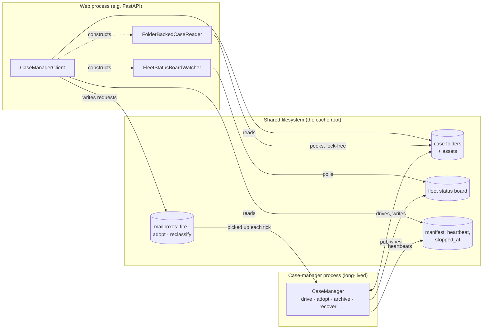

# The Web Tier and `CaseManagerClient`

### Seven Things Your UI Process Needs to Do, and How

> **Audience.** Readers of the first two tutorials in this folder. This one assumes you know
> `InquiryCase` (tutorial #1) and the reclassification pattern (tutorial #2), and it answers the
> question those left open: concretely, what does the *other* process — the FastAPI app, the
> on-call dashboard, the support console — actually call? We're after conceptual fluency, not a
> method-by-method catalog: enough of a feel for what's happening underneath each call that you
> trust it, without needing to read the mailbox or lease code to use it well.

---

## 1. One case manager, many callers, one filesystem

Recall the shape from tutorial #1 §9: the case-manager process and the web process never talk to
each other directly. Everything crosses through the cache root on shared disk.



Seven jobs land on the web tier in a typical deployment, and each one leans on a different
corner of this picture:

| # | Job | Mechanism |
|---|---|---|
| 1 | "What's happening across the whole fleet?" | `CaseManagerClient.read_fleet_status()` / `FleetStatusBoardWatcher` |
| 2 | "What's happening on *this* case, in detail?" | `FolderBackedCaseReader`, plus direct asset access |
| 3 | "A human just told me about a new case — add it." | `allocate_staging_folder()` + `create_case_in_folder()` + `submit_adopt()` |
| 4 | "This case turned out to be a different kind of thing." | `submit_reclassify()` (tutorial #2) |
| 5 | "A human just made a decision — advance the case." | `submit_fire()` |
| 6 | "Is anybody home?" | The manifest's heartbeat, read through the client |
| 7 | *(Hypothetical)* "Kill and restart the manager." | Not a client call at all — see §8 |

Notice the pattern before we get into any of them: **reads never touch the manager process**, and
**writes are always a request, never a mutation.** The web tier is never holding a case's lease,
never running a hook, never in the manager's event loop. That single discipline is what lets a
FastAPI request handler — which must return in milliseconds, not run a job queue — coexist with a
system built to run jobs for days.

---

## 2. Job 1 — fleet-wide visibility

The manager continuously publishes one file, the **fleet status board**, summarizing every live
case (plus recently-terminated ones, for a retention window) as one JSON line per case. Reading
it is the cheapest possible query: one file, no lease, no lock, no round-trip to the manager.

```python
client = CaseManagerClient(cache_root)
rows = client.read_fleet_status()          # dict[case_id, FleetStatusRow]
```

Each `FleetStatusRow` carries the fields every case type produces, regardless of what its states
are actually called: `case_id`, `external_key`, `case_type`, `case_folder`, `case_state`,
`state_entered_at`, `is_terminal`, `terminal_at`, `active_transition`, `last_transition_time`,
and three counters — `alert_count`, `slow_count`, `fail_count` — plus an `ext` dict for anything a
deployment-specific decorator wants to add. Building the dashboard's three named lists is just
filtering that dict:

```python
from datetime import datetime, timezone
from totodev_pub.case_manager_support.fleet_status import parse_iso_utc

def dashboard_summary(client: CaseManagerClient) -> dict[str, list[str]]:
    rows = client.read_fleet_status()
    now = datetime.now(timezone.utc)

    def age_secs(row) -> float:
        entered = parse_iso_utc(row.state_entered_at)
        return (now - entered).total_seconds() if entered else 0.0

    return {
        # Type-agnostic: the manager itself doesn't know what "received" means, but the
        # dashboard does — because it's allowed to know InquiryCase's vocabulary.
        "new_inbound": [r.case_id for r in rows.values() if r.case_state == "received"],

        # A SOFT, UI-level SLA warning ahead of InquiryCase's own hard 3-day @DWELL escalation
        # (tutorial #1 §4). No new mechanism — just a different threshold on the same field.
        "overdue": [
            r.case_id for r in rows.values()
            if r.case_state == "waiting_for_answers" and age_secs(r) > 36 * 3600
        ],

        # Domain-specific: the two states where InquiryCase genuinely cannot move without a
        # human — the approval gate and the failure/aging escape hatch.
        "needs_manual_action": [
            r.case_id for r in rows.values()
            if r.case_state in {"waiting_for_approval", "needs_attention"}
        ],

        # Type-AGNOSTIC "look at this": alert_count is the one signal every case family
        # produces the same way (tutorial #1 §6), raised by the framework itself or by a
        # hook calling case_emit_alert_event(). A generic ops view can use this list without
        # knowing a single InquiryCase state name.
        "flagged": [r.case_id for r in rows.values() if r.alert_count > 0],
    }
```

Two lists here matter for different reasons. `new_inbound` and `needs_manual_action` require the
dashboard to know `InquiryCase`'s actual state names — same as tutorial #2's theme, just applied
to the reader instead of the manager: *someone* has to know what the states mean, and it's
correctly the UI tier, not the fleet layer. `flagged`, by contrast, needs no such knowledge at
all — `alert_count` is deliberately the family's one type-agnostic distress signal, so a
NOC-style "what needs a human, across every case type we run" view can be built once and reused
across every case family in the deployment.

### Extended fields: cheap progress data via `ext`

Every row's `ext` dict is an open door for exactly one purpose: information that's genuinely
useful in a UI but not worth promoting to a standard column because most case types never
produce it, and not worth a client polling for because that would mean re-reading a case's
folder — event log, lease, maybe an asset file — over and over just to render a progress bar.
Instead, the case-manager process itself, which is already building this row on every publish,
can attach it once and let it ride along in the one file the client already reads.

The attachment point is `case_ext_status_info()` — an overridable instance method on
`FolderBackedCase`, called once per row as the manager builds it. Each case type decides what
belongs in its own `ext`; no manager-level wiring required.

Take `ocr_attachments` from `InquiryCase` (tutorial #1 §5): several documents, processed one at a
time, taking anywhere from seconds to a couple of minutes. Nobody needs this progress persisted —
it's meaningless the moment the step finishes — so the hook just keeps it as a plain in-memory
attribute on the case object, never touching disk for it:

```python
class InquiryCase(FolderBackedCase):
    ...
    async def perform_ocr_attachments(self, tctx):
        docs = self.case_assets.list_assets()          # e.g. 2 attachments
        for i, name in enumerate(docs, start=1):
            self._ocr_current_file = name
            await self.case_run_blocking(ocr_one_document, name)   # the actual slow work
            self._ocr_progress = (i, len(docs))         # in-memory only — no file write per document
        self._ocr_progress = None
        self._ocr_current_file = None

    def case_ext_status_info(self) -> dict[str, Any]:
        progress = getattr(self, "_ocr_progress", None)
        if progress is None:
            return {}
        processed, total = progress
        return {
            "completion_percent": int(100 * processed / total),   # e.g. 1 of 2 docs -> 50
            "current_file": self._ocr_current_file,
        }

manager = CaseManager.open("/data/inquiries", register_types=[InquiryCase])
```

`_ocr_progress` being non-`None` already captures "mid-step right now" — no need to cross-check
`active_transition` or `case_state`. From the web tier, this is just more fields on a row
you're already reading:

```python
row = client.read_fleet_status()[case_id]
if row.active_transition == "ocr_attachments" and "completion_percent" in row.ext:
    render_progress_bar(row.ext["completion_percent"], label=row.ext.get("current_file"))
```

Nothing here is persisted, versioned, or guaranteed to survive a manager restart — treat `ext` as
exactly what it is, a live, best-effort annotation, never a data contract like an `asset_aliases`
entry. One knob matters if you lean on this for anything time-sensitive: unlike a state change
(which forces an immediate board write), progress *within* one state only reaches the board on
the manager's periodic full republish, paced by policy's `fleet_status_full_flush_interval_secs`
(1 second by default). That's plenty for a progress bar; tighten it if a deployment wants
snappier live numbers, at the cost of more board-file churn.

The same trick covers most "I wish I could see X without polling every case's folder" itches:
which external service call a step is currently waiting on, which retry attempt a flaky
step is on, a queue position, a running token/row count for a long synthesis step — anything
transient, cheap to compute from state the case already has in memory, and worth a glance
without justifying its own persisted field or its own client-side polling loop.

**Two ways to consume the board, for two kinds of process.** `read_fleet_status()` above is a
plain, stateless read — call it once per request, from a short-lived handler. A long-lived
process (the one pushing updates over a websocket, say) wants *changes*, not repeated snapshots:

```python
from totodev_pub.case_manager_support.fleet_status_watcher import FleetEventKind

watcher = client.fleet_status_watcher()     # keep exactly ONE of these per long-lived process
                                             # — its diff baseline lives in its own memory

while True:
    for event in watcher.poll():            # cheap no-op when the board file hasn't changed
        match event.kind:
            case FleetEventKind.WENT_TERMINAL:
                await notify_ws(event.case_id, "closed")
            case FleetEventKind.STATE_CHANGED:
                await notify_ws(event.case_id, f"now {event.row.case_state}")
            case FleetEventKind.ALERTED:
                await notify_ws(event.case_id, "needs attention")
    await asyncio.sleep(1.0)
```

The watcher does the diffing for you — `CASE_APPEARED`, `STATE_CHANGED`, `WENT_TERMINAL`,
`TRIGGER_STARTED`/`TRIGGER_ENDED`, `ALERTED`, `WENT_SLOW`, `FAILED`, `EXT_CHANGED`,
`CASE_DISAPPEARED` — instead of every observer hand-rolling snapshot comparison. Use
`read_fleet_status()` in request handlers; use the watcher in the one process that owns pushing
live updates.

---

## 3. Job 2 — granular detail on one case, and writing into it

Zoom from the fleet into a single inquiry. `client.reader(...)` returns a
`FolderBackedCaseReader` — a cheap, lock-free peek at one folder, no lease taken:

```python
reader = client.reader(case_id=case_id)
reader.case_state          # "waiting_for_answers"
reader.case_dwell_secs     # how long it's been parked here — grows between reads, live
reader.case_event_journal.last_activity_at  # newest event's mtime (naive-local) — a "last touched" column
reader.case_assets.list_assets()   # every file actually on disk right now, for free-form display
```

### Reading a named asset, trust-checked

`case_load_asset(alias)` is the intended way to read one of the case's declared data
contracts (tutorial #1 §5) — it enforces the state-conditioned trust check *before* touching
disk:

```python
from totodev_pub.folder_backed_case_support.exceptions import AssetNotTrustedInStateError

try:
    answers = reader.case_load_asset("expert_answers")
except AssetNotTrustedInStateError:
    ...   # the file may exist, but InquiryCase hasn't promised it's finished yet
```

What you get back by default is worth understanding, because it mirrors a pattern from
tutorial #2. A case's `asset_aliases` are persisted on disk as data (loader name, path, trust
states) — the *record itself* doesn't carry Python classes. A reader that hasn't imported
`ExpertAnswers` gets a generic, schema-flexible `LazyLoadedFileData` wrapper instead of a typed
object — `answers.as_dict()["answers"]["late_fee"]` rather than `answers.answers["late_fee"]`,
but no import required. If your web tier *does* import the case's data classes and registers
them once at startup, reads come back fully typed:

```python
from totodev_pub.folder_backed_case_support.asset_dataclass_registry import asset_dataclass_registry
from totodev_pub.folder_backed_case_reader import FolderBackedCaseReader

asset_dataclass_registry.register(ExpertAnswers, InquiryAnalysis)   # once, at process startup
typed_reader = FolderBackedCaseReader(reader.case_folder, resolve_asset_types=True)
answers = typed_reader.case_load_asset("expert_answers")        # a real ExpertAnswers now
```

Same trade-off as `submit_reclassify`'s preflight in tutorial #2: convenience without imports, or
full typing with them — your choice per deployment, not a framework decision.

### Writing a named asset — directly, without a lease

Here's the part that has no equivalent in tutorials #1–#2: some data doesn't arrive through a
*trigger* at all. Look again at `InquiryCase`'s lifecycle — `waiting_for_answers` has no
`answer_issue()` trigger. Experts don't fire a transition; they just produce data, and the
automated guard `guard_answers_complete` notices when enough of it exists:

```python
"waiting_for_answers--answers_complete#compose_reply-->drafted",
```

So when the web tier's "submit expert answer" form is used, there is nothing to `fire()` — the
UI's job is simply to get the answer onto disk. `case_assets.write()` isn't available here (it's
a method of the *live, leased* case object the manager owns); the web process was never handed a
lease and never will be. What it uses instead is the same door every asset file already opens
through: the data class itself, opened directly against its known path, with **real** file
locking — the default `FileMappedPydanticMixin` behavior, not the `without_lock=True` shortcut
tutorial #1 used, because that shortcut exists specifically for a hook that already owns the
case. The web tier does not, so it takes the lock like any other outside writer:

```python
answers_path = reader.case_assets.asset_path("expert_answers.yaml")   # known path; may not exist yet
answers = ExpertAnswers.open(str(answers_path), fallback_value={})
answers.answers["late_fee"] = "Fee waived per policy 4.2."
answers.save()
```

This is a genuinely safe write, not a loophole: `.open()`/`.save()` briefly lock the file around
the actual read and write, exactly the same primitive the case's own hooks build on. The
manager's automated sweep and the web tier's manual write are simply two independent writers of
the same small file, coordinated the ordinary way file-backed systems coordinate — and the very
next sweep after this write, `guard_answers_complete` sees the new data and the case advances
itself to `drafted`, with no signal from the web tier beyond the file existing.

One nuance worth internalizing: **trust governs reads, not writes.** `expert_answers.yaml`'s
declared trust window doesn't open until `drafted` — that's a promise to *readers* that the file
won't be found half-assembled. The web tier, while it's the one *producing* that data during
`waiting_for_answers`, needs no such promise about itself. If it also wants to render "answer
received, waiting on 2 more" before the trust window opens, it uses the same escape hatch as any
other pre-trust read — the raw path, not the alias:

```python
if answers_path.exists():
    partial = ExpertAnswers.load(str(answers_path))    # a snapshot; the case is not "done" yet
    rendered = f"{len(partial.answers)} of {len(analysis.issues)} answered"
```

---

## 4. Job 3 — a human phones it in

Not every case starts from an automated ingest pipeline. Support picks up the phone, and the same
`InquiryCase` needs to exist — created by a human, through a web form, and handed to the manager
exactly the way tutorial #1's ingest script would. Deliberately, this reuses **the same
classmethod, the same class, the same adoption airlock** — no new case type, no special case:

```python
staging = client.allocate_staging_folder()
case = InquiryCase.create_case_in_folder(
    staging / "case",
    external_key="PHONE-2026-07-08-114502",
    nickname="J. Alvarez — billing question",
)
case.case_detach()                       # release the lease; the folder is now inert on disk
handle = client.submit_adopt(staging / "case")
result = await client.wait_adopt(handle, timeout=10.0)
assert result.status == "completed", result.rejection_reason
case_id = result.case_id
```

Two things worth calling out:

- **This is the one place the web tier *must* import a case class.** Reclassify's preflight
  (tutorial #2 §5) is designed to degrade gracefully when the caller hasn't imported the target
  type; creation obviously can't — you're instantiating the class. That's not a gap, it's the
  natural shape of the operation: the web form knows it's building an inquiry.
- **The adoption airlock still runs.** `submit_adopt` doesn't trust the caller any more than an
  automated ingest script — it validates the folder is well-formed, the type is registered, the
  `case_id` isn't a duplicate, and only *then* moves it into the live bucket. A support agent's
  double-click that resubmits the same staging folder gets a rejected result, not a duplicate
  case, the same way a malformed automated drop would. What adoption does *not* dedupe is
  `external_key` — two distinct phone calls both tagged `PHONE-...` are two distinct cases by
  design. If your workflow wants to prevent an agent from opening a second case for a caller
  already mid-inquiry, that's a `client.locate_all(external_key=...)` check the web tier makes
  *before* creating the folder — application policy, not a framework guarantee.

From here the phone-originated case is indistinguishable from an email-originated one: same
states, same guards, same fleet board row. That indistinguishability is the entire point of
having designed the lifecycle around "an inquiry," not "an inquiry that arrived by email."

---

## 5. Job 4 — reclassify, briefly

Tutorial #2 covered this in full (its "Placement C"), so just the shape, for completeness of this
list: when a human decides a case is a different kind of thing than first assumed (a low-
confidence spam verdict a reviewer overrides, say), the web tier doesn't touch the case at all —
it drops a request, the same way it fires a trigger:

```python
handle = client.submit_reclassify(case_id=case_id, target_type="SpamCase")
result = await client.wait_result(handle, timeout=10.0)     # a ReclassifyResult
assert result.status == "completed"
```

`submit_reclassify` runs a same-process preflight by default (existence, and — only if this
process's registry happens to know the target class — state compatibility), so most obviously
doomed requests fail fast without ever reaching the mailbox. See tutorial #2 §5 for the full
story, including why `wait_result` returning `None` means "unknown," not "failed."

---

## 6. Job 5 — firing a manual decision

The reviewer clicks "Approve." The web tier's job is to relay that decision, not perform it:

```python
handle = client.submit_fire(
    case_id=case_id,
    trigger="approve",
    trigger_kwargs={"reviewer": "dave"},
)
outcome = await client.wait_result(handle, timeout=10.0)    # AdvanceResultSerializable
if outcome is None:
    ...       # manager didn't answer in time — see §7, "is anybody home?"
elif outcome.status == "completed" and outcome.progressed:
    ...       # case moved: initial_state -> final_state
else:
    ...       # status == "rejected" / "error", or progressed=False — show outcome.exception_messages
```

The request drops into the manager's `fire_mailbox`; on its next maintenance tick the manager
picks it up, calls the trigger inside its own event loop — where the case's lease, the
non-reentrancy guarantee, and any choke limits all apply exactly as they would for an automated
step — and writes back an `AdvanceResultSerializable`: `status` (`completed` / `rejected` /
`error`), `initial_state`, `final_state`, `progressed`, `blocked`, `failed`, `alerted`, and
`exception_messages` if the trigger itself raised. The web process never calls `approve()` on a
case object it doesn't own; it only ever learns the outcome after the fact.

One caution, since it's easy to assume otherwise after reading about adoption's dedup and
reclassify's idempotent-by-correlation-id result files: **firing has no such guard.**
Resubmitting the same `correlation_id` fires the trigger again rather than replaying a cached
result. If your UI can double-submit (a doubly-clicked button, a retried request), the usual web
answer applies — disable the control until a result arrives, or dedupe at the HTTP layer — the
mailbox itself won't do it for you here.

---

## 7. Job 6 — is anybody home?

Before the web tier queues a request it can't watch execute, it's worth knowing whether the
manager process is actually running. This is exactly what `only_if_fresh` (default `True`, seen
throughout this series) checks for you automatically — but you can also ask directly:

```python
from totodev_pub.case_manager_support.exceptions import ManagerNotFreshError

try:
    client.read_fleet_status(only_if_fresh=True)
    healthy = True
except ManagerNotFreshError as exc:
    healthy = False
    reason = "stopped" if exc.stopped_at else "heartbeat stale"
```

The mechanism underneath: every maintenance tick, the manager rewrites a small `manifest.yaml`
with a fresh `heartbeat_at` timestamp; a clean `stop()` additionally sets `stopped_at`. A
freshness check is really two questions collapsed into one — "did it shut down on purpose?" vs.
"has it simply gone quiet?" — and `ManagerNotFreshError` carries both fields so your error message
can tell the two apart. There's a built-in detection lag, governed by policy's
`manifest_stale_secs` (30 seconds by default): a manager that has actually wedged is only
*reported* as unfresh once that window elapses without a heartbeat, so tighten it for a
dashboard that needs a faster verdict, at the cost of more sensitivity to a merely-busy tick.

That answers "is the *process* alive." It's a different, narrower question from "is *this
specific case* stuck," which the heartbeat can't see — a single hung external API call inside one
case's hook doesn't stop the manager from heartbeating or from advancing every other case
concurrently. For that, look at the case itself:

```python
active = reader.case_active_trigger      # ActiveTrigger(trigger, elapsed_secs) or None
if active is not None and active.elapsed_secs > 300:
    ...   # this ONE case's current step has been running suspiciously long
```

The fleet board carries the same signal in bulk (`active_transition` / `last_transition_time`
per row), which is what lets a dashboard flag "this case's `ocr_attachments` step has been
running for 6 minutes" without polling every folder individually. (If you're ever writing code
that runs *inside* the manager process rather than the web tier, the driver's own
`stalled_cases()` / `blocked_cases()` queries and the policy's `escalation_stall_secs` /
`escalation_fail_threshold` knobs do the equivalent job with full pool visibility — but those are
manager-process concepts; the web tier only ever sees their effects through the board and the
reader.)

---

## 8. Job 7 (hypothetical) — killing and restarting the manager process

Nothing in `CaseManagerClient` sends a "stop" or "restart" command — deliberately; it's the same
gap this series flagged for case *removal* (see `src/totodev_pub/_backlog/proposed_mailbox_case_removal_protocol.md`):
a destructive, process-lifecycle action doesn't fit the mailbox's request/result shape without a
lot more thought about authorization and halt semantics than we've given it. So "the web app
kills and restarts the manager" is necessarily an **orchestration-level** action — a supervisor,
a container runtime, a deploy script sending a signal — not an RPC the web tier makes. It's worth
walking through anyway, because the protections that make it safe(r) are the same ones that make
every other job in this tutorial safe, applied to the harshest case.

**The graceful path.** A well-behaved supervisor sends `SIGTERM`; the manager process's own
handler calls `await manager.stop(timeout=...)`. That request-halts every in-flight trigger,
waits (bounded) for them to settle, force-publishes the fleet board one last time, and — this is
the detail that matters to every client — writes the manifest with `stopped_at` set. That's the
`ManagerNotFreshError(stopped_at=...)` case from §7: a client that asks during a clean shutdown
gets an honest "stopped on purpose," not an ambiguous timeout.

**The hard path.** A crash, an OOM kill, an actual `kill -9` — no handler runs, `stop()` never
executes. The manifest simply stops advancing. Clients relying on `only_if_fresh` see the *other*
half of `ManagerNotFreshError` — a stale `heartbeat_at` — after `manifest_stale_secs` elapses.
Less graceful, same protective effect: nobody's request silently vanishes into a dead process.

**Why the folders themselves are never at risk.** Every mutating operation this whole series has
shown — a trigger's step, a reclassify, an adopt — is built on the same primitives: atomic file
replace (write-temp-then-rename, never edit-in-place), the case's own lease (a **30-second crash-
recovery window**, not a "how long can a step run" limit — a legitimately long step keeps a
background pulse beating the lease every ~10 seconds so it never lapses out from under a live
owner), and, for reclassify specifically, an explicit two-phase commit. A kill at literally any
instant leaves each affected file in either its old, fully-written state or its new one — never
torn — because nothing is ever half-written to the file that matters; a crash mid-operation just
means the *next* thing to happen never got triggered.

**What restart does about it.** `start()` refuses to run without a prior `recover()` in the same
session (`RecoverRequiredError` enforces this — it's not optional to skip). `recover()` is the
reconciliation gate:

- It rebuilds the live pool from what's actually on disk (or a faster pool-membership journal, if
  the deployment opted into `journal_attach_steady_state`) — a folder is live if and only if it's
  sitting in the live bucket, independent of whatever the previous process's in-memory pool
  thought.
- A lease left behind by the killed process is simply expired (30 seconds is short specifically
  so this window is small) and reclaimed by the new one — no manual intervention, and no risk of
  two managers fighting over one folder, because the *new* process can only take ownership once
  the old lease has actually lapsed.
- Anything the old process had picked out of a mailbox but not finished — a fire request moved
  into `firing/`, a reclassify moved into `executing/` — is **not blindly retried**. It's dead-
  lettered: an explicit error result is written (`replay_reclassify_on_recover`, and its `fire`
  counterpart), so a waiting client learns the truth ("this may or may not have partially
  happened, treat it as failed and reconsider") instead of the request silently re-firing a
  trigger that already ran once, or silently vanishing.
- Pending termination and eject tickets are replayed to finish what they were doing; the adopt
  drop folder is rescanned if the deployment wants that on startup.

The theme tying this whole tutorial together shows up one last time here: the system's answer to
"what if we get killed mid-operation" is never "guess and hope" — it's always "notice precisely
what state we're in, and either finish it or report it as failed," the same posture a well-
written trigger takes toward its own exceptions (tutorial #1 §5, "raising is failing, and failing
is data"). A hard kill is just a very large, very abrupt failure, and the folder-is-truth design
was built to make that an ordinary case to recover from, not an exceptional one.

---

## 9. Putting it together

None of these seven jobs required the web tier to understand a lease, a choke limit, a driver
tier, or a two-phase commit. What it needed was:

- Two read-only views (`FleetStatusRow` for the fleet, `FolderBackedCaseReader` for one case),
  both lock-free and cheap enough to call from a request handler.
- One extra move for data that arrives outside the trigger vocabulary entirely — writing a named
  asset directly, with real locking, exactly like any other writer of that file.
- Three mailbox request types (`fire`, `adopt`, `reclassify`) that all share the same
  request → tick → result shape, and the same `only_if_fresh` guard against queuing into a dead
  process.
- One honest signal (the manifest heartbeat) for "is anyone processing my requests right now,"
  and the knowledge that a specific case's stall is a different question the reader answers
  directly.
- The understanding that the one operation with no client-facing surface — killing the process
  itself — is safe by the same construction as everything else, not by a special case bolted on.

That's the whole surface. Everything sophisticated — the lease, the pulse, the two-phase commits,
the dead-lettering — exists precisely so that this list could stay this short.


## 10. Docker Deployment Strategy

Note that when using docker-based deployment the built-in filesystem isolation between the web application and the case manager process often needs to be bridged.  One of the most common ways is by having a separate, persistent shared volume (e.g. `volatile/` that both process mount similarly to make their semantics and log files comprehensible and consistent).


---

### Where to go next

- `totodev_pub/case_manager_client.py` — the complete web-tier surface; every method in this
  tutorial is a thin wrapper documented there.
- `totodev_pub/case_manager_support/fleet_status.py` and `fleet_status_watcher.py` — the board's
  on-disk format (`FleetStatusRow`), the poll-and-diff watcher (`FleetEventKind`), and how rows
  are built.
- `totodev_pub/folder_backed_case.py` — `case_ext_status_info()` (§2), the per-case hook that
  populates a row's `ext` dict.
- `totodev_pub/folder_backed_case_reader.py` — the full read-only surface, including
  `case_active_trigger` and the asset-trust boundary (`case_load_asset`).
- `totodev_pub/folder_backed_case_support/asset_dataclass_registry.py` — the opt-in typed-read
  mechanism from §3.
- `totodev_pub/case_manager_support/adopt.py` — the adoption airlock's full validation list
  (`AdoptRejectReason`).
- `totodev_pub/case_manager_support/recover.py` and `mailbox/processor.py` — the recovery
  reconciliation and dead-lettering behavior from §8 (`RecoverReport`,
  `replay_reclassify_on_recover`, `replay_fire_on_recover`).
- `totodev_pub/folder_backed_case_support/constants.py` — the lease timing constants
  (`DEFAULT_LEASE_TTL_SECS`, the heartbeat throttle, the in-flight pulse divisor) referenced in §8.
- `tests/test_case_manager_client_reads.py`, `test_case_manager_fire_mailbox.py`,
  `test_case_manager_adopt_mailbox.py`, `test_case_manager_fleet_status.py`,
  `test_case_manager_fleet_watcher.py` — working examples of every mechanism in this tutorial,
  end to end.
- `src/totodev_pub/_backlog/proposed_mailbox_case_removal_protocol.md` — the change proposal for
  the one lifecycle action (removal) this family of tutorials has deliberately not covered yet.
