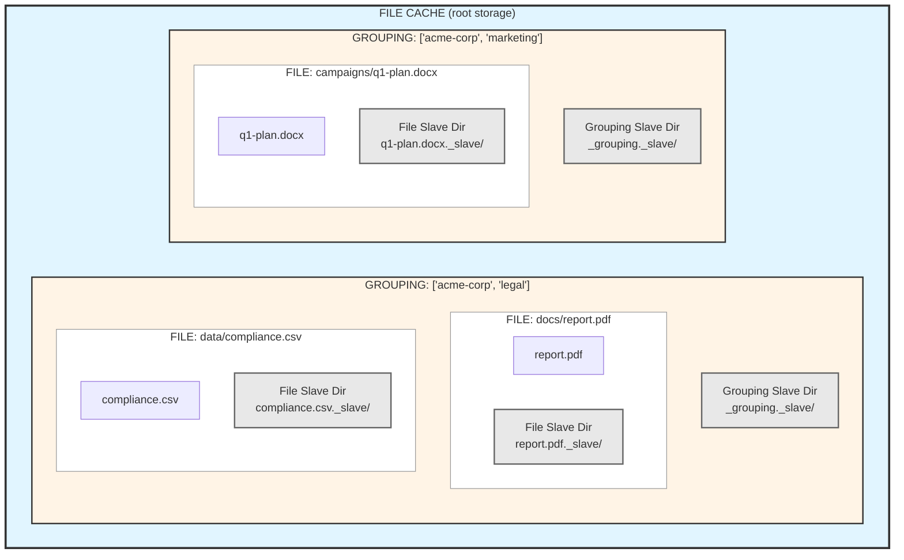
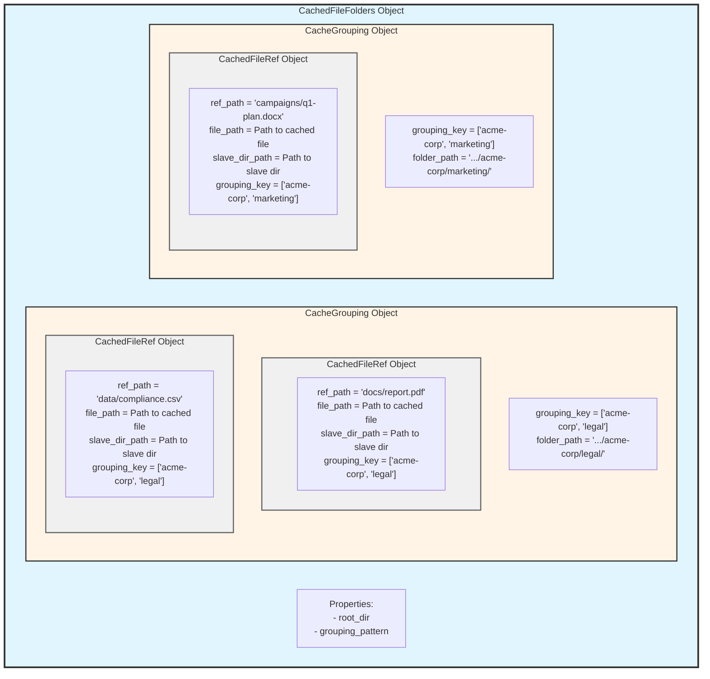

# Briefing 1: Core Structure - Cache, Groupings, and Slave Directories

## Summary

CachedFileFolders provides a structured way to cache files from external sources (SharePoint, Gmail, APIs, user uploads, generated output, etc.) while maintaining organized storage and workspace for processing artifacts. The system uses a three-level hierarchy: **Cache** → **Groupings** → **Files**, with automatic "slave directories" at both the grouping and file levels for storing related data.

**Key Insight:** Think of CachedFileFolders as a filing cabinet (cache) with labeled drawers (groupings) containing documents (files), where each drawer and document gets an automatic scratch folder (slave directory) for notes, annotations, and processing artifacts.

---

## Three-Level Structure: Cache < Grouping < File

### Conceptual View



**Legend:**
- 🔵 Blue = Cache (entire system)
- 🟡 Yellow = Grouping (collection of related files)
- ⚫ Gray = Slave directory (scratch space at any level)
- ⚪ White = Actual cached file

### Python Objects View



**Key Python Objects:**
- **`CachedFileFolders`** - The cache itself, manages all groupings and storage
- **`CacheGrouping`** - Represents one grouping, provides convenient methods for that collection
- **`CachedFileRef`** - Represents a single cached file with its metadata and slave directory

---

## Level 1: The Cache (CachedFileFolders)

A **cache** is the top-level container represented by a `CachedFileFolders` object. It defines:

- **Storage location** - where cached files live on disk
- **Grouping pattern** - how files are organized (e.g., `"projects/{project}/"`, `"sites/{site_name}/"`)
- **Change detection strategy** - how to detect when files need updating

Think of it as the filing system itself - the cabinet, the rules for organization, and the policies.

```python
cache = CachedFileFolders(
    grouping_pattern="clients/{client}/{department}/",
    root_dir="volatile/cache/storage"
)
```

---

## Level 2: File Groupings

A **grouping** is a logical collection of related files within the cache, identified by a `grouping_key`. This is the **primary key** for organizing your cached files.

**Examples:**
- `grouping_key = ["acme-corp", "legal"]` → stores files under `clients/acme-corp/legal/`
- `grouping_key = ["techstart", "2025"]` → stores files under `clients/techstart/2025/`

### Grouping Pattern Variables

The grouping pattern acts as a template that the grouping_key fills in:

```python
# Pattern with two variables (typical case)
pattern = "clients/{client}/{department}/"
grouping_key = ["acme-corp", "legal"]
# Results in: clients/acme-corp/legal/

# Pattern with different structure
pattern = "projects/{project}/{year}/"
grouping_key = ["webapp-redesign", "2025"]
# Results in: projects/webapp-redesign/2025/
```

### Grouping Slave Directory

**Every grouping automatically gets its own slave directory** - created empty, ready for whatever you need:

- Grouping-level indexes or manifests
- Aggregated reports across all files in the grouping
- Processing logs for the entire collection
- Configuration files specific to this grouping

**Lifecycle:** Created when first file is added to grouping. Persists until the grouping is explicitly purged or the cache is cleaned up.

---

## Level 3: Cached Files

Individual **files** are stored within a grouping. Each file has:

- **`ref_path`** - the file's primary key within its grouping (see below)
- **`file_path`** - where it's actually stored on disk in the cache
- **`grouping_key`** - which grouping it belongs to

### Understanding ref_path: The File's Primary Key

The `ref_path` is a **primary key** for looking up a specific file within a grouping. Think of it like a unique ID, but with structure:

**Key Characteristics:**
- Can be any string, but should resemble a file path or URL
- Examples: `"docs/report.pdf"`, `"2025/invoices/invoice-001.pdf"`, `"https://example.com/data.csv"`
- Gets converted to a local directory structure when stored in the cache
- Used for lookup: "Get me the file with ref_path='docs/report.pdf' in grouping ['acme-corp', 'legal']"

**Why it matters:**
```python
# These are DIFFERENT files even though they have the same filename:
# File 1: grouping_key=["acme-corp", "legal"], ref_path="contracts/agreement.pdf"
# File 2: grouping_key=["acme-corp", "legal"], ref_path="policies/agreement.pdf"

# These are also DIFFERENT files (different groupings):
# File 3: grouping_key=["acme-corp", "legal"], ref_path="report.pdf"
# File 4: grouping_key=["acme-corp", "marketing"], ref_path="report.pdf"
```

**The combination of `(grouping_key, ref_path)` uniquely identifies a file in the cache.**

### File Slave Directory

**Every cached file gets its own slave directory** - created empty, automatically managed:

**Common uses:**
- OCR text extraction results
- Thumbnail images
- Parsed metadata (JSON/YAML)
- Processing state tracking
- Vector embeddings or database IDs

**Key lifecycle rule:** When the file is deleted from the cache, **its slave directory is automatically deleted**. When a file is updated, the slave directory persists (you control what to refresh).

```python
# File stored at: /cache/storage/projects/webapp/docs/report.pdf
# Slave dir at:   /cache/storage/projects/webapp/docs/report.pdf._slave/
#
# Inside slave dir:
#   - ocr_text.txt          # Your OCR output
#   - thumbnail.png         # Your generated thumbnail
#   - metadata.yaml         # Your processing metadata
#   - events/               # Your event log directory
```

---

## Why This Structure Matters

### 1. **Separation of Concerns**
Cached files remain pristine copies of source data. All derived work (OCR, parsing, indexing) lives in slave directories, keeping clean separation between "source of truth" and "processing artifacts."

### 2. **Automatic Cleanup**
Slave directories are automatically managed. When a file is removed, all its processing artifacts disappear with it - no orphaned metadata, no cleanup code needed.

### 3. **Flexible Organization**
Groupings let you organize by project, client, date, team - whatever makes sense for your domain. The pattern enforces consistent structure across your cache.

### 4. **Processing State Co-location**
Processing artifacts live right next to their source files. No separate database to keep in sync, no complex ID mappings - just a directory tree that mirrors your logical organization.

### 5. **Discoverable and Inspectable**
Everything is just files and directories. You can `ls`, `find`, `grep`, `zip` - standard Unix tools work. Operators can inspect cache state without special tooling.

---

## Physical Storage Example

Here's what the actual filesystem might look like, showing how `ref_path` converts to directory structure:

```
/cache/storage/
├── clients/
│   ├── acme-corp/
│   │   ├── legal/                             # grouping_key = ["acme-corp", "legal"]
│   │   │   ├── _grouping._slave/              # Grouping slave dir
│   │   │   │   ├── manifest.yaml
│   │   │   │   └── batch_logs/
│   │   │   ├── docs/
│   │   │   │   ├── report.pdf                 # ref_path = "docs/report.pdf"
│   │   │   │   └── report.pdf._slave/         # File slave dir
│   │   │   │       ├── ocr_text.txt
│   │   │   │       ├── thumbnail.png
│   │   │   │       ├── metadata.yaml
│   │   │   │       └── events/
│   │   │   └── data/
│   │   │       ├── compliance.csv             # ref_path = "data/compliance.csv"
│   │   │       └── compliance.csv._slave/
│   │   │           ├── schema.json
│   │   │           └── metadata.yaml
│   │   └── marketing/                         # grouping_key = ["acme-corp", "marketing"]
│   │       ├── _grouping._slave/              # Grouping slave dir
│   │       └── campaigns/
│   │           ├── q1-plan.docx               # ref_path = "campaigns/q1-plan.docx"
│   │           └── q1-plan.docx._slave/       # File slave dir
```

**Notice:** The `ref_path` directly determines the file's location within its grouping. A ref_path of `"docs/report.pdf"` creates the `docs/` subdirectory automatically.

---

## Key Takeaways

1. **CachedFileFolders** = The entire cache system with its storage location and organization rules
   - Python object: `CachedFileFolders`

2. **Grouping** = A logical collection of related files (primary key: `grouping_key`)
   - Python object: `CacheGrouping`
   - `grouping_key` is typically multipart: `["acme-corp", "legal"]` or `["project", "2025"]`
   - Each grouping gets a slave directory (`_grouping._slave/`)

3. **File** = An individual cached file
   - Python object: `CachedFileRef`
   - Primary key: `(grouping_key, ref_path)` uniquely identifies each file
   - `ref_path` should look like a file path or URL and determines storage location
   - Contains: `file_path`, `slave_dir_path`, `ref_path`, `grouping_key`
   - Each file gets its own slave directory (`filename._slave/`)

4. **Slave Directories** = Automatic scratch space at both grouping and file levels
   - **Grouping-level** (gray in diagrams): For collection-wide data
   - **File-level** (gray in diagrams): For per-file artifacts
   - Created empty, use however you wish
   - Automatically cleaned up when the parent is deleted

**Mental Model:** It's a filing cabinet where every drawer (grouping) and every document (file) gets its own scratch folder automatically. The folders are yours to use, and they vanish when their parent is removed.

---

## Storage Planning

Designing a cache is more than naming a folder. Two early choices have outsized impact: the `grouping_pattern` you commit to when the cache is created, and the `ref_path` conventions you adopt for individual files. Thoughtful planning pays off in maintainability, discoverability, and performance.

### Choosing a grouping_pattern

The `grouping_pattern` defines the directory layout under the cache root. You set it once when creating `CachedFileFolders`, and changing it later means rebuilding the cache from scratch. For tiny, disposable caches you can omit the pattern entirely—`CachedFileFolders` then uses a single anonymous grouping—but long-lived caches deserve a semantic structure.

**Why to think ahead:**
- File-system inspection is simpler when the directory names read like the business concepts they represent.
- Group-level operations (like purging yesterday's ingest) only work when related files share a grouping. A meaningful pattern lets you delete whole cohorts in one call.
- Iteration APIs operate within a grouping; overly granular groupings turn simple loops into nested lookups.
- Glob filters match against grouping keys, so including client codes, regions, or run dates makes ad-hoc discovery easy.
- Permissions or quota policies are easier to explain when groupings align with teams or workflows.

**Example patterns to spark ideas:**
- `"clients/{client}/{department}/"` keeps customer data organized by account and department.
- `"projects/{project}/sources/{source}/"` separates ingestion source from the consuming project.
- `"sites/region-{region}/{site_code}/{year}/"` works well for distributed sensor or retail data.
- `"pipelines/{pipeline_id}/runs/{run_date}/"` enables quick cleanup of stale pipeline runs.
- `None` (no pattern) delivers a single grouping—acceptable for prototypes or scratch caches.

### Anticipating ref_path patterns

Ref paths can evolve over time, but consistency pays dividends. Each `ref_path` determines the subdirectories inside its grouping, drives lookup methods, and influences how the filesystem handles the cache under load.

**Important nuance:** If the final segment of a `ref_path` looks like a filename (it contains a dot), that segment does *not* become another directory. The cache uses the file proxy's materialized filename for the actual file, while the `ref_path` string remains unchanged for lookups. For example, `docs/report.pdf` produces the directory `.../docs/` with a file named `report.pdf`, whereas `docs/report/2025` creates nested directories down to `2025`.  The proxy used to bring the file into the cache may override the naming of the file within the filesystem.

**Considerations:**
- Human-readable `ref_path` values make the cache inspectable with basic CLI tools.
- Built-in glob filtering means you can encode search keys—dates, document types, customer IDs—directly into the path instead of maintaining separate indexes.
- Spreading files across nested directories prevents any single folder from holding thousands of entries, which keeps directory listings fast.
- Stable naming conventions simplify deduplication and refresh logic when the same upstream asset is reprocessed.
- Favor filesystem-safe characters and manageable segment lengths to keep the cache portable.

**Example ref_path schemes:**
- Emails: `"2025/11/08/from-jane@example.com/subject-contract-update.eml"` partitions by date, then sender.
- Invoices: `"invoices/{customer_id}/{year}-{month}/invoice-{invoice_number}.pdf"` groups by customer and billing period.
- Data snapshots: `"tables/{table}/{partition_key}/snapshot-{iso_timestamp}.parquet"` mirrors analytic partitioning.
- Media assets: `"assets/{campaign_slug}/{asset_type}/{sequence:04d}.jpg"` keeps campaign creatives ordered and categorized.
- API payloads: `"raw/{provider}/{resource}/{yyyy}/{mm}/{dd}/{uuid}.json"` spreads high-volume ingests across time-based folders.

---

## What's Next?

**Briefing 2** will introduce **File Proxies** - how files from external sources (SharePoint, Gmail, APIs) are represented as "promises" that can be materialized into the cache. We'll see how the proxy pattern lets you work with files that don't exist locally yet.

