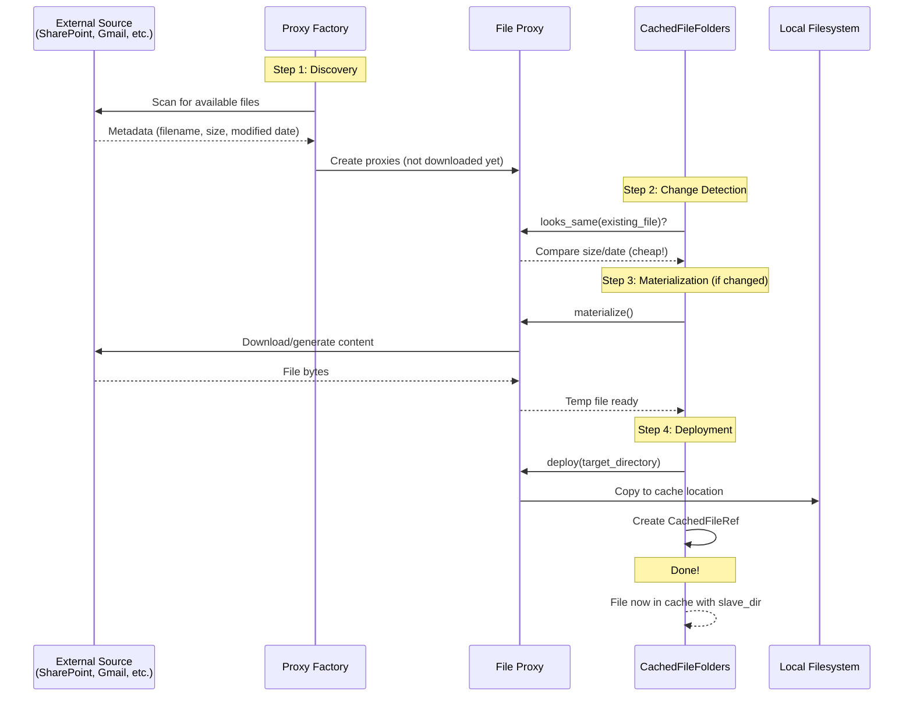

# Briefing 2: File Proxies - The "Promise of a File"

## Summary

File Proxies are the bridge between external data sources and the CachedFileFolders cache. A **File Proxy** represents a file that *could* be retrieved but hasn't been downloaded yet - think of it as a "promise" or "IOU" for a file. Proxies abstract away the differences between SharePoint documents, Gmail messages, API responses, local files, and any other data source, providing a uniform interface for caching.

**Key Insight:** File Proxies let you write code that treats SharePoint documents, Gmail messages, and local files identically - they're all just "things that can become files in the cache."

---

## Proxy vs CachedFileRef: Promise vs Fulfillment

Understanding the relationship between these two objects is central to how CachedFileFolders works:

| Aspect | **File Proxy** (Promise) | **CachedFileRef** (Fulfillment) |
|--------|-------------------------|----------------------------------|
| **Represents** | A file that *could* be cached | A file that *is* cached |
| **State** | Lightweight, not yet downloaded | Actual file on local disk |
| **Location** | Points to external source | Points to cache location |
| **Key Properties** | `ref_path()`, source metadata | `file_path`, `slave_dir_path`, `grouping_key` |
| **Has slave_dir?** | No | Yes - created automatically |
| **Lifecycle** | Temporary - used during sync | Persistent - lives in cache until deleted |

**The Transformation:**

```python
# Start: File Proxy (promise)
proxy = SharepointFileProxy(...)
print(proxy.ref_path())           # "docs/report.pdf" - where it would go

# Sync to cache
result = await cache_grouping.resync_bulk([proxy])

# End: CachedFileRef (fulfillment)
cached_ref = result.changes[0].cur
print(cached_ref.file_path)       # Actual file in cache
print(cached_ref.slave_dir_path)  # Slave directory for processing artifacts
```

**Think of it this way:** A proxy is like a menu item - it describes what you can order. A CachedFileRef is like the dish served at your table - it's actually here now.

---

## The Problem File Proxies Solve

Imagine you're building a document processing system that needs to:

- Download files from SharePoint
- Retrieve emails from Gmail (as saved .eml files)
- Process uploaded user files
- Cache API responses as JSON files

**Without proxies**, you'd write different code for each source:

```python
# Messy: Different code for each source
sharepoint_files = download_from_sharepoint()
gmail_files = fetch_gmail_messages()
local_files = scan_local_directory()

# Now what? They're all different types!
for sp_file in sharepoint_files:
    cache.add_sharepoint_file(sp_file)  # Custom method
for gmail in gmail_files:
    cache.add_gmail_message(gmail)  # Different method
# ... and so on
```

**With proxies**, they all look the same:

```python
# Clean: Uniform interface
proxies = []
proxies.extend(sharepoint_factory.scan_files())
proxies.extend(gmail_factory.scan_messages())
proxies.extend(local_factory.scan_directory())

# They're all FileProxyBase objects!
await cache_grouping.resync_bulk(proxies)  # One method handles all sources
```

---

## File Proxy Lifecycle



---

## Key Concepts

### 1. File Proxy = A Handle to a Potential File

A file proxy is **not** the file itself - it's a lightweight object that knows:

- How to identify the file (`ref_path`)
- How to check if it's changed (`looks_same()`)
- How to retrieve it when needed (`materialize()` and `deploy()`)

**Analogy:** Like a restaurant menu item. The menu describes the dish (name, ingredients, preparation notes) but isn't the dish itself. When you order it, the kitchen prepares it and serves it to your table.

### 2. Lazy Evaluation

Proxies enable **lazy evaluation** - you can scan thousands of SharePoint files in seconds without downloading any of them. Only files that are new or changed actually get downloaded.

```python
# Scanning 1000 files: Fast! (just metadata)
proxies = sharepoint_factory.scan_files(max_files=1000)

# Syncing to cache: Smart! (only downloads changed files)
result = await cache_grouping.resync_bulk(proxies)
print(f"Scanned: 1000, Downloaded: {len(result.changes)}")  # Maybe only 3 changed!
```

### 3. Source Abstraction

Different sources have different APIs and authentication mechanisms:

- SharePoint uses Microsoft Graph API with OAuth tokens
- Gmail uses Google API with service accounts
- Local files use filesystem operations
- APIs might use REST endpoints with API keys

**File Proxies hide all this complexity.** The cache doesn't need to know about OAuth, service accounts, or REST APIs - it just works with the proxy interface.

---

## The FileProxyBase Interface

All proxies implement the `FileProxyBase` interface, which defines four key methods:

- **`ref_path()`** - Returns the unique identifier for this file within its grouping (e.g., `"docs/report.pdf"`)
- **`looks_same(existing_file)`** - Optional fast check: "Does this look like the same file?" Compares size/date without downloading. Enables smart change detection.
- **`materialize(temp_dir)`** - Does the expensive work: download from SharePoint, fetch from API, generate content, etc. Saves to temporary location.
- **`deploy(target_dir)`** - Copies the materialized file to its final location in the cache

These four methods are all the cache needs to work with any data source.

### Optional Extensions (Body Retention and Truncated Entries)

`FileProxyBase` also provides three optional, safe-defaulted methods that support
body-retention tiering (keeping a file's metadata while truncating its body). You
never need to override them, but they let a proxy express richer intent and metadata:

- **`local_retention_recommendation()`** - Recommend how much of this file the cache should retain locally: `KEEP` (default, keep the body), `TRUNCATE` (record metadata only, no body), or `EXCLUDE` (don't cache at all). A recommendation only; the cache has final say.
- **`peek_metadata()`** (async) - Cheaply probe source-side `size`/`mtime`/`origin_version` *without* downloading. Returns `None` when nothing is cheaply known (the cache then falls back to materialize-and-compare), mirroring `looks_same()`'s `Optional` philosophy.
- **`retrieval_hint()`** - Return an informational blob (origin path, URL, message id, etc.) describing how the original could be re-fetched later. It facilitates, but does not implement, re-materialization.

See **Briefing 10** ([`briefing_10_truncated_entries.md`](briefing_10_truncated_entries.md)) for the full
design direction and a worked example, plus the authoritative docstrings in
[`../file_proxy_base.py`](../file_proxy_base.py).

---

## Concrete Examples

Here are three different proxy types that show how diverse sources all present the same interface:

### SharePoint File Proxy

```python
class SharepointFileProxy(FileProxyBase):
    """Represents a SharePoint document that can be downloaded."""
    
    def __init__(self, site_id, file_id, file_name, size, modified_date, access_token):
        # Store SharePoint-specific metadata
        ...
    
    def ref_path(self) -> str:
        # Return path like: "sites/ProjectAlpha/Documents/report.pdf"
        return construct_path_from_sharepoint_metadata()
    
    def looks_same(self, existing_file: Path) -> bool:
        # Compare size and modification date (no download needed!)
        return file_size_matches and modification_date_matches
    
    def materialize(self, temp_dir: str) -> None:
        # Download from SharePoint using Microsoft Graph API
        # - Authenticate with OAuth token
        # - Call Graph API endpoint
        # - Save bytes to temp_dir
        ...
    
    def deploy(self, target_dir: str) -> None:
        # Copy materialized file to target_dir
        ...
```

### Gmail Message Proxy

```python
class GmailMessageProxy(FileProxyBase):
    """Represents a Gmail message that can be saved as .eml file."""
    
    def __init__(self, message_id, subject, date, gmail_service):
        # Store Gmail-specific metadata
        ...
    
    def ref_path(self) -> str:
        # Organize by date: "2025/01/15/msg_abc123.eml"
        return f"{date.strftime('%Y/%m/%d')}/msg_{message_id}.eml"
    
    def looks_same(self, existing_file: Path) -> bool:
        # Email messages don't change, so check if file exists
        return existing_file.exists()
    
    def materialize(self, temp_dir: str) -> None:
        # Fetch email using Gmail API
        # - Call Gmail API to get message in RFC822 format
        # - Decode and save as .eml file to temp_dir
        ...
    
    def deploy(self, target_dir: str) -> None:
        # Copy materialized file to target_dir
        ...
```

### Local File Proxy

```python
class LocalFileProxy(FileProxyBase):
    """Represents a local file that can be copied into cache."""
    
    def __init__(self, local_path: str, ref_path: Optional[str] = None):
        # Store path to local file
        # ref_path is optional - defaults to local_path if not provided
        # This allows organizing files differently in cache than they are locally
        ...
    
    def ref_path(self) -> str:
        # Return custom ref_path or default to local_path
        return custom_ref_path or local_path
    
    def looks_same(self, existing_file: Path) -> bool:
        # Compare size and modification time
        return size_matches and mtime_matches
    
    def materialize(self, temp_dir: str) -> None:
        # For local files, already materialized (no download needed)
        ...
    
    def deploy(self, target_dir: str) -> None:
        # Copy from local filesystem to target_dir
        ...
```

**Example with ref_path override:**

```python
# User uploads "IMG_20250107.jpg" but you want to organize by date
uploaded = Path("/tmp/uploads/IMG_20250107.jpg")
proxy = LocalFileProxy(
    local_path=str(uploaded),
    ref_path="2025/01/07/photo.jpg"  # Override: organize by date in cache
)
# File will be cached at: {grouping}/2025/01/07/photo.jpg
```

**Key Observation:** Despite completely different data sources (cloud API, email service, local disk), they all present the same four methods. The cache doesn't need to know the difference.

---

## Proxy Factories (Optional Convenience)

While not required by the architecture, **Proxy Factories** are a useful pattern for creating many related proxies. A factory handles the repetitive work of scanning external sources and creating proxy objects.

```python
# Factory creates many proxies from a source
factory = SharepointFileProxyFactory(site_id, drive_id, access_token)
proxies = factory.scan_files(max_files=100)  # Returns generator of proxies

# Or create proxies manually if you prefer
proxy1 = SharepointFileProxy(...)
proxy2 = SharepointFileProxy(...)
proxies = [proxy1, proxy2]

# Either way, sync them the same way
await cache_grouping.resync_bulk(proxies)
```

Factories are especially helpful when working with paginated APIs, handling authentication, or scanning large directory trees. But they're just a convenience - you can always create proxies directly.

---

## The Transformation: From Proxy to CachedFileRef

When you sync proxies to the cache, here's what happens:

1. **Discovery**: Proxies are created (by factories or manually) - lightweight and fast
2. **Change Detection**: Cache calls `looks_same()` on each proxy (optional, cheap check)
3. **Materialization**: If changed/new, cache calls `materialize()` to download/generate (expensive, only when needed)
4. **Deployment**: Cache calls `deploy()` to move file to final location  
5. **Result**: A `CachedFileRef` is created, pointing to the cached file with its slave directory

The proxy (promise) has become a CachedFileRef (fulfillment).

---

## Beyond External Sources: Cache as Document Database

While much of the discussion focuses on external sources (SharePoint, Gmail, APIs), there's a powerful hidden capability: **you don't need an external source to use CachedFileFolders**.

The `LocalFileProxy` is a thin wrapper that lets you put arbitrary files into the cache structure. This means CachedFileFolders can serve as a **structured document database** for any files - user uploads, generated reports, intermediate processing results, or application data.

```python
# User uploads a file - put it in the cache
uploaded_file = Path("/tmp/user_upload.pdf")
proxy = LocalFileProxy(uploaded_file)
result = await cache_grouping.upsert_file(proxy)

# Now it's in the cache with a slave directory
cached_ref = result.cur
# Process it, add OCR to slave_dir, track with events, etc.
```

Putting files into the cache—regardless of source—gives you access to all cache capabilities: organized storage by grouping_key and ref_path, automatic slave directories for processing artifacts, metadata and event tracking, change detection, and the ability to mix external downloads with user uploads or generated content. You're not limited to caching remote files - CachedFileFolders is a general-purpose structured file storage system that happens to excel at syncing from external sources.

---

## Key Takeaways

1. **Proxy vs CachedFileRef** = Promise vs Fulfillment
   - **Proxy**: Lightweight, points to external source, temporary during sync
   - **CachedFileRef**: Actual file in cache with slave directory, persistent
   - The proxy transforms into a CachedFileRef during synchronization

2. **FileProxyBase Interface** = Four simple methods unify all data sources
   - `ref_path()`, `looks_same()`, `materialize()`, `deploy()`
   - SharePoint, Gmail, local files, APIs - all implement the same interface
   - Cache doesn't need source-specific code

3. **Lazy Evaluation** = Scan thousands of files quickly, download only what changed
   - `looks_same()` enables cheap change detection (compare size/date)
   - Only changed/new files trigger expensive downloads
   - Efficiency at scale

4. **Beyond External Sources** = Cache as structured document database
   - `LocalFileProxy` lets you add any files to the cache
   - User uploads, generated reports, application data all benefit from slave directories
   - Not just for syncing external sources

5. **Optional Factories** = Convenient but not required
   - Factories help create many proxies from a source (pagination, auth, scanning)
   - You can always create proxies directly
   - Just a helpful pattern, not architectural requirement

**Mental Model:** File proxies are like restaurant menu items - they describe what you can order (name, description, ingredients). CachedFileRefs are like the actual dishes served at your table - they're here now and ready to consume.

---

## Related Code Examples

Concrete proxy implementations in this directory show the interface applied to real sources:

- [`sharepoint_tutorial.py`](sharepoint_tutorial.py) - a SharePoint document proxy + factory using Microsoft Graph.
- [`gmail_sync.py`](gmail_sync.py) - Gmail message proxies (including nested attachment proxies).
- [`local_file_tree_sync.py`](local_file_tree_sync.py) - the `LocalFileProxy` pattern for putting local files into the cache.
- [`zoho_workdrive_sync.py`](zoho_workdrive_sync.py) - a full proxy + factory that also implements the optional retention/peek extensions (`local_retention_recommendation()`, `peek_metadata()`, `retrieval_hint()`).
- [`../file_proxy_base.py`](../file_proxy_base.py) - the `FileProxyBase` interface itself, with authoritative docstrings.

---

## What's Next?

**Briefing 3** will cover **Synchronization** - how CachedFileFolders keeps the cache current by detecting changes (INSERT, UPDATE, DELETE) and how to process files as they're synchronized.
