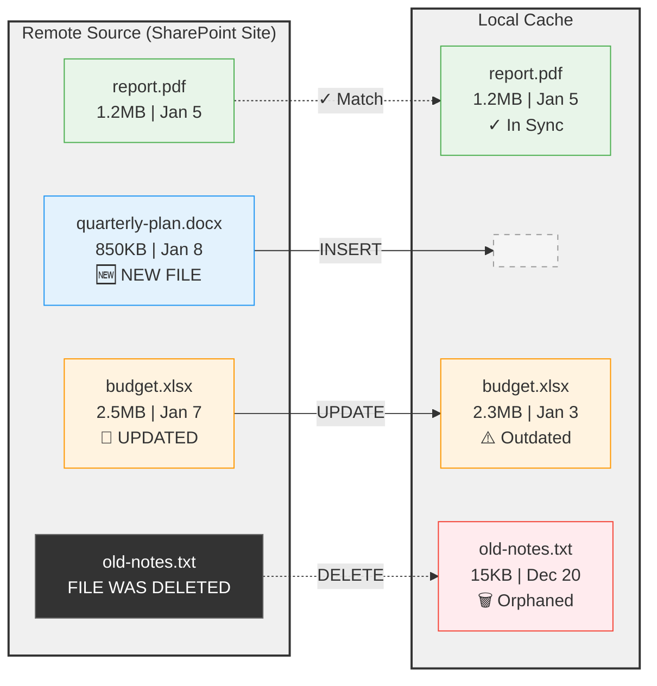

# Briefing 3: Synchronization - Keeping the Cache Current

## Summary

Synchronization is how CachedFileFolders keeps your local cache aligned with external sources. The system detects three types of changes: **INSERT** (new files), **UPDATE** (modified files), and **DELETE** (removed files). While bulk synchronization with automatic mark-and-sweep is a powerful capability, it's entirely optional - you can manage files individually if that suits your use case better.

**Key Insight:** Synchronization enables powerful separation of concerns - change detection, retrieval, authentication, retries, and serialization are handled by the sync layer, allowing your business logic to focus purely on processing files as a simple filesystem walk.

---

## The Synchronization Problem

Here's what happens when a remote source changes over time while your local cache sits idle:



**Sync actions needed:**
- 🔵 **INSERT** (`quarterly-plan.docx`) - New file on remote, not in cache yet
- 🟠 **UPDATE** (`budget.xlsx`) - File changed on remote (larger size, newer date)
- 🔴 **DELETE** (`old-notes.txt`) - File in cache but removed from remote source
- ✓ **No Action** (`report.pdf`) - Already in sync

Synchronization detects these mismatches and brings the cache current automatically.

---

## Why Synchronization Matters: Separation of Concerns

One of the most valuable aspects of CachedFileFolders' synchronization is architectural: it **separates infrastructure concerns from business logic**.

**Infrastructure concerns handled by sync:**
- Change detection (what's new, modified, or deleted?)
- Retrieval (downloading files from external sources)
- Authentication (OAuth tokens, API keys, credentials)
- Latency and retries (network failures, timeouts)
- Serialization (converting data to files)

**Your business logic:**
- Process files as a simple filesystem walk
- Read cached files, analyze content, generate outputs
- Store results in slave directories
- No API calls, no authentication, no network code

```python
# Synchronization handles all the hard infrastructure stuff
result = await cache_grouping.resync_bulk(proxies)

# Your business logic is just filesystem operations
for change in result.changes:
    if change.change_type == ChangeType.INSERT:
        # New file appeared - process it
        content = change.cur.file_path.read_text()
        analysis = analyze_document(content)
        
        # Save results to slave directory
        (change.cur.slave_dir_path / "analysis.json").write_text(analysis)
```

This separation means you can develop and test business logic independently, swap external sources easily, and keep your code focused on what matters to your domain.

---

## Three Types of Changes

When synchronizing, the cache detects three types of changes:

### INSERT - New File Added

A file with this `(grouping_key, ref_path)` combination wasn't in the cache before.

```python
change.change_type == ChangeType.INSERT
change.cur         # CachedFileRef - the new file
change.old         # None - didn't exist before
```

**Typical actions:**
- Process the new file (OCR, parsing, indexing)
- Store processing artifacts in slave directory
- Queue background jobs using slave_dir
- Create metadata tracking

### UPDATE - Existing File Modified

A file with this `(grouping_key, ref_path)` was already cached, but the external source has a newer version.

```python
change.change_type == ChangeType.UPDATE
change.cur         # CachedFileRef - the new version
change.old         # CachedFileRef - the old version (briefly available)
```

**Typical actions:**
- Reprocess the updated file
- Update processing artifacts
- Preserve selected metadata from old version
- Note: slave directory persists through updates (you control what to refresh)

### DELETE - File Removed from Source

A file was in the cache, but wasn't included in the sync (removed from external source).

```python
change.change_type == ChangeType.DELETE
change.cur         # None - no longer exists
change.old         # CachedFileRef - the deleted file (briefly available)
```

**Typical actions:**
- Remove from search indexes or databases
- Look up identifiers stored in slave_dir for cleanup
- Cancel queued jobs
- Note: Both file and slave directory are deleted after sync completes

---

## Bulk Synchronization (Optional but Powerful)

The `resync_bulk()` method provides automatic mark-and-sweep synchronization:

```python
# Gather proxies from external source
proxies = sharepoint_factory.scan_files(max_files=1000)

# Sync: inserts new, updates changed, marks missing for deletion
result = await cache_grouping.resync_bulk(
    file_proxies=proxies,
    max_concurrent_requests=5,
    upsert_fail_policy="RETAIN_OLD"  # Keep old file if download fails
)

# Process the changes
for change in result.changes:
    print(f"{change.change_type.value}: {change.ref_path}")
    # Handle INSERT, UPDATE, DELETE as needed
```

**How mark-and-sweep works:**
1. **Mark phase**: Each proxy in the batch marks its cache entry as "seen"
2. **Upsert phase**: New/changed files are downloaded and cached
3. **Sweep phase**: Any files NOT marked as "seen" are deleted (removed from source)

**Result:** Your cache mirrors the external source after sync completes.

### resync_bulk() vs resync_sweep()

Under the hood, there are actually two synchronization methods:

- **`resync_sweep()`** - The most fundamental method, providing fine-grained control over synchronization behavior including parallelization strategies, retry logic, failure handling, and custom change processing callbacks. This is the low-level workhorse.

- **`resync_bulk()`** - A convenience wrapper around `resync_sweep()` that handles common use cases with sensible defaults. It simplifies the API by managing concurrency, batching, and result collection automatically.

For most use cases, `resync_bulk()` is sufficient and recommended. However, for highly specialized or performance-optimized scenarios—such as custom throttling strategies, specialized error recovery, or fine-tuned parallelization—developers should consider using `resync_sweep()` directly for maximum control.

---

## Individual File Management (Also Valid)

Bulk sync is powerful but **not required**. You can manage files individually:

```python
# Add or update a single file
change = await cache_grouping.upsert_file(proxy)

# Delete a single file
cache_grouping.delete_file(ref_path)

# Check what's in the cache
for cached_ref in cache_grouping.files():
    print(cached_ref.ref_path)
```

**When to use individual management:**
- Event-driven systems (webhook notifications of changes)
- User uploads (one file at a time)
- Selective caching (not mirroring entire source)
- Custom change detection logic
- Does not trigger mark-and-sweep deletion

There's no requirement to use bulk synchronization - pick the approach that fits your use case.

---

## The ChangeNotice Object

Every change (INSERT, UPDATE, DELETE) is represented by a `ChangeNotice`:

```python
class ChangeNotice:
    change_type: ChangeType          # INSERT, UPDATE, or DELETE
    ref_path: str                    # The file's ref_path
    grouping_key: Optional[tuple]    # The file's grouping_key
    
    cur: Optional[CachedFileRef]     # New/current file (None for DELETE)
    old: Optional[CachedFileRef]     # Old file (None for INSERT)
    
    file_name: str                   # Basename of the file
```

**Key properties:**
- `cur` - The current file (present for INSERT and UPDATE, None for DELETE)
- `old` - The old file (present for UPDATE and DELETE, None for INSERT)
- Both `cur` and `old` provide access to `file_path`, `slave_dir_path`, etc.

**Important:** The `old` reference is only valid briefly - usually just during the change processing callback or result iteration. After that, deleted files and their slave directories are removed.

---

## Using Slave Directories During Sync

Slave directories can play important roles during synchronization, though this requires custom coding:

**For new files (INSERT):**
```python
if change.change_type == ChangeType.INSERT:
    # Queue analysis job and save the job ID
    job_id = queue_ocr_job(change.cur.file_path)
    (change.cur.slave_dir_path / "jobs.yaml").write_text(f"ocr_job: {job_id}")
```

**For deleted files (DELETE):**
```python
if change.change_type == ChangeType.DELETE:
    # Read database keys from slave_dir before cleanup
    meta = change.old.metadata()
    if db_key := meta.get('vector_db_id'):
        vector_db.delete(db_key)
    # Note: old file and slave_dir will be deleted after this callback
```

**For updated files (UPDATE):**
```python
if change.change_type == ChangeType.UPDATE:
    # Check if reprocessing is needed
    old_meta = change.old.metadata()
    if old_meta.get('ocr_version') != CURRENT_OCR_VERSION:
        reprocess_with_new_ocr(change.cur.file_path)
```

The slave directory pattern provides a flexible workspace for orchestrating jobs, tracking processing state, and maintaining referential integrity with external systems. The specifics depend on your application's needs.

---

## Change Detection: How Does It Know?

The cache determines change type through a combination of:

1. **Presence check**: Is `(grouping_key, ref_path)` in the cache?
   - Not present → **INSERT**
   - Present → might be UPDATE

2. **Similarity check** (if proxy implements `looks_same()`):
   - File size and modification time match → no change (skip download)
   - Different → **UPDATE**

3. **Mark-and-sweep** (for bulk sync):
   - Files in cache but NOT in proxy batch → **DELETE**

This multi-stage approach minimizes expensive downloads while keeping the cache current.

---

## Concurrent Downloads and Retry Logic

`resync_bulk()` handles concurrent downloads automatically:

```python
result = await cache_grouping.resync_bulk(
    file_proxies=proxies,
    max_concurrent_requests=5,        # Download 5 files simultaneously
    upsert_fail_policy="RETAIN_OLD"   # Keep old file if download fails
)

# Check for failures
if result.failures:
    for ref_path, error in result.failures.items():
        print(f"Failed to download {ref_path}: {error}")
```

**Failure policies:**
- `"RETAIN_OLD"` - Keep existing cached file if download fails (safe default)
- `"DELETE"` - Remove cached file if download fails (enforce source-of-truth)

The system handles network timeouts, retries, and parallel operations, keeping your code simple.

---

## Processing Patterns

### Pattern 1: Process During Sync

```python
result = await cache_grouping.resync_bulk(proxies)

for change in result.changes:
    if change.change_type == ChangeType.INSERT:
        process_new_file(change.cur)
    elif change.change_type == ChangeType.UPDATE:
        reprocess_updated_file(change.cur)
    elif change.change_type == ChangeType.DELETE:
        cleanup_deleted_file(change.old)
```

**Pros:** Immediate processing  
**Cons:** Blocks until all files processed

### Pattern 2: Queue Jobs, Process Later

```python
result = await cache_grouping.resync_bulk(proxies)

for change in result.changes:
    if change.change_type in [ChangeType.INSERT, ChangeType.UPDATE]:
        job_id = job_queue.enqueue("process_document", change.cur.file_path)
        # Track job in slave directory
        (change.cur.slave_dir_path / "jobs.yaml").write_text(f"job_id: {job_id}")

# Background workers process jobs later
```

**Pros:** Fast sync, asynchronous processing  
**Cons:** Need job queue infrastructure

### Pattern 3: Filesystem Walk (Ignore Sync Events)

```python
# Sync in background
await cache_grouping.resync_bulk(proxies)

# Later: process everything as a filesystem walk
for cached_ref in cache_grouping.files():
    meta = cached_ref.metadata()
    if not meta.get('processed'):
        process_file(cached_ref)
        meta.overwrite_source_file({'processed': True})
```

**Pros:** Simple, decoupled from sync  
**Cons:** Must track processing state yourself

---

## Key Takeaways

1. **Three Change Types** = INSERT, UPDATE, DELETE
   - Detected automatically during synchronization
   - Represented by `ChangeNotice` objects with `cur` and `old` references

2. **Separation of Concerns** = Sync handles infrastructure, you handle business logic
   - Sync: change detection, retrieval, authentication, retries, serialization
   - You: process files as simple filesystem operations
   - Clean architectural boundary

3. **Bulk Sync is Optional** = Use what fits your use case
   - `resync_bulk()` with mark-and-sweep for mirroring external sources
   - Individual `upsert_file()` / `delete_file()` for event-driven systems
   - Both approaches are valid

4. **Slave Directories During Sync** = Flexible workspace for orchestration
   - Queue jobs and save job IDs for new files
   - Look up database keys for cleanup on deletes
   - Track processing state and versions on updates
   - Requires custom coding but enables powerful patterns

5. **Smart Change Detection** = Minimize expensive downloads
   - `looks_same()` enables cheap comparison (size/mtime)
   - Only changed files trigger downloads
   - Mark-and-sweep finds deletions automatically

**Mental Model:** Synchronization is like a smart assistant that watches your external sources, fetches only what's new or changed, and presents you with a clean, local filesystem to work with - no API calls, no authentication, just files.

---

## What's Next?

**Briefing 4** will cover **Real-World Patterns** - the CacheGrouping facet for cleaner code, metadata and event logging conveniences, and when to use CachedFileFolders versus alternative approaches.

