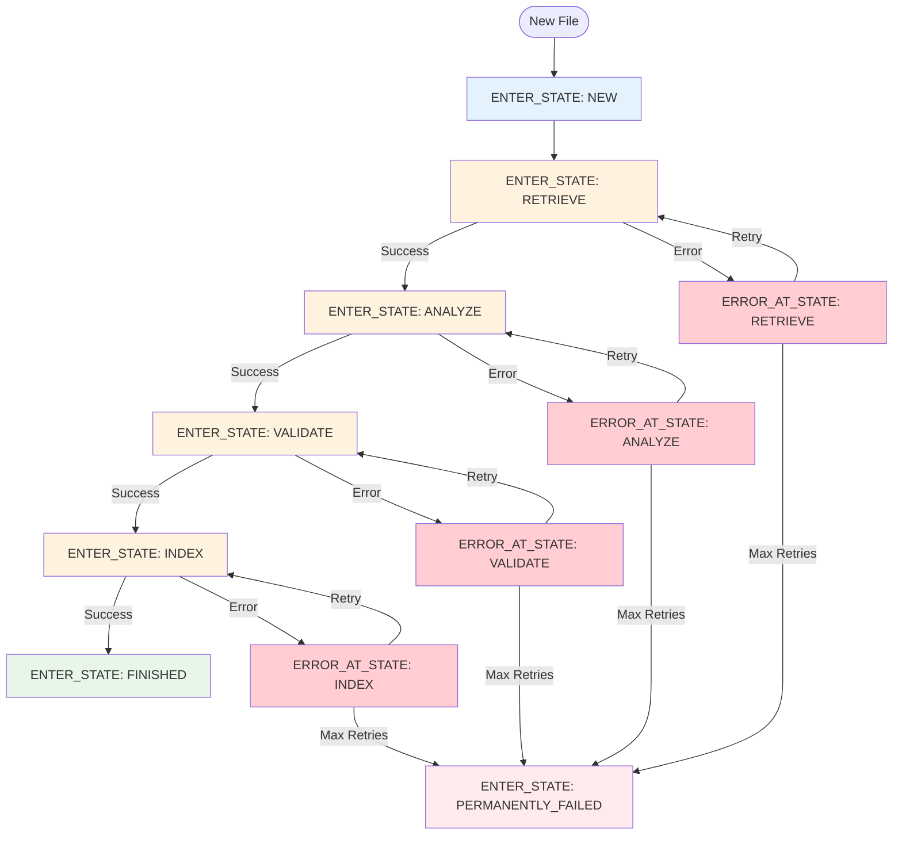

# Briefing 4: Event Logging for Processing Pipelines

## Summary

Event logging provides a lightweight, file-based way to track processing state and coordinate multi-stage pipelines without needing a database or message queue. Every cached file can have its own event log living in its slave directory, making it easy to orchestrate complex document processing workflows. Events are human-browsable files with structured names, making the system debuggable and observable.

**Key Insight:** Event logging turns each cached file's slave directory into a mini-database that tracks "what happened" and "what's the current state"—perfect for orchestrating OCR → analysis → validation → indexing pipelines where each stage needs to know what came before. Throughout this briefing we use the same terminology (`ENTER_STATE`, `ERROR_AT_STATE`) that our `PrimitiveStateMachineLog` convenience class adopts, so the transition from raw events to the helper API feels natural.

---

## The Problem: Coordinating Multi-Stage Processing

Imagine you're building a document processing system:

1. **Download** documents from SharePoint (sync phase)
2. **OCR** the documents to extract text (background job)
3. **Analyze** the text for key information (another job)
4. **Validate** the results with a human reviewer (async process)
5. **Index** into search system (final step)

**Questions you need to answer:**
- Which files need OCR? (haven't been processed yet)
- Which files are currently being processed? (avoid duplicate work)
- Which files failed OCR and need retry? (error recovery)
- Which files are waiting for human validation? (workflow state)
- What's the current status of file X? (monitoring/debugging)

**Traditional solutions:**
- Database with processing state tables (overhead, separate system)
- Message queue with job tracking (complexity, infrastructure)
- Custom log files (parsing, querying, race conditions)

**Event logging solution:** Store events as files right next to each cached document in its slave directory. No separate database, no message broker - just files.

---

## The event_log() Convenience Method

Every `CachedFileRef` exposes an `event_log()` method that returns a ready-to-use `PrimitiveEventLog`:

```python
# During synchronization or file processing
for change in sync_result.changes:
    if change.change_type == ChangeType.INSERT:
        # Get event log for this specific file
        log = change.cur.event_log()
        
        # Record that OCR is needed
        log.create_event("OCR-STATUS", "QUEUED")
        
        # Queue the actual OCR job
        job_id = ocr_queue.enqueue(process_ocr, change.cur.file_path)
        log.create_event("OCR-JOB", "SUBMITTED", {"job_id": job_id})
```

**Where events live:**
```
cached_file.pdf
cached_file.pdf._slave/
  ├── events/                    # Default subdirectory for events
  │   ├── e001_OCR-STATUS@QUEUED.yaml
  │   └── e002_OCR-JOB@SUBMITTED.yaml
  ├── metadata.yaml
  └── ocr_output.txt
```

The event log is created automatically - no setup needed. Just call `event_log()` and start creating events.

---

## Event File Naming Convention

Event information (label, value, sequence) is encoded into the filename: `e{seq}_{LABEL}@{VALUE}.ext`

**Examples:**
```
e001_ENTER_STATE@NEW.yaml
e002_ENTER_STATE@RETRIEVE.yaml
e003_ENTER_STATE@ANALYZE.yaml
e004_ERROR_AT_STATE@ANALYZE.yaml
e005_ENTER_STATE@ANALYZE.yaml
e006_ENTER_STATE@FINISHED.yaml
```

This makes events human-browsable with standard tools (`ls`, `find`, `grep`) and preserves timeline order.

---

## Creating Events

Events can be created with or without data payloads:

```python
# Marker event (no data) - just a status flag
log.create_event("ENTER_STATE", "RETRIEVE")

# Dict payload - store structured metadata
log.create_event("ANALYSIS", "SUMMARY", {
    "char_count": 15420,
    "confidence": 0.94,
    "duration_secs": 45
})
```

Even more formal, validated structures can be sent by passing Pydantic data structures.

---

## Querying Events

```python
# has_event() - Quick check: what's the current value of this label?
current_stage = log.has_event("ENTER_STATE")  # Returns current state value or False

# latest_values() - Get snapshot of ALL labels at once
values = log.latest_values()  # MappingProxyType({'ENTER_STATE': 'ANALYZE', 'ERROR_AT_STATE': 'RETRIEVE'})

# events() - Iterate full timeline with filtering
for event in log.events(label_glob="ERROR_*"):  # Filter by pattern
    print(f"{event.label_value}: {event.contents()}")
```

---

## Recommended Pattern: Pipeline State Machine

Event logging is flexible—use any labeling scheme that fits your needs. One clean, consistent pattern pattern for making event logging pracitcal are state mechines.  A simple implementation would **use a single `ENTER_STATE` label where the value represents the current stage**, combined with an `ERROR_AT_STATE` label for error tracking. This mirrors the interface of `PrimitiveStateMachineLog`, making it effortless to layer the helper on top of existing logs later.  You can add more labels for things like capturing data or signifying important conditions, but these two kinds of log entries can allow you to model most moderately complex process flows.

This pattern keeps your event logs simple and queryable. All examples in this briefing will follow this pattern to help you internalize it.

### The Pattern



**Key elements:**
- **`ENTER_STATE` label**: Tracks current stage (NEW → RETRIEVE → ANALYZE → VALIDATE → INDEX → FINISHED)
- **`ERROR_AT_STATE` label**: Records errors with stage name as value (can have multiple errors per stage)
- **Stage progression**: Each `ENTER_STATE` event moves to the next stage
- **Error recovery**: Check error count at a stage to decide retry vs permanent failure

### Why This Pattern Works

1. **Single source of truth**: `log.has_event("ENTER_STATE")` immediately tells you the current stage
2. **Clean progression**: Each stage is a value, not a separate label  
3. **Error tracking**: `ERROR_AT_STATE` events correlate with stages
4. **Easy querying**: Find all files at "ANALYZE" or with errors at "RETRIEVE"
5. **Extensible**: Add new stages by adding new values, no schema changes

### Basic Implementation

```python
async def process_document_pipeline(cached_ref: CachedFileRef):
    """
    Multi-stage pipeline: NEW → RETRIEVE → ANALYZE → VALIDATE → INDEX → FINISHED
    """
    log = cached_ref.event_log()
    current_stage = log.has_event("ENTER_STATE")  # Returns current state value or False
    
    try:
        # Initialize if new file
        if not current_stage:
            log.create_event("ENTER_STATE", "NEW")
            current_stage = "NEW"
        
        # Stage 1: Retrieve data
        if current_stage == "NEW":
            log.create_event("ENTER_STATE", "RETRIEVE")
            raw_data = retrieve_from_source(cached_ref.file_path)
            (cached_ref.slave_dir_path / 'raw.json').write_text(raw_data)
            current_stage = "RETRIEVE"
        
        # Stage 2: Analyze
        if current_stage == "RETRIEVE":
            log.create_event("ENTER_STATE", "ANALYZE")
            raw_data = (cached_ref.slave_dir_path / 'raw.json').read_text()
            analysis = perform_analysis(raw_data)
            (cached_ref.slave_dir_path / 'analysis.json').write_text(json.dumps(analysis))
            log.create_event("ENTER_STATE", "ANALYZE", {'entity_count': len(analysis)})
            current_stage = "ANALYZE"
        
        # Additional stages...
        # Stage 3: Validate, Stage 4: Index, Stage 5: Finish
        
    except Exception as e:
        # Log error at current stage
        log.create_event("ERROR_AT_STATE", current_stage or "", {
            'error_type': type(e).__name__,
            'error_message': str(e),
            'timestamp': datetime.now().isoformat()
        })
        raise

# Query by stage
def find_files_at_stage(cache_grouping, stage: str):
    """Find all files currently at a specific stage."""
    results = []
    for cached_ref in cache_grouping.files():
        log = cached_ref.event_log()
        if log.has_event("ENTER_STATE") == stage:
            results.append(cached_ref)
    return results

# Find files with errors
def find_files_with_errors_at_stage(cache_grouping, stage: str):
    """Find files that have errors at a specific stage."""
    results = []
    for cached_ref in cache_grouping.files():
        log = cached_ref.event_log()
        errors = list(log.events(label_glob="ERROR_AT_STATE", value_glob=stage))
        if errors:
            results.append((cached_ref, errors))
    return results
```

**Event timeline example:**
```
e001_ENTER_STATE@NEW.yaml
e002_ENTER_STATE@RETRIEVE.yaml
e003_ENTER_STATE@ANALYZE.yaml
e004_ERROR_AT_STATE@ANALYZE.yaml            # Error encountered
e005_ENTER_STATE@ANALYZE.yaml                   # Retry from same stage
e006_ENTER_STATE@VALIDATE.yaml
e007_ENTER_STATE@INDEX.yaml
e008_ENTER_STATE@FINISHED.yaml                  # Success!
```

All subsequent examples in this briefing will use this pattern.

---

## Background Job Coordination

Event logs coordinate asynchronous workers without a central coordinator. Each worker checks `log.has_event('ENTER_STATE')` to find files at its stage:

```python
# Worker specializing in the RETRIEVE stage
def retrieval_worker():
    for cached_ref in cache_grouping.files():
        log = cached_ref.event_log()
        
        if log.has_event('ENTER_STATE') == 'NEW':
            try:
                log.create_event('ENTER_STATE', 'RETRIEVE')
                data = retrieve_from_source(cached_ref.file_path)
                save_to_slave_dir(cached_ref, data)
                log.create_event('ENTER_STATE', 'RETRIEVE')
            except Exception as e:
                log.create_event('ERROR_AT_STATE', 'RETRIEVE', {'error': str(e)})

# Worker specializing in the ANALYZE stage
def analysis_worker():
    for cached_ref in cache_grouping.files():
        log = cached_ref.event_log()
        
        if log.has_event('ENTER_STATE') == 'RETRIEVE':
            try:
                log.create_event('ENTER_STATE', 'ANALYZE')
                data = load_from_slave_dir(cached_ref)
                analysis = perform_analysis(data)
                save_analysis(cached_ref, analysis)
                log.create_event('ENTER_STATE', 'ANALYZE')
            except Exception as e:
                log.create_event('ERROR_AT_STATE', 'ANALYZE', {'error': str(e)})
```

**Key benefits:**
- No message broker or job queue required
- Workers are stateless - just check event logs
- Natural load balancing - first worker to see a file claims it
- **External tool integration**: Event logs work with orchestration tools (Airflow, Luigi, Prefect) and FSM libraries by importing `PrimitiveEventLog` and pointing at the slave directory.  Even when using workflow tools, event logs can give you broader visibility and undestanding of your processing pipelines.
- **Concurrency safe**: Multiple processes can create events simultaneously without conflicts

---

## Error Recovery

Error recovery is straightforward: check `ERROR_AT_STATE` and count errors to decide whether to retry or mark as permanently failed:

```python
for cached_ref in cache_grouping.files():
    log = cached_ref.event_log()
    error_stage = log.has_event('ERROR_AT_STATE')
    
    if error_stage:
        error_count = sum(1 for e in log.events(label_glob='ERROR_AT_STATE', value_glob=error_stage))
        
        if error_count < 3:
            retry_stage(cached_ref, error_stage)  # Retry
        else:
            log.create_event('ENTER_STATE', 'PERMANENTLY_FAILED')  # Give up
```

Resume interrupted pipelines by checking `ENTER_STATE` and continuing from that stage - no special handling needed.

---

## Human-Browsable Debugging

One of the most underrated features: you can debug with standard Unix tools.

```bash
# See all events for a file (using ENTER_STATE pattern)
$ ls cached_file.pdf._slave/events/
e001_ENTER_STATE@NEW.yaml
e002_ENTER_STATE@RETRIEVE.yaml
e003_ENTER_STATE@ANALYZE.yaml
e004_ERROR_AT_STATE@ANALYZE.yaml
e005_ENTER_STATE@ANALYZE.yaml
e006_ENTER_STATE@FINISHED.yaml

# Find all files currently being analyzed
$ find . -name "*ENTER_STATE@ANALYZE*"
./client1/legal/contract.pdf._slave/events/e003_ENTER_STATE@ANALYZE.yaml
./client2/hr/policy.pdf._slave/events/e002_ENTER_STATE@ANALYZE.yaml

# Find files that have errors
$ find . -name "*ERROR_AT_STATE*"
./client1/legal/contract.pdf._slave/events/e004_ERROR_AT_STATE@RETRIEVE.yaml
./client3/finance/report.pdf._slave/events/e003_ERROR_AT_STATE@ANALYZE.yaml

# Count completed files
$ find . -name "*ENTER_STATE@FINISHED*" | wc -l
142

# Check error details
$ cat ./client1/legal/contract.pdf._slave/events/e004_ERROR_AT_STATE@RETRIEVE.yaml
error_type: ConnectionError
error_message: Failed to connect to API
timestamp: '2025-01-07T14:23:45'
retry_count: 1

# Timeline of what happened (most recent first)
$ ls -lt cached_file.pdf._slave/events/
```

**Operators, DevOps, and AI agents** can inspect the system without specialized tools.

---

## When to Use Event Logging

Best for document/file processing pipelines where each file or group of files has their own "short" event queuue. Not ideal in cases where a single log requires high-frequency updates (thousands/second) or complex cross-file queries.

---

## Key Takeaways

1. **Recommended Pattern: ENTER_STATE/ERROR_AT_STATE** - Use a single `ENTER_STATE` label with stage names as values (NEW → RETRIEVE → ANALYZE → VALIDATE → INDEX → FINISHED), plus `ERROR_AT_STATE` for errors. This creates a clean finite state machine and lines up with the `PrimitiveStateMachineLog` helper for a drop-in abstraction later.

2. **Human-Browsable Files** - Events are files (`e{seq}_{LABEL}@{VALUE}.yaml`) you can inspect with `ls`, `find`, and `grep`. No special tools needed for debugging or monitoring.

3. **Coordination Without Infrastructure** - Workers check event logs to claim work and advance stages. No message broker, job queue, or central database required. Integrates with Airflow, Luigi, and helper classes like `PrimitiveStateMachineLog`.

**Mental Model:** Event logs turn each file's slave directory into a lightweight, file-based state machine visible to any process or tool.

---

## What's Next?

**Briefing 5** will cover **Metadata and Cache Queries** - the `metadata()` method for simple per-file state, walking the cache with `files()`, and the powerful `filtered_map()` method for querying and transforming cached files.

