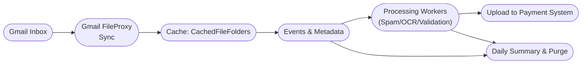

# Briefing 6: Applying the Patterns — Gmail Invoice Intake

## Scenario Overview

A finance team routes payment requests to a shared Gmail inbox. Messages arrive throughout the day (often with PDFs that need OCR) and must be triaged within a minute or two. The system needs to:

- Pull new emails quickly, including attachments, and cache them consistently.
- Run a lightweight pipeline that flags spam, validates attachments, and pushes qualified invoices into a payment system for human review.
- Maintain a short retention window (36 hours) so the cache stays lean.
- Produce an end-of-day summary showing processed vs rejected items and why.

Rather than designing every service from scratch, we’ll map this workload onto the building blocks introduced in previous briefings: Gmail proxies, event logs, metadata snapshots, and query helpers.



---

## Storage Planning for the Gmail Cache

Before wiring up the sync job, decide how this cache will be organized on disk. The `grouping_pattern` is fixed for the lifetime of the cache, so choose one that keeps operations intuitive while supporting retention policies and reporting.

**Grouping pattern ideas:**

- `"{mailbox}/{label}/"` keeps data separated by Gmail label, so finance can rotate or retire labels without touching other flows.
- `"clients/{client_code}/mailboxes/{mailbox}/"` is handy when one service account serves multiple clients; purging a client’s history becomes one grouping delete.
- `"pipelines/invoice-intake/runs/{run_date}/"` lets you create short-lived groupings per day; a cleanup job can drop the previous day in one call.
- `"teams/{team}/mailbox/{mailbox}/"` helps when multiple departments share the platform but need isolated retention windows.
- `None` (single grouping) works for proof-of-concept runs, but expect to rebuild once retention and reporting requirements solidify.

Ref paths can evolve, but consistent conventions make querying, monitoring, and cleanup painless.

**Ref_path patterns to consider:**

- Emails: `"emails/{yyyy}/{mm}/{dd}/{gmail_id}.eml"` keeps directories shallow while preserving Gmail’s immutable ID.
- Attachments: `"emails/{gmail_id}/attachments/{sequence:02d}-{safe_filename}"` mirrors Gmail’s structure and avoids filename collisions.
- Derived OCR artifacts: `"emails/{gmail_id}/artifacts/ocr/{attachment_id}.json"` so processed data sits beside its source.
- Payments-ready bundle: `"uploads/{yyyy}/{mm}/{dd}/{invoice_number}.zip"` gives auditors an obvious path to review outbound payloads.
- Spam/quarantine: `"spam/{yyyy}/{mm}/{dd}/{gmail_id}.json"` isolates noise for separate retention policies.

Document these choices alongside the cache setup so future maintainers know how to interpret the directory tree and when it is safe to remove a grouping or rename a ref path segment.

---

## 1. High-Frequency Sync from Gmail

Use the Gmail FileProxy helpers (`file_proxy_gmail.py`) to bring emails and attachments into `CachedFileFolders`. These proxies hide the Gmail API details, extract attachments, and drop everything into our standard cache layout.

```python
factory = GmailEmailFileProxyFactory(
    service_account_info=creds,
    user_email="inbox@client.com",
    min_img_kbytes=20
)

proxies = factory.scan_messages(received_after=cutoff)
cache.grouping(["inbox@client.com", "INBOX"]).resync_bulk(proxies, change_receiver)
```

- **Polling cadence:** A lightweight job (cron/systemd) runs every 30–60 seconds. For inspiration, see `gmail_sync.py`, which demonstrates a dual-mode synchronizer (fast checks + periodic sweeps) using these same primitives.
- **Attachments:** Each attachment becomes its own cached file under the email’s `_files/` folder; metadata records which ones were extracted vs kept inline.

---

## 2. Immediate Metadata Snapshot

At ingest time, capture the facts that the pipeline will repeatedly need: sender, subject keywords, attachment count, initial spam score, etc. Writing them once avoids rereading raw EML files.

```python
meta = change.metadata()
meta.update({
    "processing_stage": "FETCHED",
    "invoice_count": len(attachment_refs),
    "spam_score": heuristic_score(change.cur.file_path),
    "received_at": datetime.utcnow().isoformat()
})
meta.write()
```

- Encourage teams to agree on core keys (`processing_stage`, `final_status`, `amount_total`, `anomaly_tags`, `upload_reference`).
- Metadata stays tiny and cheap; no file is created until `write()` runs, so unused caches stay empty.

---

## 3. Event Log + Optional State Machine Wrapper

Every cached email gets an event log (Briefing 4) that records the lifecycle. A typical sequence:

1. `ENTER_STATE@FETCHED`
2. `ENTER_STATE@OCR_PENDING`
3. `ENTER_STATE@VALIDATION`
4. `ENTER_STATE@UPLOADED` or `ENTER_STATE@REJECTED`
5. `ERROR_AT_STATE@VALIDATION` (when anomalies are detected)

For convenience, the `PrimitiveStateMachineLog` wrapper can emit these transitions while enforcing consistent payloads (e.g., rejection reasons). Keep payloads small (just pointers to data stored elsewhere in the slave dir).

---

## 4. Processing Pipeline (High-Level Stages)

### a. Spam / Legitimacy Check

- Run quick heuristics (domain allowlist, text scoring).
- Update metadata (`spam_score`, `suspected_spam = true`) and log `ERROR_AT_STATE` if rejected outright.

### b. Attachment & OCR Handling

- Iterate attachment files from the cache (`_files/…`); send PDFs through OCR or structured extractors.
- Store results in the slave directory (`artifacts/ocr.json`) and summarize fields (amounts, vendor IDs) in metadata.

### c. Validation & Anomaly Detection

- Cross-check totals across attachments and email body.
- Record anomalies in metadata (`anomaly_tags = [...]`) and log `ERROR_AT_STATE@VALIDATION` with a brief payload (`{"reason": "missing_po_number"}`).

### d. Upload to Payment System

- When everything passes, call the external API. Save response identifiers in metadata (`upload_reference`, `uploaded_at`), and emit `ENTER_STATE@UPLOADED`.
- Rejections end with `ENTER_STATE@REJECTED` and a final summary in metadata (`final_status`, `reject_reason`).

Each stage runs quickly by reading the cached files it needs, updating metadata, and logging the state transition. Long-running tasks (OCR) can live in background workers that pick up items based on `processing_stage`.

---

## 5. Daily Summary & Monitoring

### Querying

- Use `filtered_map()` (or `files()` for smaller sets) to collect data for the report:

```python
rows = filtered_map(
    cache.grouping(["inbox@client.com", "INBOX"]),
    include_metadata=True,
    mapper=lambda entry: {
        "path": str(entry.cached_ref.file_path),
        "status": entry.metadata.data.get("final_status"),
        "rejection_reason": entry.metadata.data.get("reject_reason"),
        "amount": entry.metadata.data.get("amount_total"),
        "received": entry.metadata.data.get("received_at")
    }
)
```

- Group by `final_status` for counts; list rejected items with their `reject_reason` and timestamps. Combine with event log lookups if you need the last error payload.

### Report Output

- Produce a short CSV/JSON summary, email it to stakeholders, and archive it along with the cache.
- Optionally drive dashboards or Slack alerts by reusing the same query results.

### Real-Time Monitoring

- Operators can inspect current queue by viewing event log latest values:

```python
log = PrimitiveEventLog(entry.cached_ref.slave_dir_path / "events")
current_stage = log.latest_values().get("ENTER_STATE")
```

---

## 6. Retention & Cleanup (≤36 Hours)

- Schedule a cleanup job that walks `cache.grouping(...).files()` and checks metadata timestamps (`processed_at`, `received_at`).
- Delete cached emails + slave dirs older than 36 hours **once they reach a terminal state** (`UPLOADED` or `REJECTED`). To be safe, run cleanup after the daily report finishes.
- Remove orphaned artefacts (`artifacts/` files) as part of the same pass; they live under the slave directory, so deleting the whole folder keeps things tidy.

---

## 7. Putting It Together

1. **Sync layer** (see `gmail_sync.py` for an example): keeps the cache fresh via the Gmail FileProxy factory.
2. **Processing workers:** read from the cache, update metadata/state logs, perform OCR and validation, and drive uploads.
3. **Metadata + logs:** provide the canonical facts for automation, dashboards, and daily summaries without introducing a database.
4. **Retention job:** enforces storage limits and ensures only relevant emails stay on disk.

With these components, the Gmail invoice pipeline remains observable, maintainable, and scalable.

---

## Related Code Examples

The sync layer for this scenario maps onto these examples in this directory:

- [`gmail_sync.py`](gmail_sync.py) - a dual-mode Gmail synchronizer (fast checks + periodic sweeps) built on the Gmail FileProxy factory; the closest concrete match for this briefing.
- [`outlook_email_sync.py`](outlook_email_sync.py) - the same mailbox-intake shape for Microsoft 365 / Outlook.
