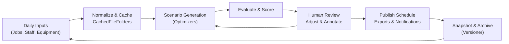

# Briefing 7: Applying the Patterns — Staff Scheduling & Crew Assignment

## Scenario Overview

A furniture delivery and installation company plans its daily work by assembling crews (people + equipment) and mapping them to job stops. Schedulers pull data from multiple sources — upcoming jobs, team availability, equipment maintenance, past assignments, skill matrices, service levels, and labor rules. The scheduling tool helps coordinators iterate toward an optimal daily plan:

- Gather structured inputs that describe constraints and opportunities.
- Run automated scenario generation to propose possible assignments.
- Capture human adjustments, comments, and ratings for each scenario.
- Promote a “published” solution that feeds downstream execution systems (dispatch, payroll, customer notifications).
- Retain historical schedules for audits and trend analysis.



CachedFileFolders supplies the durable store for inputs, generated solutions, evaluator artifacts, and reports. Event logs and metadata snapshots keep the iteration loop transparent while the CachedGroupingVersioner enables rich “what-if” versioning.

---

## Storage Planning for the Scheduling Cache

Schedulers revisit the same crews every day, so plan cache structure to keep history orderly and enable targeted cleanups.

**Grouping pattern ideas:**
- `"schedules/{region}/{yyyy}/{mm}/{dd}/"` keeps one grouping per service date, letting teams archive or restore specific days in isolation.
- `"regions/{region}/workstreams/{stream}/"` works when parallel dispatch teams (delivery vs install) run their own board.
- `"drafts/{region}/{week_iso}/"` can hold in-progress iterations across the week before they are copied into the final schedule grouping.
- `"analyst/{user_id}/sandbox/"` creates personal staging areas for back-testing algorithms without affecting production history.
- `None` is acceptable for proofs-of-concept but loses the selective-retention benefits above.

**Ref_path conventions to adopt:**
- Inputs: `"inputs/{timestamp_iso}/{artifact_name}.json"` for structured feeds (jobs, availability, people, skills).
- Working scenarios: `"scenarios/{scenario_id}/solution.json"` describing crew/job assignments.
- Evaluations: `"scenarios/{scenario_id}/evaluation/{metric}.json"` with scoring outputs (utilization, overtime risk).
- Manual notes: `"scenarios/{scenario_id}/annotations/{user_id}.md"` capturing human feedback.
- Published schedule: `"published/solution.json"` plus `"published/exports/{format}/{file_name}"` for dispatch packets and CSVs.
- Version bundles: `"snapshots/{tag}/"` storing exports created by `CachedGroupingVersioner.snapshot(...)`.

Document these choices with the scheduling playbook so future maintainers understand where “official” solutions live versus exploratory drafts.

---

## 1. Daily Input Intake & Normalization

Structured data (jobs, employees, trucks) arrive from HR, CRM, and maintenance systems. Use import workers to normalize and deposit them into CachedFileFolders before schedule generation begins.

```python
from totodev_pub.cached_file_folders import CachedFileFolders

cache = CachedFileFolders("schedules/{region}/{yyyy}/{mm}/{dd}/", root_dir="/schedule/cache")
grouping = cache.grouping(["north-hub", service_date.strftime("%Y"), service_date.strftime("%m"), service_date.strftime("%d")])

def ingest_inputs(input_payloads):
    for artifact_name, payload in input_payloads.items():
        grouping.upsert_json(
            ref_path=f"inputs/{datetime.utcnow().isoformat()}Z/{artifact_name}.json",
            data=payload,
            metadata={"source": payload.get("source_system")}
        )
```

- **Refresh cadence:** Most teams sync raw inputs nightly, then rerun incrementally when day-of changes occur (call-outs, rush jobs).
- **Schema snapshots:** Keep canonical schemas under `inputs/latest/` for workers that only need the newest version.
- **Traceability:** Attach metadata fields (`source_system`, `version_id`, `import_batch`) so later evaluations can reference the exact input snapshot.

---

## 2. Metadata Snapshots for Scenario Iteration

Each time the optimizer or a human creates a scenario, write a metadata record capturing the scenario’s status, pedigree, and key KPIs. Keeping metadata small preserves quick lookups.

```python
meta = entry.metadata()
meta.update({
    "scenario_id": scenario_id,
    "stage": "DRAFT",
    "created_by": user_id,
    "derived_from": baseline_id,
    "objective_score": scores.get("objective_total"),
    "crew_conflicts": len(scores.get("conflicts", [])),
    "created_at": datetime.utcnow().isoformat()
})
meta.write()
```

- Recommended metadata keys: `stage` (DRAFT, REVIEW, PUBLISHED), `quality_band`, `notes_ref`, `baseline_solution`, `simulation_seed`.
- Update metadata on every evaluator pass to include `overtime_hours`, `drive_time_total`, `skill_mismatch_count`, enabling dashboards without re-reading entire solution files.
- Use `final_status` to distinguish scenarios that were rejected versus archived after publication.

---

## 3. Event Log + State Machine Wrapper

Mirror the collaboration lifecycle with an event log sequence:

1. `ENTER_STATE@INGESTED_INPUTS`
2. `ENTER_STATE@SCENARIO_GENERATED`
3. `ENTER_STATE@UNDER_REVIEW`
4. `ENTER_STATE@APPROVED` or `ENTER_STATE@DISCARDED`
5. `ENTER_STATE@PUBLISHED`
6. `ENTER_STATE@ARCHIVED`

`PrimitiveStateMachineLog` keeps transitions consistent and records payloads like conflict summaries or manual overrides:

```python
log = PrimitiveStateMachineLog(entry.cached_ref.slave_dir_path / "events")
log.enter_state("SCENARIO_GENERATED", payload={"generator": "annealing_v3", "baseline": baseline_id})
```

Use small payloads (pointers to larger artifacts stored alongside the scenario) to avoid bloating the log.

---

## 4. Scenario Generation & Evaluation Loop

### a. Seed Baseline & Constraints
- Load the latest `inputs/` artifacts and snapshot them with the scenario metadata (`inputs_ref_path`) so reproducibility is guaranteed.
- Quick validation passes check for missing skills, overlapping job windows, or unavailable assets. Record issues under `evaluation/preflight/`.

### b. Automated Scenario Generation
- Optimizers write `scenarios/{scenario_id}/solution.json` containing assignments, timestamps, and computed costs.
- Summaries go to metadata (`objective_score`, `crew_utilization_pct`) to drive shortlist sorting.
- Stash raw solver telemetry in `scenarios/{scenario_id}/artifacts/solver.log` if needed for debugging.

### c. Review & Human Adjustments
- UI writes reviewer notes to `annotations/` and updates metadata (`stage="UNDER_REVIEW"`, `reviewer=user_id`).
- Manual edits to the solution create derivative artifacts, such as `solution_overrides.json`, keeping the base solver output intact for comparison.

### d. Publish & Export
- Once approved, promote scenario metadata to `stage="PUBLISHED"` and capture `published_at` timestamp.
- Generate downstream formats: route manifests, crew checklists, SMS payloads. Save under `published/exports/`.
- Update event log with `ENTER_STATE@PUBLISHED` and attach summary metrics (crew count, total jobs).

---

## 5. Version Snapshots with CachedGroupingVersioner

Schedulers often explore multiple algorithms or need to roll back to a previous solution. Pair each daily grouping with `CachedGroupingVersioner` to snapshot the entire schedule package.

```python
from totodev_pub.cached_file_folders_support.cached_folders_versioner import CachedGroupingVersioner

versioner = CachedGroupingVersioner(grouping, branch="daily-schedules")
commit_hash = versioner.snapshot_commit(f"{service_date} published schedule")
versioner.tag(f"published-{service_date.isoformat()}", commit=commit_hash)
```

- Use branches like `drafts` versus `published` if teams maintain parallel histories.
- Store exported archives (created via `versioner.snapshot(Path(...))`) in `snapshots/` to share with analysts or restore entire days quickly.
- Before running “what-if” batches, create an annotated tag (`versioner.tag("pre-optimization", message="Inputs loaded, no solutions yet")`) to serve as a revert anchor.

---

## 6. Daily Reporting & Collaboration

### Querying
- Use `filtered_map()` to aggregate scenario metadata and evaluation metrics for dashboards:

```python
rows = filtered_map(
    grouping,
    include_metadata=True,
    mapper=lambda entry: {
        "scenario_id": entry.metadata.data.get("scenario_id"),
        "stage": entry.metadata.data.get("stage"),
        "objective_score": entry.metadata.data.get("objective_score"),
        "overtime_hours": entry.metadata.data.get("overtime_hours"),
        "conflicts": entry.metadata.data.get("crew_conflicts", 0),
    }
)
```

- Combine with event log lookups to show the timeline of approvals and who performed the final publish action.
- Generate reviewer task lists by filtering `stage="UNDER_REVIEW"` and sorting by `objective_score`.

### Report Output
- Create daily summaries (CSV/JSON) listing active crews, job assignments, and key risk metrics; archive them under `published/exports/reports/`.
- Produce annotated PDFs or slide decks from the same artifacts for executive briefings if needed.
- Feed metrics into BI dashboards or scheduling KPIs (delivery SLA, overtime).

### Real-Time Monitoring
- Supervisors can tail `ENTER_STATE` events to watch in-flight scenario progress.
- Alert workers when a scenario hits `ENTER_STATE@APPROVED` without subsequent publish within a threshold.

---

## 7. Retention & Historical Analysis

- Retain daily schedule groupings for at least the contractual window (e.g., 60–90 days) to support payroll audits or customer disputes.
- Schedule cleanup jobs that:
    - Check metadata `stage` and `updated_at`.
    - Move published scenarios older than retention to cold storage via `versioner.snapshot(...)` before deletion.
    - Purge discarded drafts after 14 days unless tagged with `keep_for_training`.
- When removing a grouping, delete the entire directory to clear scenario artifacts, annotations, and event logs together. Versioner tags ensure rehydration is possible if needed.

---

## 8. Putting It Together

1. **Input ingestion**: Normalize and cache all structured feeds each day.
2. **Scenario workspace**: Use CachedFileFolders to store generated solutions, evaluations, and reviewer notes with metadata snapshots.
3. **Event-driven lifecycle**: Track iteration progress via event logs and metadata `stage` fields, powering collaboration.
4. **Version management**: Snapshot daily states with `CachedGroupingVersioner` to enable rollbacks, sharing, and audit readiness.
5. **Publication pipeline**: Promote the chosen scenario, generate exports, and notify downstream systems.
6. **Retention strategy**: Enforce policy-driven cleanup while preserving tagged snapshots for analytics.

With these patterns, the staff scheduling tool remains transparent, auditable, and resilient to the daily churn of demands and constraints.


