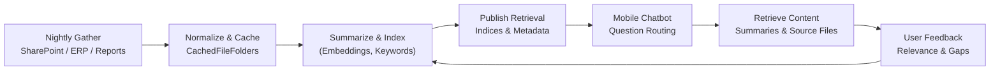

# Briefing 8: Applying the Patterns — Project Intelligence Chatbot

## Scenario Overview

A heavy manufacturing enterprise supports dozens of simultaneous projects spread across fabrication shops, job sites, and design offices. Engineers, supervisors, and field teams routinely need quick answers about specifications, tolerances, commercial terms, budgets, or actual hours. Today they ping project managers who manually reconcile SharePoint folders, ERP tables, and nightly reporting tools. The goal is to deliver a mobile-friendly chatbot that instantly answers natural language questions by tapping into curated project knowledge.

- Cache nightly snapshots of project files, ERP extracts, and operational reports.
- Preprocess and summarize artifacts for searchability and rapid retrieval.
- Maintain relevance-ranked indexes that power the chatbot’s retrieval pipeline.
- Let users drill into original documents or synthesized summaries with minimal latency.
- Age out inactive projects so storage requirements stay manageable.



CachedFileFolders stores the raw artifacts and derived summaries, while metadata snapshots and event logs track ingestion health.

---

## Storage Planning for the Project Cache

Projects span months, so choose patterns that isolate per-project assets and simplify retention.

**Grouping pattern ideas:**
- `"projects/{project_code}/"` keeps all assets for a project together and allows efficient archival when the project closes.
- `"business_unit/{unit}/projects/{project_code}/"` supports department-centric dashboards or compliance.
- `"fiscal_year/{yyyy}/projects/{project_code}/"` helps implement retention windows tied to fiscal reporting.
- `"index-builds/{batch_timestamp}/"` is useful for experimentation with embedding pipelines, leaving production grouping untouched.
- `None` is suitable for prototypes but complicates project-specific purges.

**Ref_path conventions to adopt:**
- SharePoint docs: `"sharepoint/{artifact_hash}/{filename}"` to avoid collisions and track version lineage.
- ERP extracts: `"erp/{run_date}/{dataset_name}.json"` storing nightly API payloads.
- Reports: `"reports/{run_date}/{report_name}.pdf"` or `.json` depending on format.
- Summaries & embeddings: store derived artifacts inside each cached entry’s slave directory (e.g., `summaries/primary.json`, `artifacts/index-ready.json`) so index builders can co-locate metadata with the originating source.
- Chatbot usage breadcrumbs: `"sessions/{session_id}/question_{seq:03d}.json"` for traceability and model tuning.

Document the patterns in the project knowledge playbook to align ingestion workers, indexers, and chatbot services.

---

## 1. Nightly Ingestion & Normalization

An orchestrated job runs nightly (with incremental polling throughout the day if needed) to gather new or updated content.

```python
cache = CachedFileFolders("projects/{project_code}/", root_dir="/var/project-intel/cache")
grouping = cache.grouping([project_code])

def ingest_project_artifacts(project_code, sharepoint_files, erp_payloads, reports):
    grouping = cache.grouping([project_code])
    for doc in sharepoint_files:
        grouping.upsert_file(
            ref_path=f"sharepoint/{doc.checksum}/{doc.filename}",
            source_path=doc.local_temp_path,
            metadata={
                "source": "sharepoint",
                "uploaded_at": doc.modified_at.isoformat(),
                "doc_type": doc.doc_type,
            }
        )
    for dataset_name, payload in erp_payloads.items():
        grouping.upsert_json(
            ref_path=f"erp/{run_date}/{dataset_name}.json",
            data=payload,
            metadata={"source": "erp", "run_date": run_date.isoformat()}
        )
    for report in reports:
        grouping.upsert_file(
            ref_path=f"reports/{run_date}/{report.name}",
            source_path=report.path,
            metadata={"source": "reporting", "rendered_at": run_date.isoformat()}
        )
```

- **Change detection:** Respect SharePoint ETags, ERP incremental APIs, and report sequence numbers to avoid redundant caching.
- **Metadata completeness:** Capture `source`, `run_date`, `checksum`, `project_status` to make stale data easy to detect.
- **Integrity hooks:** Validate dataset schemas and log warnings if ERP fields drift; store anomalies under `summaries/{artifact_id}-validation.json`.

---

## 2. Metadata Snapshots & Event Logging

For each ingestion cycle, capture ingestion status and summarization progress. Metadata keeps the chatbot aware of the latest available context.

```python
meta = entry.metadata()
meta.update({
    "artifact_id": artifact_id,
    "source": source_system,
    "ingestion_batch": batch_id,
    "stage": "INGESTED",
    "run_date": run_date.isoformat(),
    "summary_ref": None,
    "embedding_ref": None,
})
meta.write()
```

- Update metadata to `stage="SUMMARY_READY"` and include `summary_ref` / `embedding_ref` after preprocessing completes.
- Track `last_used_at` and `retrieval_popularity` counters to inform retention heuristics.
- Event logs track a repeatable series of states so operators can audit the lifecycle. A SharePoint specification might move through:  
  `ENTER_STATE@INGESTED` → `ENTER_STATE@SUMMARIZED` → `ENTER_STATE@INDEXED` → `ENTER_STATE@PUBLISHED`.  
  An ERP extract that fails summarization would show `ENTER_STATE@INGESTED`, then `ERROR_AT_STATE@SUMMARIZE` with a payload pointing to the validation issue, helping remediation workers resume at the correct step.

---

## 3. Summarization, Embedding & Indexing Pipeline

### a. Summaries & Table Extraction
- Use NLP workers to summarize documents into concise answer-oriented blurbs; store under `summaries/`.
- Extract tables or key-value pairs from contracts/spec sheets into structured JSON for slot-filling responses.
- Annotate metadata with `summary_version`, `keywords`, and `tags` for downstream filtering.
- Persist derived artifacts inside each entry’s slave directory (`entry.cached_ref.slave_dir_path / "summaries/..."`) so downstream indexers can iterate cached documents, discover standardized summaries/extracts, and ingest them without bespoke lookups.

### b. Embedding Generation & Index Build
- Convert textual artifacts into embeddings via background workers. Save vector batches into `indexes/{version}/`.
- Maintain incremental `portage` snapshots so the retrieval service can reload the latest index without re-running the full pipeline.
- Keep `index_manifest.json` detailing index shards, embedding models, and build timestamps.
- Expose a consistent slave-dir layout (`artifacts/index-ready.json`, `summaries/primary.json`, `extractions/structured.json`) to make it trivial for indexing workers to walk cached documents and assemble retrieval datasets.

### c. Publish for Chatbot Consumption
- Once embeddings are ready, update metadata `stage="INDEXED"` and notify the chatbot service via an event log entry or message queue.
- Cache a lightweight search manifest (`manifests/latest.json`) listing active projects and top-level artifact counts for quick navigation.

---

## 4. Chatbot Retrieval Flow

- The chatbot receives a question, performs candidate lookup via indexes (`indexes/latest/...`), then hydrates the top artifacts from cache.
- When necessary, retrieve raw files (e.g., spec PDF) using `CachedRef` to stream content to the mobile client.
- Use metadata `summary_ref` to send condensed answers with citations.
- Record user interactions under `sessions/` with metadata (question, chosen documents, response latency) to refine ranking models.
- Provide feedback hooks so project managers can flag incorrect results; store the signals under `feedback/{artifact_id}.json`.

---

## 5. Monitoring & Reporting

### Querying
- Employ `filtered_map()` to gather ingestion completeness metrics:

```python
rows = filtered_map(
    grouping,
    include_metadata=True,
    mapper=lambda entry: {
        "artifact_id": entry.metadata.data.get("artifact_id"),
        "stage": entry.metadata.data.get("stage"),
        "run_date": entry.metadata.data.get("run_date"),
        "summary_ref": entry.metadata.data.get("summary_ref"),
        "embedding_ref": entry.metadata.data.get("embedding_ref"),
    }
)
```

- Combine with event log summaries to detect stuck artifacts or repeated failures during summarization.
- Build dashboards showing per-project cache freshness, number of indexed documents, and user question latency.

### Report Output
- Generate nightly health reports stored under `reports/cache-health/{run_date}.json`, including ingestion counts, failures, and index sizes.
- Produce monthly retention summaries to justify storage consumption.

### Real-Time Monitoring
- Lightweight workers can tail event logs to confirm that `ENTER_STATE@INDEXED` occurs within SLA.
- Alert on `ERROR_AT_STATE@SUMMARIZE` spikes, prompting NLP model review.

---

## 6. Retention & Project Lifecycle Management

- Define retention rules: active projects keep full history; inactive ones keep only last stable snapshot plus select summaries.
- Schedule cleanup jobs to:
    - Remove artifacts whose metadata `last_used_at` exceeds retention threshold and `project_status` is `CLOSED`.
    - Collapse old embeddings into long-term storage (`archives/`) while keeping current index shards hot.
    - Delete chatbot session logs older than required (e.g., 90 days) unless flagged for feedback analysis.
- Before pruning, optionally snapshot the grouping using `CachedGroupingVersioner` to preserve a recoverable archive.

---

## 7. Putting It Together

1. **Nightly ingestion**: Collect SharePoint files, ERP extracts, and reports into per-project groupings.
2. **Metadata & events**: Track ingestion batches, summarization status, and index readiness.
3. **Summarize & index**: Generate summaries, embeddings, and manifests that drive chatbot retrieval.
4. **Chatbot integration**: Serve mobile queries by retrieving cached summaries and source documents.
5. **Retention management**: Keep the cache lean by expiring inactive projects and session history.

With these building blocks, the project intelligence chatbot provides fast, authoritative answers while maintaining an auditable, maintainable knowledge cache.


