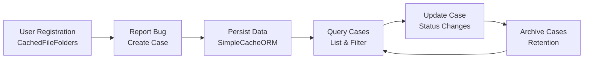

# Briefing 9: Applying the Patterns — Bug Tracking System

## Scenario Overview

A development team needs a simple bug tracking system to manage bug reports during early-stage application development. The system allows users to report bugs and track their status. This is an ideal use case for `PrimitiveSchemaResolver` and `SimpleCacheORM` because:

- The data models are straightforward (User, Case)
- The application is in rapid prototype phase
- No complex queries or relationships are needed initially
- Quick iteration is more important than optimal database design



The system uses `PrimitiveSchemaResolver` to automatically organize objects by class name, allowing developers to focus on business logic rather than data storage structure. `SimpleCacheORM` provides a clean API for persistence operations without requiring schema registration.

---

## Storage Planning for the Bug Tracking Cache

For a bug tracking system in early development, a simple flat structure works well. As the application matures, you can migrate to more sophisticated storage patterns.

**Grouping pattern options:**
- `None` (flat structure) - Simplest for prototypes, all objects stored at the root level
- `"bugs/{project_name}/"` - Organize by project if supporting multiple projects
- `"bugs/{year}/{month}/"` - Organize by time period for easier archival
- `"bugs/draft/"` vs `"bugs/live/"` - Separate draft cases from active ones

For this example, we'll use `None` (flat structure) to keep it simple, but note where you might want organization later.

**Automatic file organization with PrimitiveSchemaResolver:**
- `User/User-{slug}.yaml` - User accounts
- `Case/Case-{slug}.yaml` - Bug reports

The resolver automatically creates these subdirectories based on class names, requiring no manual directory structure design.

---

## 1. Data Models

Define Pydantic models for the two core entities: User and Case (bug report).

```python
from datetime import datetime
from enum import Enum
from typing import Optional
from pydantic import BaseModel, EmailStr
from totodev_pub.cached_file_folders_support.primitive_schema_protocol import SlugProvider


class CaseStatus(str, Enum):
    """Status of a bug case."""
    OPEN = "open"
    IN_PROGRESS = "in_progress"
    RESOLVED = "resolved"
    CLOSED = "closed"


class User(BaseModel, SlugProvider):
    """User account information."""
    username: str
    email: EmailStr
    full_name: str
    created_at: datetime
    
    def __init__(self, **data):
        if "created_at" not in data:
            data["created_at"] = datetime.utcnow()
        super().__init__(**data)
    
    def generate_slug(self) -> str:
        """Generate slug from email address (sanitized for filesystem)."""
        return self.email.replace("@", "_at_").replace(".", "_dot_")


class Case(BaseModel):
    """Bug report case."""
    title: str
    description: str
    reporter_username: str  # Reference to User.username
    status: CaseStatus = CaseStatus.OPEN
    assigned_to: Optional[str] = None  # Optional username
    created_at: datetime
    updated_at: datetime
    resolved_at: Optional[datetime] = None
    
    def __init__(self, **data):
        now = datetime.utcnow()
        if "created_at" not in data:
            data["created_at"] = now
        if "updated_at" not in data:
            data["updated_at"] = now
        super().__init__(**data)
```

These models are plain Pydantic `BaseModel` subclasses - no special persistence mixins required when using `SimpleCacheORM` with `PrimitiveSchemaResolver`. 

**Optional enhancement:** You can use `FileMappedPydanticMixin` if you want to take advantage of its file rewrite capabilities and automatic file path management. However, this is not required - `SimpleCacheORM` works perfectly fine with plain `BaseModel` subclasses, and the ORM handles all persistence operations for you.

---

## 2. Initializing the Cache and ORM

Set up `CachedFileFolders` and `SimpleCacheORM` with `PrimitiveSchemaResolver` for zero-configuration persistence.

```python
from totodev_pub.cached_file_folders import CachedFileFolders
from totodev_pub.cached_file_folders_support.primitive_schema_resolver import PrimitiveSchemaResolver
from totodev_pub.cached_file_folders_support import SimpleCacheORM

# Create cache - using flat structure (grouping_key=None) for simplicity
cache = CachedFileFolders("bug_tracker/", "/tmp/bug_tracker_cache")

# Create resolver with flat grouping
resolver = PrimitiveSchemaResolver(cache, grouping_key=None)

# Create ORM layer
orm = SimpleCacheORM(cache, resolver=resolver)

# No schema registration needed! PrimitiveSchemaResolver works automatically.
```

That's it - no schema registration, no path templates, no configuration. The resolver automatically handles file organization by class name.

---

## 3. User Management

Create and manage user accounts. Users use email-based slugs via `SlugProvider`.

```python
from datetime import datetime


class BugTrackerService:
    """Service class for bug tracking operations."""
    
    def __init__(self, orm: SimpleCacheORM):
        self.orm = orm
    
    async def create_user(self, username: str, email: str, full_name: str) -> str:
        """Create a new user account. Returns the slug (derived from email)."""
        user = User(
            username=username,
            email=email,
            full_name=full_name,
            created_at=datetime.utcnow()
        )
        
        # Resolver calls user.generate_slug() automatically (email-based)
        slug = self.orm.resolver.generate_slug(user)
        await self.orm.upsert(user, schema_key=User, slug=slug)
        
        return slug
    
    def get_user(self, slug: str) -> Optional[User]:
        """Load a user by slug."""
        return self.orm.get(User, schema_key=User, slug=slug)
    
    def get_user_by_email(self, email: str) -> Optional[User]:
        """Load a user by email address (uses email-based slug)."""
        # Derive slug from email using same sanitization as User.generate_slug()
        slug = email.replace("@", "_at_").replace(".", "_dot_")
        return self.get_user(slug)
    
    def find_user_by_username(self, username: str) -> Optional[User]:
        """Find a user by username (requires iterating all users)."""
        for user in self.orm.objects(User, schema_key=User, slug="*"):
            if user.username == username:
                return user
        return None
    
    async def update_user(self, slug: str, **updates) -> bool:
        """Update user information."""
        user = self.get_user(slug)
        if not user:
            return False
        
        updated_user = user.model_copy(update=updates)
        await self.orm.upsert(updated_user, schema_key=User, slug=slug)
        return True


# Usage example
service = BugTrackerService(orm)

# Create users (slug derived from email automatically)
alice_email_slug = await service.create_user(
    username="alice",
    email="alice@example.com",
    full_name="Alice Developer"
)

await service.create_user(
    username="bob",
    email="bob@example.com",
    full_name="Bob Tester"
)

# Load by slug or email
alice = service.get_user(alice_email_slug)
alice = service.get_user_by_email("alice@example.com")  # Same result
```

**Notes:**
- **SlugProvider pattern:** `User` implements `SlugProvider` with email as the natural key. The resolver automatically calls `generate_slug()`, producing files like `User-alice_at_example_dot_com.yaml`. The slug is stable—updating user fields doesn't change the file location.
- **Email-based lookup:** `get_user_by_email()` loads users directly without iteration. Email is ideal because it's unique, stable, and meaningful.
- **Alternative:** Without a natural key, let the resolver auto-generate time-based slugs (as shown with `Case` below).

---

## 4. Case Management (Bug Reports)

Create, update, and query bug reports.

```python
class BugTrackerService:
    # ... (previous methods)
    
    async def create_case(self, title: str, description: str, reporter_username: str) -> str:
        """Create a new bug case. Returns auto-generated slug."""
        if not self.find_user_by_username(reporter_username):
            raise ValueError(f"Reporter not found: {reporter_username}")
        
        case = Case(
            title=title,
            description=description,
            reporter_username=reporter_username,
            status=CaseStatus.OPEN,
            created_at=datetime.utcnow(),
            updated_at=datetime.utcnow()
        )
        
        slug = self.orm.resolver.generate_slug(case)  # Time-based slug
        await self.orm.upsert(case, schema_key=Case, slug=slug)
        
        return slug
    
    def get_case(self, slug: str) -> Optional[Case]:
        """Load a case by slug."""
        return self.orm.get(Case, schema_key=Case, slug=slug)
    
    async def update_case_status(
        self,
        case_slug: str,
        new_status: CaseStatus,
        assigned_to: Optional[str] = None
    ) -> bool:
        """Update case status and optionally assign it."""
        case = self.get_case(case_slug)
        if not case:
            return False
        
        case.status = new_status
        case.updated_at = datetime.utcnow()
        
        if assigned_to:
            if not self.find_user_by_username(assigned_to):
                raise ValueError(f"Assignee not found: {assigned_to}")
            case.assigned_to = assigned_to
        
        if new_status in (CaseStatus.RESOLVED, CaseStatus.CLOSED):
            case.resolved_at = datetime.utcnow()
        
        await self.orm.upsert(case, schema_key=Case, slug=case_slug)
        return True
    
    def list_cases(
        self,
        status: Optional[CaseStatus] = None,
        reporter: Optional[str] = None,
        assigned_to: Optional[str] = None
    ) -> list[Case]:
        """List cases with optional filtering (iterates all cases)."""
        matching = []
        for case in self.orm.objects(Case, schema_key=Case, slug="*"):
            if status and case.status != status:
                continue
            if reporter and case.reporter_username != reporter:
                continue
            if assigned_to and case.assigned_to != assigned_to:
                continue
            matching.append(case)
        
        matching.sort(key=lambda c: c.created_at, reverse=True)
        return matching
    
    async def assign_case(self, case_slug: str, username: str) -> bool:
        """Assign a case to a user."""
        return await self.update_case_status(
            case_slug,
            CaseStatus.IN_PROGRESS,
            assigned_to=username
        )


# Usage example
bug_slug = await service.create_case(
    title="Login button not working",
    description="When clicking the login button, nothing happens.",
    reporter_username="bob"
)

# List and filter cases
open_cases = service.list_cases(status=CaseStatus.OPEN)
await service.assign_case(bug_slug, "alice")
await service.update_case_status(bug_slug, CaseStatus.RESOLVED)
alice_cases = service.list_cases(assigned_to="alice")
```

**Notes:**
- Cases use auto-generated time-based slugs (no `SlugProvider`). For natural keys, implement `SlugProvider` like `User` does.
- `list_cases()` iterates all cases—fine for small datasets. Scale with indexes or a database query layer.

---

## 5. Application Structure

Put it all together in a simple application structure.

```python
# bug_tracker_app.py

from totodev_pub.cached_file_folders import CachedFileFolders
from totodev_pub.cached_file_folders_support.primitive_schema_resolver import PrimitiveSchemaResolver
from totodev_pub.cached_file_folders_support import SimpleCacheORM

# Models (User, Case) defined above
# BugTrackerService defined above


class BugTrackerApp:
    """Main application class."""
    
    def __init__(self, cache_root: str = "/tmp/bug_tracker_cache"):
        # Initialize storage
        self.cache = CachedFileFolders("bug_tracker/", cache_root)
        self.resolver = PrimitiveSchemaResolver(self.cache, grouping_key=None)
        self.orm = SimpleCacheORM(self.cache, resolver=self.resolver)
        
        # Initialize service layer
        self.service = BugTrackerService(self.orm)
    
    async def startup(self):
        """Initialize the application."""
        # Processing code here
        pass
    
    async def handle_user_registration(self, username: str, email: str, full_name: str):
        """Handle user registration request."""
        slug = await self.service.create_user(username, email, full_name)
        return {"status": "success", "slug": slug}
    
    async def handle_create_bug(self, title: str, description: str, reporter_username: str) -> dict:
        """Handle bug report creation."""
        slug = await self.service.create_case(title, description, reporter_username)
        return {"status": "success", "slug": slug}
    
    async def handle_list_bugs(self, status: Optional[str] = None) -> dict:
        """Handle bug list request."""
        status_enum = CaseStatus(status) if status else None
        cases = self.service.list_cases(status=status_enum)
        return {
            "status": "success",
            "cases": [case.model_dump() for case in cases]
        }
    
    async def handle_update_bug_status(self, case_slug: str, new_status: str) -> dict:
        """Handle bug status update."""
        status_enum = CaseStatus(new_status)
        success = await self.service.update_case_status(case_slug, status_enum)
        
        if success:
            return {"status": "success"}
        return {"status": "error", "message": "Case not found"}


# Example usage
async def main():
    app = BugTrackerApp()
    await app.startup()
    # Processing code here


if __name__ == "__main__":
    import asyncio
    asyncio.run(main())
```

---

## 6. File Structure on Disk

After running the application, the cache directory will contain:

```
/tmp/bug_tracker_cache/
└── bug_tracker/
    ├── User/
    │   ├── User-alice_at_example_dot_com.yaml
    │   └── User-bob_at_example_dot_com.yaml
    └── Case/
        ├── Case-1a2b3c4d.yaml
        ├── Case-5e6f7g8h.yaml
        └── Case-9i0j1k2l.yaml
```

Each YAML file contains the serialized Pydantic model:

```yaml
# User/User-alice_at_example_dot_com.yaml
# Note: The filename is derived from the email via SlugProvider.generate_slug()
username: alice
email: alice@example.com
full_name: Alice Developer
created_at: '2025-01-15T10:30:00'

# Case/Case-1a2b3c4d.yaml
title: Login button not working
description: When clicking the login button, nothing happens...
reporter_username: bob
status: resolved
assigned_to: alice
created_at: '2025-01-15T11:00:00'
updated_at: '2025-01-15T14:30:00'
resolved_at: '2025-01-15T14:30:00'
```

---

## 7. Migration Path

As the application grows, you can migrate to more sophisticated storage:

1. **Add grouping by project:**
   ```python
   resolver = PrimitiveSchemaResolver(cache, grouping_key=["project-name"])
   ```

2. **Implement custom SchemaResolver:**
   - Add indexes for username lookups
   - Optimize case queries by status/assignee
   - Add relationship support (cases → users)

3. **Migrate to database:**
   - Keep the same service layer interface
   - Replace `SimpleCacheORM` with database ORM
   - Models can remain Pydantic but use database-backed storage

The key benefit of starting with `PrimitiveSchemaResolver` is that your business logic (service layer) doesn't need to change - only the persistence layer does.

---

## 8. Best Practices

**When using PrimitiveSchemaResolver + SimpleCacheORM:**

1. **Use meaningful slugs for human-readable references:**
   - Usernames or other natural identifiers when helpful
   - Auto-generated slugs are fine when uniqueness is the only requirement

2. **Encapsulate persistence in service layer:**
   - Keep ORM calls in service classes, not in UI/API handlers
   - Makes migration to different storage easier later

3. **Be aware of iteration costs:**
   - `list_cases()` with filters iterates all cases
   - Fine for < 1000 items, but plan for indexes if scaling

4. **Handle concurrency appropriately:**
   - File-based storage doesn't provide ACID transactions
   - Use file locks or optimistic concurrency if multiple writers exist

5. **Plan your grouping strategy:**
   - Start flat (grouping_key=None) for simplicity
   - Add grouping when you need isolation (by project, time period, etc.)

6. **Keep models simple:**
   - Plain Pydantic models work best
   - Avoid deep nesting or circular references initially

---

## 9. Summary

This bug tracking system demonstrates:

- **Zero-configuration persistence:** No schema registration needed with `PrimitiveSchemaResolver`
- **Automatic organization:** Files organized by class name automatically
- **Natural key patterns:** Using `SlugProvider` to implement email-based slugs for Users, enabling direct lookup by email without iteration
- **Simple API:** `SimpleCacheORM` provides clean get/save/delete operations
- **Rapid prototyping:** Focus on business logic, not storage design
- **Easy migration path:** Service layer abstracts persistence, making database migration straightforward

The system can be extended with features like:
- Comment threads on cases
- File attachments
- Case history/audit logs
- Email notifications
- Advanced search and filtering

All while maintaining the same simple persistence pattern until the application's data access patterns become clear enough to justify a more sophisticated storage solution.
