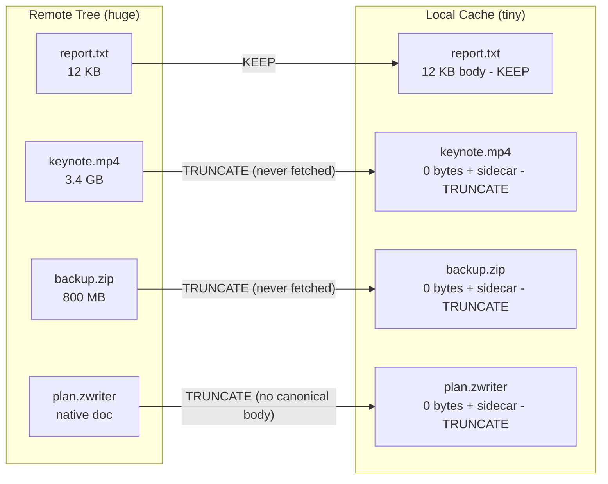
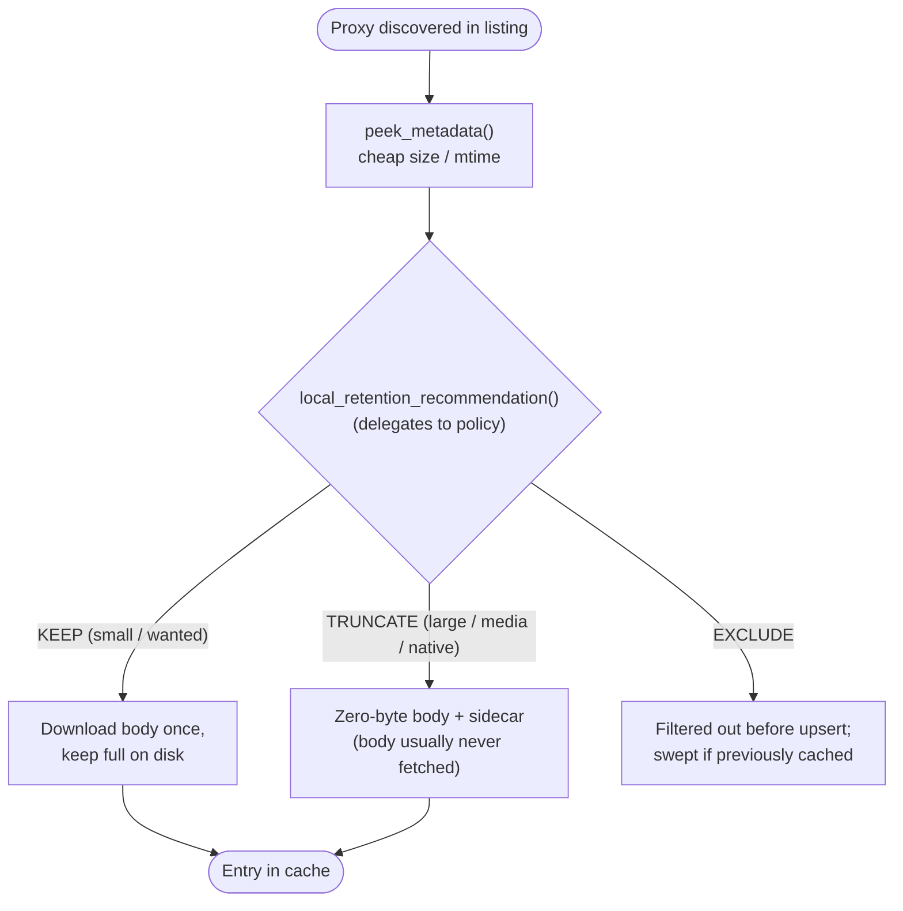
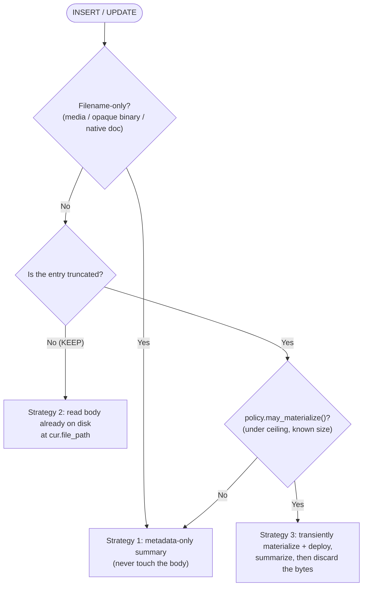

# Briefing 10: Truncated Entries - Mirroring Trees Larger Than Disk

## Summary

Sometimes the remote tree you want to mirror is far larger than the local disk you have to mirror it into. A WorkDrive share, a SharePoint site, or an S3 prefix can hold terabytes of video, disk images, and archives that you have no intention of ever reading byte-for-byte. **Truncated entries** let CachedFileFolders represent every one of those files in the cache - with a real `ref_path`, slave directory, metadata, and event log - while keeping only a zero-byte body plus a small metadata sidecar on disk. The file is "present" for every purpose except its bytes.

This briefing covers three tightly-related mechanisms that make this work:

1. The **TRUNCATE flag** a proxy uses to recommend that a file's body should *not* be retained locally.
2. **Cheap change detection** (`peek_metadata()` + a truncation-aware `looks_same()`) that lets you decide what to truncate *without* downloading anything.
3. **Summarizing and indexing during the change-receiver stage** of a sync - including how to transiently borrow a truncated file's bytes when (and only when) policy allows.

**Key Insight:** A truncated entry is a File Proxy's promise that has been deliberately *half-kept* - the cache fulfills the metadata but skips the body. Combined with a cheap "peek" and a sync-time change receiver, you can mirror, summarize, and index a tree that would never fit on local disk - and you decide, per file, whether its bytes are ever worth fetching at all.

---

## The Problem: A Tree Bigger Than Your Disk

Imagine a WorkDrive folder tree containing:

- thousands of small text/office documents you genuinely want on disk,
- hundreds of multi-gigabyte videos and disk images you will never parse,
- some "native" cloud documents (Writer/Sheet/Show) that have no canonical file at all.

You want one uniform thing: a local cache you can *walk like a filesystem* - list it, attach per-file metadata, run a summary/search pipeline over it - without downloading petabytes you will throw away.

A naive mirror downloads everything and runs out of disk on the first big video. The truncated-entries approach instead lets the cache hold a faithful **skeleton** of the tree: every file has an entry, but only the files worth keeping have bodies.



Every file is represented; only `report.txt` actually consumes meaningful disk.

---

## The TRUNCATE Flag: Recommending What to Retain

A proxy expresses how much of itself the cache should keep through one optional method on `FileProxyBase`:

```python
def local_retention_recommendation(self) -> LocalRetentionRecommendation:
    ...
```

It returns one of three points on a single axis - *how much of the file the cache keeps locally*:

| Member | Result | Meaning |
|--------|--------|---------|
| `KEEP` | Full entry | Fetch the body and keep it on disk in full. The default; the library's historical behavior. |
| `TRUNCATE` | Truncated entry | Record authoritative metadata (size/mtime, optionally a hash) but **do not keep the body**. The cached file is a zero-byte placeholder with a metadata sidecar. |
| `EXCLUDE` | No entry | Do not bring the file into the cache at all. |

Two subtleties matter:

- **It is advice, not a command.** The name says "recommendation" for a reason: the cache (CachedFileFolders) has the final say and may override a proxy's recommendation with its own policy.
- **`TRUNCATE` vs `EXCLUDE` are different intents.** `TRUNCATE` keeps the file *in* the cache as a metadata-bearing skeleton entry (it still has a slave dir, metadata, and event log). `EXCLUDE` is a sweep-*membership* signal handled at the driver layer - `resync_bulk()` filters EXCLUDE proxies out of the stream before upsert, so any previously cached copy falls to the sweep's deletion pass. Use `TRUNCATE` when you still want to know the file exists; use `EXCLUDE` when it should not be in the cache at all.

A clean way to organize the decision is a small, explicit *retention policy* the proxy delegates to. In the Zoho example, `local_retention_recommendation()` is one line:

```python
def local_retention_recommendation(self) -> LocalRetentionRecommendation:
    if self._is_native_doc:           # native docs never have a canonical body
        return LocalRetentionRecommendation.TRUNCATE
    return self._policy.recommend(self._name, self._size)
```

and the policy reads like prose:

```python
def recommend(self, name: str, size: Optional[int]) -> LocalRetentionRecommendation:
    if self.is_audio_video(name):                      # media: always metadata-only
        return LocalRetentionRecommendation.TRUNCATE
    if size is not None and size > self.truncate_over_bytes:   # e.g. 50 KB
        return LocalRetentionRecommendation.TRUNCATE
    return LocalRetentionRecommendation.KEEP
```

Keeping the decision in one place makes "what does this cache retain?" a single, testable function.

### What a Truncated Entry Looks Like on Disk

```text
keynote.mp4                       # zero bytes; mtime preserved from source
keynote.mp4._slave/
  ├── _truncation_info.yaml       # recorded size, mtime, optional hash/version
  ├── metadata.yaml               # your normal per-file metadata
  ├── summary.md                  # written by your change receiver (below)
  ├── index.json
  └── events/
```

The body is gone, but the entry is otherwise a first-class citizen: it has its `ref_path`, a slave directory, metadata, and an event log, exactly like a `KEEP` entry. The sidecar (`_truncation_info.yaml`) records the authoritative facts (size, mtime, optionally a hash) that the body would otherwise have provided.

---

## Cheap Change Detection: A Good "Peek" Avoids Big Downloads

Truncation only pays off if you can decide *what* to truncate **without** downloading. That is what the cheap-metadata tier is for.

### `peek_metadata()` - probe without fetching

```python
async def peek_metadata(self) -> Optional[OriginMetadata]:
    ...
```

`OriginMetadata` is a small tuple of cheaply-knowable, all-optional facts:

```python
class OriginMetadata(NamedTuple):
    size: Optional[int] = None            # bytes, if cheaply known
    mtime: Optional[float] = None         # POSIX timestamp, if cheaply known
    origin_version: Optional[str] = None  # opaque ETag / version id - compare, never interpret
```

A proxy returns whatever it can learn cheaply - and `None` when it knows nothing cheaply, mirroring the `looks_same() -> Optional[bool]` philosophy ("I can't tell; do it the expensive way"). Crucially, `peek_metadata()` must **never** download or generate the file just to measure it. Most remote stores hand you size and mtime in their directory listing for free, so a peek is just reading fields you already paged in:

```python
async def peek_metadata(self) -> Optional[OriginMetadata]:
    if self._size is None and self._modified_time is None:
        return None
    mtime = self._modified_time.timestamp() if self._modified_time else None
    return OriginMetadata(size=self._size, mtime=mtime)
```

Because the size came back in the listing, the cache can apply a "truncate over 50 KB" rule to a 3 GB video *without ever touching it*.

### `looks_same()` against a truncated entry

When the cache later re-syncs and compares a proxy against an *existing truncated* entry, there is no body on disk to compare - the file is zero bytes. The cache solves this by preserving the original mtime on the truncated placeholder and passing the recorded (pre-truncation) size to `looks_same()` via `override_byte_count`:

```python
def looks_same(self, other_fpath: str, override_byte_count: Optional[int] = None) -> Optional[bool]:
    if self._modified_time is None:
        return None
    st = os.stat(other_fpath)
    other_size = st.st_size if override_byte_count is None else override_byte_count
    return self._size == other_size and self._modified_time.timestamp() == st.st_mtime
```

The mtime read straight off the zero-byte file is already authoritative; only the size needs substituting. The result: a truncated entry can be change-checked as cheaply as a normal one, and is only "re-truncated" if it genuinely changed upstream.

> Note for content-comparing proxies: a proxy that compares by *content* (e.g. an email proxy parsing an injected header) cannot be compared cheaply while the body is truncated. It may ignore `override_byte_count` and will naturally report a difference, prompting a fresh materialize. Likewise, `override_byte_count` is irrelevant under `use_xxhash=True`, which hashes bytes a truncated entry does not have - at scale, truncating caches should use `use_xxhash=False`.

---

## Putting Peek + TRUNCATE Together

The decision for each discovered file flows like this:



The net effect: bytes are only ever pulled for files you decided are worth keeping (`KEEP`), or - as we'll see next - briefly borrowed for summarization when policy explicitly permits it.

---

## Summarize & Index During the Change-Receiver Stage

Briefing 3 introduced synchronization and the INSERT/UPDATE/DELETE change types. Synchronization also accepts an optional **`change_receiver`** - an async callback invoked for each change as it is processed:

```python
result = await grouping.resync_bulk(
    file_proxies=factory.scan_files(root_folder_id, max_files=max_files),
    upsert_fail_policy="RETAIN_OLD",
    max_concurrent_requests=4,
    change_receiver=indexer.on_change,   # async (notice, proxy) -> None
)
```

The receiver is the natural home for a per-file summarize + index step. Its signature receives both the `ChangeNotice` and the originating proxy:

```python
async def on_change(self, notice: ChangeNotice, proxy: Optional[FileProxyBase]) -> None:
    if notice.change_type == ChangeType.DELETE:
        # tear down the index row for the removed file
        self.vector_index.remove(notice.old.ref_path)
        return
    # INSERT / UPDATE: derive a summary, write artifacts, upsert into the index
    await self._on_upsert(notice, proxy)
```

For INSERT/UPDATE it writes a `summary.md` and an `index.json` into the file's slave directory, refreshes `metadata.yaml`, and upserts the summary into a vector index; for DELETE it removes the index row. This composes directly with the rest of the toolkit: it lives next to the file (Briefing 1's slave directories), can record progress via the event log (Briefing 4), and curates `metadata.yaml` for fast queries (Briefing 5).

> Why **async**? Summarizing a *truncated-but-fetchable* file requires `await proxy.materialize(...)`. A synchronous receiver cannot do that, so this pattern must use an async receiver.

### The Three Body-Access Strategies

The interesting question is: *how does the receiver get content to summarize when most files have no body on disk?* It never assumes a truncated entry's bytes are fetchable. Instead it picks one of three strategies per file, gated by the same retention policy:



1. **Filename-only (never touch the body).** Audio/video of any size, opaque binaries (archives, installers, disk images), and native cloud docs have nothing a text/pandoc summarizer can use - fetching them is pure wasted egress. Summarize from filename/path/size alone (with a small/medium/large media size class).

2. **KEEP entry - read directly.** The body is already on disk at `cur.file_path`. Read it; never re-drive the proxy.

3. **TRUNCATE but fetchable - borrow the bytes transiently.** For text/docs between the truncate threshold and the hard ceiling, briefly `materialize()` + `deploy()` the pristine proxy into the cache's throwaway temp dir, summarize the borrowed copy, then delete it. The cache entry **stays a zero-byte truncated file** - you only borrowed the bytes:

```python
async def _summarize_via_transient_body(self, proxy, ref_path, name, size, media_kind):
    temp_root = Path(self.cache.get_temp_directory_root())
    deploy_dir = Path(tempfile.mkdtemp(dir=str(temp_root)))
    try:
        ready = await proxy.materialize(self.materialize_blocking_secs, temp_root)
        if not ready:
            return *self._metadata_only_summary(ref_path, name, size, media_kind), False
        proxy.deploy(str(deploy_dir))
        body = next(p for p in deploy_dir.iterdir() if p.is_file())
        summary, method = self._summarize_body(body, ref_path, name, size, media_kind)
        return summary, method, True
    except Exception:                 # transient fetch is best-effort; degrade gracefully
        return *self._metadata_only_summary(ref_path, name, size, media_kind), False
    finally:
        shutil.rmtree(deploy_dir, ignore_errors=True)   # discard the borrowed body
```

The gate that decides between strategy 3 and falling back to strategy 1 is `RetentionPolicy.may_materialize()`, which is deliberately conservative:

```python
def may_materialize(self, name: str, size: Optional[int]) -> bool:
    if self.summarize_by_filename_only(name):     # media / opaque binaries -> never
        return False
    if size is None:                              # unknown size -> never (could be huge)
        return False
    if size > self.never_materialize_over_bytes:  # hard ceiling (e.g. 100 MB) -> never
        return False
    return True
```

Note the distinct decisions: "what does the cache *retain*?" (`recommend()`) and "may the summary step *briefly fetch* a truncated body?" (`may_materialize()`) are separate functions, because keeping and borrowing are different questions. A 30 MB PDF can be `TRUNCATE` (not worth keeping) yet still summarizable (worth borrowing once); a 3 GB video is `TRUNCATE` and must never be fetched.

---

## `retrieval_hint()`: Leaving Breadcrumbs for Later Re-Fetch

A truncated entry has no body, so how would anyone get it back later? The proxy can record a breadcrumb via `retrieval_hint()`:

```python
def retrieval_hint(self) -> Dict[str, Any]:
    return {
        "source": "zoho_workdrive",
        "file_id": self._file_id,
        "api_host": self._api_client.api_host,
        "ref_path": self.ref_path(),
    }
```

This is **purely informational**. It does not implement re-materialization; it merely *facilitates* it by recording where the file came from (origin path, URL, message id, drive id, etc.) so future tooling - or a human - could reconstruct a proxy and re-fetch the bytes on demand. Pull-side re-derivation is intentionally out of scope for the cache itself: the cache never re-fetches on its own.

---

## Related Code Examples

These examples in this directory implement the mechanisms above end-to-end:

- [`zoho_workdrive_sync.py`](zoho_workdrive_sync.py) - the full TRUNCATE / summarize / index demo: a `FileProxy` + factory that recursively mirrors a WorkDrive tree, reports size/mtime via `peek_metadata()`, and delegates retention to a policy.
- [`retention_policy.py`](retention_policy.py) - the size/type policy: `recommend()` (KEEP vs TRUNCATE) and the separate `may_materialize()` body-fetch gate, plus media/opaque-binary classification.
- [`summary_indexer.py`](summary_indexer.py) - the async `change_receiver` implementing the three body-access strategies (filename-only, read-on-disk, transient-borrow).
- [`stub_vector_index.py`](stub_vector_index.py) - a documented, dependency-free stub vector index showing the `upsert` / `remove` / `query` shape to swap for a real vector DB.
- [`../file_proxy_base.py`](../file_proxy_base.py) - the `FileProxyBase` interface and the `LocalRetentionRecommendation` / `OriginMetadata` definitions, with the authoritative docstrings on truncation semantics.

---

## Key Takeaways

1. **Truncated entries mirror trees larger than disk.** A `TRUNCATE` entry keeps a zero-byte body plus a metadata sidecar, but is otherwise a first-class entry (ref_path, slave dir, metadata, events). Your cache becomes a faithful, walkable skeleton of a remote tree that would never fit locally.

2. **The TRUNCATE flag is a recommendation, not a command.** `local_retention_recommendation()` returns `KEEP` / `TRUNCATE` / `EXCLUDE`; the cache has final say. Keep the decision in one explicit, testable policy. `TRUNCATE` keeps a skeleton entry; `EXCLUDE` keeps nothing.

3. **A good peek avoids big downloads.** `peek_metadata()` reports cheaply-known size/mtime/version (or `None`), and a truncation-aware `looks_same()` (via `override_byte_count`) lets even zero-byte entries be change-checked cheaply. You decide what to truncate *before* fetching anything.

4. **The change receiver is where summarize + index belongs.** An async `change_receiver(notice, proxy)` writes per-file artifacts and maintains a (vector) index, using three body-access strategies - filename-only, read-on-disk, or transiently borrow-and-discard - gated by a conservative `may_materialize()` decision separate from the retain decision.

5. **`retrieval_hint()` leaves breadcrumbs, not bytes.** It records how the original could be re-fetched later but never re-fetches on its own; pull-side re-derivation is out of scope for the cache.

**Mental Model:** A truncated entry is a File Proxy's promise that you chose to half-keep - you fulfilled its metadata and skipped its body. With a cheap peek to decide and an async change receiver to summarize, you can faithfully mirror, catalogue, and search a tree whose bytes will never fit on your disk.
