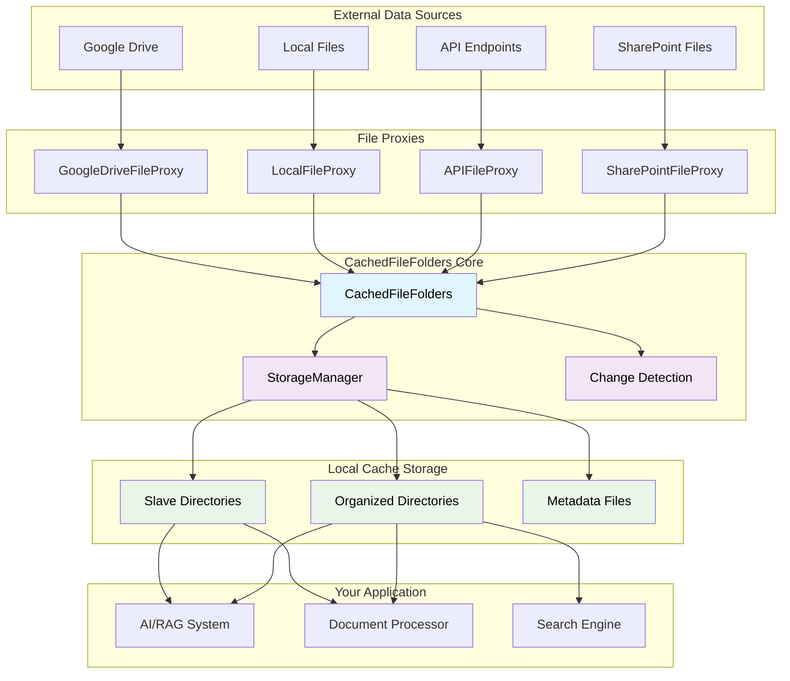
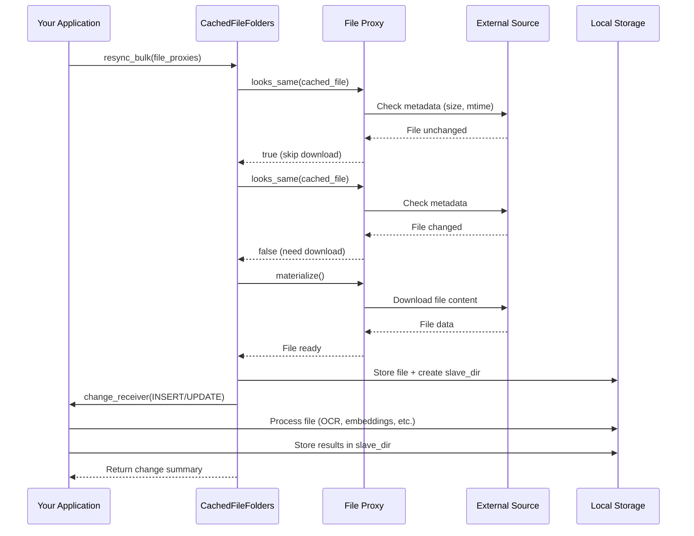
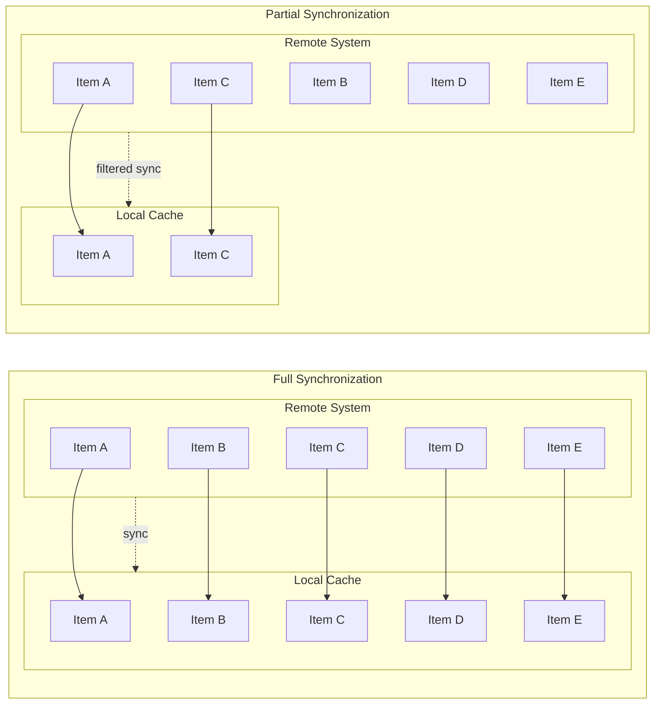
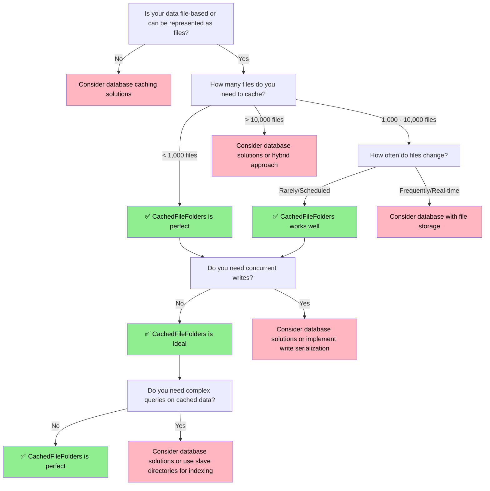
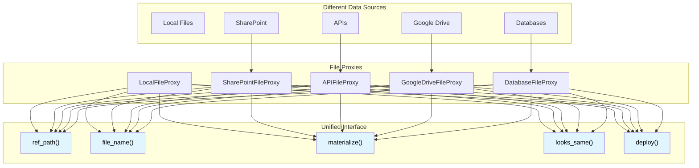
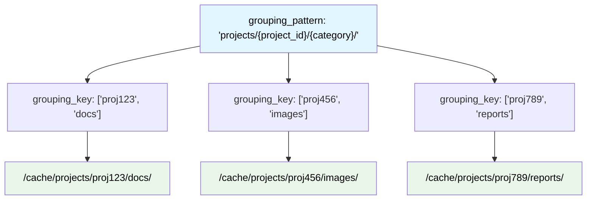
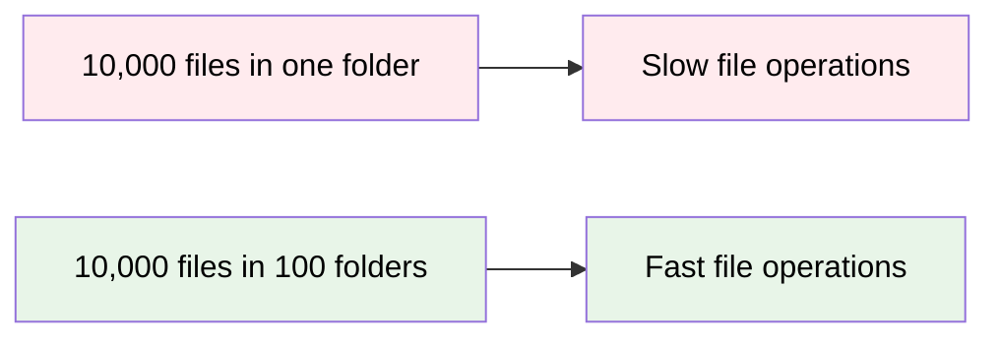
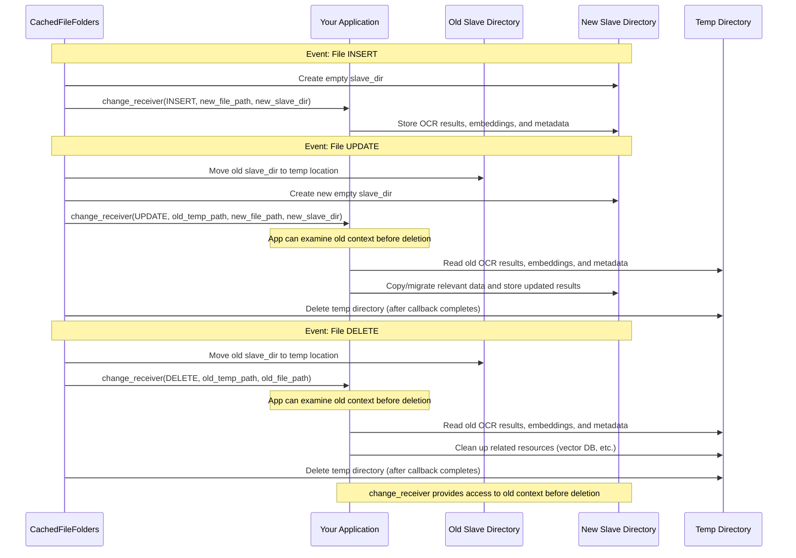

# The Challenge of Cache Maintenance (tododev.CachedFileFolders class)

A core component of many real-world generative AI systems is the gathering and use of a knowledge-base from which the AI can draw information.  While this need is easy to understand and describe in words, the amount of gory details and edge cases necessary to implement it can make up a big chunk of hours in a real-world project.  Yet, because there are so many fine-point variations in each project, the problem resists handling via reusable library.

This article explores the general challenge of maintaining a cache of externally managed data using the reusable `CachedFileFolders` library. The class is not the solution to every caching situation, but it fits a common set of medium-to-low-volume workflow and integration scenarios.

## Quick Start

Here's the simplest possible example of using `CachedFileFolders` to cache a few local files:

```python
from totodev_pub.cached_file_folders import CachedFileFolders
from totodev_pub.cached_file_folders_support.file_proxy_local_file import LocalFileProxy

# Create a cache that stores files in organized folders
cache = CachedFileFolders(grouping_pattern="cache/", root_dir="/tmp/my_cache")

file_proxies = [ # Cache some local files
                LocalFileProxy("/path/to/document1.pdf"),
                LocalFileProxy("/path/to/document2.docx")
               ]

# Sync them into the cache
changes, failures = await cache.resync_bulk(file_proxies=file_proxies, grouping_key=None)

print(f"Cached {len(changes)} files, {len(failures)} exceptions raised")
```

That's it! Your files are now cached locally and ready for fast access. The rest of this tutorial explains the concepts, advanced features, and real-world patterns that make this simple example powerful.

## System Architecture

Here's how the CachedFileFolders system works at a high level:



**Key Components:**
- **File Proxies**: Handle different data sources and provide unified interface
- **CachedFileFolders**: Main orchestrator for synchronization and management
- **StorageManager**: Handles file system operations and organization
- **Change Detection**: Determines what needs updating
- **Local Cache**: Organized storage with slave directories for metadata

## Data Flow

Here's how files flow through the system during synchronization:



**Key Flow Points:**
1. **Change Detection**: Check if file needs updating before downloading
2. **Lazy Download**: Only download files that have actually changed
3. **Concurrent Processing**: Multiple files can be processed simultaneously
4. **Real-time Notifications**: Process files as they're downloaded
5. **Metadata Storage**: Use slave directories for preprocessing results

Maintaining a "synchronized" cache of external data is about keeping local copies of "remote" data and ensuring that the local copies are as fresh as you need them to be.  This can sometimes mean maintaining an entire mirrored local copy of the source data.  And it can also mean maintaining only a portion of the source data.  

Illustration: two cache synchronization strategies (full mirror vs partial subset)



## Why Use a Cache

### Business Benefits

- **Cost Reduction**: Dramatically reduce API costs and bandwidth usage by avoiding repeated remote calls
- **Reliability**: Keep your application running even when external systems are down or rate-limited
- **Performance**: Turn seconds into milliseconds for AI operations, keeping token budgets under control
- **Predictability**: Steady, consistent performance instead of variable network-dependent response times

### Technical Benefits

A local cache shortens the distance between your application and its data.  In practice that means much lower latency, fewer round-trips to the "remote" system, and far more stable runtimes.  In AI-heavy pipelines, **speed is everything**: pre-indexing data sources for retrieval (e.g., RAG) and keeping working sets local can turn seconds into milliseconds and keep token budgets under control.

- **Speed and latency**: Keep hot data close so prompts, retrieval, and scoring stay fast
- **AI/RAG readiness**: Pre-index sources once, then serve low-latency lookups during inference
- **Resilience**: Ride out rate limits, flaky networks, and maintenance windows with local copies
- **Summarization at corpus scale**: Analyze the whole set to produce global summaries/insights
- **Freshness control**: Fully mirror when needed; or sync a focused subset for lighter footprints
- **Precompute/enrichment**: Generate OCR text, summaries, embeddings, and indices ahead of time

## Is CachedFileFolders Right for You?

Use this decision tree to quickly determine if `CachedFileFolders` fits your needs:



### Quick Decision Guide

**✅ CachedFileFolders is ideal when:**
- You have < 10,000 files (per folder) to cache
- Data is file-based (documents, images, JSON, CSV, etc.)
- You don't need complex queries on cached data
- Files don't change too frequently
- You want human-readable cache storage
- You need to preprocess files (OCR, embeddings, etc.)

**❌ Consider alternatives when:**
- You have > 10,000 files
- You need complex queries on cached data
- You need high-frequency concurrent writes
- Your data isn't naturally file-based
- You need real-time synchronization

## Cache Events/Actions

If a cache is thought of as a mirror of an existing structure, there are several events that are important:

- **Insert:** an item from the source needs to be added into the cache because it does not already exist
- **Update:** an item from the source needs to be replaced because it has changed on the source
- **Delete:** an item from the cache needs to be removed because it no longer exists in the source system.

### Caching Rhythm

There are two extremes of caching rhythm that are typically used, although hybrids are possible.

- **Fully synchronized:** These caches attempt to periodically bring the source and the cache into perfect alignment.  Under this cadence, a sweep of the cache is performed using some mechanism to identify changes and make updates based on them.  The objective is that at the end of that sweep, the local cache represents a complete image of the source.  The strategy often sacrifices overall processing and bandwidth costs in order to maximize retrieval performance.
- **On-Demand caching:** These caches do not attempt to stay in perfect alignment.  Rather, in the extreme case, they retrieve files only upon request and cache retrieval results.  In such scenarios, logic may be used to choose whether to use the cache data or force a refresh.  The strategy sacrifices some retrieval performance in order to reduce retrieval and pre-processing costs.


## Files as Atomic Units

For our discussion here we will speak in terms of "files" as the atomic unit of data.  In practice, many data sources that are not files can be represented as files:

- Database Table --> CSV file
- RESTful data endpoint --> JSON/YAML file
- Dynamically rendered web page --> HTML File or screenshot PDF

The solution we describe here, based on the `CachedFileFolders` class, relies upon using the "File" as an atomic unit of tracking.  If your data is not already file-shaped, one of the requirements of this solution is to conceptually map it into files.  It generally relies on simple files and directories for storage, traversal, and retrieval.  Its internals are deliberately organized to be human or AI readable and manipulable via simple text editors and file browsers.  Because it is file and directory based, it will not provide the same level of performance as a database solution.  However, in many of the cases where these caches are used, the delay of LLM activity and/or retrieval of data from remote sources is hundreds of times greater than file access. Therefore, in AI-driven systems, this kind of technical solution is often not a driver of system performance.

## Planning your Cache

When thinking about implementing a cache, there are several dimensions to ponder:
- Source: What is the origin data "units"? (remote files, JSON docs, database tables, etc.)
- Rhythm: What is the cache rhythm? (Synchronized? On-demand?  Hybrid?)
- Precomp: What precomputation is necessary/valuable? (OCR? Load into database? Summarize?  Index? )
- Actions: What actions are necessary in response to Insert, Update, Delete?  This can overlap with the precomp.

## Example Scenarios

Below are example caching scenarios that illustrate the kinds of problems this library can support.

| **Scenario** | **Data Sources** | **Sync Rhythm** | **Precomputation** | **Key Notes** |
|:---|:---|:---|:---|:---|
| **RAG Chatbot** | Box.com repository | Full, nightly | Embeddings, vector DB indexing | Unannounced changes |
| **Customer Support** | CSV exports | Full sync | SQLite database | Searchable context |
| **Enhanced RAG** | SharePoint + ERP + PDFs | Mixed: full/on-demand | Markdown, vector DB, summaries | Large corpus |
| **Invoice Processing** | PDFs + APIs + Sheets | Full, nightly | Local database | Infrequent changes |
| **Leasing Assistant** | SharePoint Word docs | Full, nightly | Markdown conversion | LOI validation |
| **eBay Listing Bot** | Google Drive (10K+ images) | Hybrid subsections | AI analysis, descriptions | Batch processing |
| **Project Info Cache** | GitHub repos | Full sync (limited) | Summary docs + links | Shared knowledge base |

*Detailed implementation examples for these scenarios are provided in the Implementation Examples section below.*


## Glossary

Key technical terms used throughout this tutorial:

**CachedFileFolders** - The main class that manages local file caching with support for grouping, change detection, and preprocessing.

**File Proxy** - An object that represents a file from any source (local, remote, API) and provides lazy retrieval and change detection capabilities.

**ref_path** - A unique identifier for each cached file that maps external resources to local cache locations. Must be filesystem-compatible and often looks like a URL or file path.

**grouping_key** - A dictionary or list that provides values to fill in a grouping pattern, creating organized subdirectories in the cache (e.g., `["project1", "docs"]` for pattern `"projects/{project_id}/{category}/"`).

**grouping_pattern** - A string template that defines how files are organized into subdirectories (e.g., `"projects/{project_id}/{category}/"`).

**slave_dir** - An automatically managed directory associated with each cached file where preprocessing results, metadata, and derived data can be stored.

**resync_sweep()** - A method that performs full synchronization, detecting inserts, updates, and deletes while providing real-time change notifications.

**resync_bulk()** - A simpler synchronization method that processes all files and returns a summary of changes.

**materialize()** - The process of downloading or retrieving a file from its source into the local cache.

**change_receiver** - A callback function that gets notified in real-time as files are processed during synchronization.

## Implementation Details of `CachedFileFolders`

### File Proxies - The Universal File Interface

A **File Proxy** is an object that represents a file from any source (local, remote, API, database) and provides a unified interface for retrieval and change detection. Think of it as a "smart pointer" to a file that knows how to get the actual content when needed.

#### The Proxy Pattern



#### Built-in Proxy Types

| **Proxy Type** | **Use Case** | **Change Detection** | **Performance** |
|:---|:---|:---|:---|
| **LocalFileProxy** | Local files, temp files | File size + mtime | Fastest |
| **SharePointFileProxy** | SharePoint documents | API metadata | Good |
| **APIFileProxy** | REST endpoints | ETag/Last-Modified | Variable |
| **GoogleDriveFileProxy** | Google Drive files | Drive API metadata | Good |

#### When to Create Custom Proxies

**✅ Create custom proxies when:**
- You need specific authentication (OAuth, API keys)
- You want optimized change detection (metadata vs full download)
- You need custom error handling or retry logic
- You want to batch multiple API calls
- You need to transform data during retrieval

**❌ Use built-in proxies when:**
- You're working with simple local files
- Standard HTTP APIs with ETag support
- You don't need custom logic

#### Key Proxy Methods

```python
from totodev_pub.cached_file_folders_support.file_proxy_base import FileProxyBase

class FileProxyBase:
    def ref_path(self) -> str:
        """Unique identifier for this file"""
        
    def file_name(self) -> str:
        """Name to use in local cache"""
        
    async def materialize(self, blocking_secs: float) -> bool:
        """Download/retrieve the file content"""
        
    def looks_same(self, other_fpath: str) -> Optional[bool]:
        """Check if file has changed (fast metadata comparison)"""
        
    def deploy(self, target_dir: str) -> None:
        """Write file to target directory"""
```

#### Performance Benefits

- **Lazy Loading**: Files are only downloaded when needed
- **Change Detection**: Skip downloads for unchanged files
- **Concurrent Downloads**: Multiple proxies can download simultaneously
- **Metadata Optimization**: Use API metadata instead of downloading files

### Primary Key for files - `ref_path`

It's essential in systems that are attempting to keep a local cache that there be some consistent naming that maps the external resource to the cached resource.  In our case, we will call it the `ref_path`.  On one level, it is simply a string that is provided when a file is added to the cache to "name" it that can later be used to "find" it.  However, there are certain restrictions on how this name can be shaped, and it is deliberately intended to be file-system-compatible, meaning that it will be internally converted into directories and file names.  The choice of calling it a `ref_path` rather than file_id or similar is meant to hint at the fact that it is particularly useful if this string looks a little bit like a directory.  For example, website URLs, RESTful data endpoints, and files existing on remote storage systems like Dropbox andSharepoint.

Because the internal storage format of the system is in files and directories, the shape of the `ref_path` has a potential impact on how storage, retrieval, and traversal scale in terms of performance.  Many modern file systems can easily deliver satisfactory performance when the contents of a directory are in the low thousands but degrade as they get into the tens of thousands.  The `ref_path` structure because it affects the organization of files and directories used for storage can be used to subdivide internal storage for performance reasons.

It is worth noting that the business rules of the system do not require that the `ref_path` match the name of the file's actual storage name.  In other words, you could have ref_path="https://srvr.com/some/path.xyz" but specify that the actual file name in the local cache should be "arbitrary.pdf".  However, once the actual local file name is set, it should not be changed.  With that said, in order to avoid confusion it's probably a good idea if the file name aligns with the `ref_path` when that is reasonably possible.

### Grouping Cached Files - `grouping_key`

The `grouping_key` concept organizes your cache into logical subdirectories. Think of it as creating folders within your cache to keep related files together.

#### How Grouping Works



#### Common Grouping Patterns

| **Pattern** | **Example grouping_key** | **Result Directory** |
|:---|:---|:---|
| `"projects/{project_id}/"` | `["proj123"]` | `/cache/projects/proj123/` |
| `"environments/{env}/docs/{type}/"` | `["prod", "contracts"]` | `/cache/environments/prod/docs/contracts/` |
| `"sites/{site_name}/"` | `["main_site"]` | `/cache/sites/main_site/` |
| `""` (empty) | `None` | `/cache/` (flat structure) |

#### When to Use Grouping

**✅ Use grouping when:**
- You have multiple projects/environments to separate
- Different sync schedules (daily vs hourly)
- Different data sources (SharePoint vs API)
- Performance: Keep directories under 1,000 files
- Security: Isolate sensitive data

Note that there is no technical reason you would need to put different file types or data sources into separate groupings.  Do so only if it is useful to do so.

**❌ Skip grouping when:**
- You have < 100 files total
- All files are the same type and sync schedule
- You want the simplest possible setup

#### Performance Impact



**Rule of thumb**: Keep each directory under 1,000 files for optimal performance.

### Supporting Data - `slave_dir`

Each cached file gets its own **slave directory** - a dedicated folder for storing preprocessing results, metadata, and derived data. Think of it as a "workspace" for each file.

#### Directory Structure Example

```text
/cache/projects/proj123/docs/
├── contract.pdf                    # Original cached file
├── contract.pdf.slave/             # Slave directory
│   ├── ocr_text.txt               # OCR results
│   ├── summary.md                 # AI-generated summary
│   ├── embeddings.json            # Vector embeddings
│   └── metadata.yaml              # File metadata
├── invoice.pdf
└── invoice.pdf.slave/
    ├── extracted_data.json    # Parsed invoice data
    └── validation_report.txt  # Data validation results
```

#### Common Use Cases

| **File Type** | **Slave Directory Contents** | **Purpose** |
|:---|:---|:---|
| **PDF Documents** | `ocr_text.txt`, `summary.md`, `embeddings.json` | RAG system preparation |
| **Images** | `thumbnail.jpg`, `analysis.json`, `tags.txt` | Image processing results |
| **CSV Data** | `schema.json`, `validation_report.txt`, `index.db` | Data validation and indexing |
| **API Responses** | `parsed_data.json`, `cache_metadata.yaml` | Structured data extraction |

#### How Slave Directories Work



#### Best Practices

**✅ Do:**
- Store preprocessing results (OCR, embeddings, summaries)
- Keep metadata and configuration files
- Store validation reports and error logs
- Use consistent naming conventions
- Include timestamps in metadata files

**❌ Don't:**
- Store large binary files (use the main cache instead)
- Store temporary files (they'll be deleted on updates)
- Store sensitive data without encryption
- Rely on slave directory contents for critical logic

#### Lifecycle Management

- **Created**: When a file is first cached
- **Preserved**: During file reads and queries
- **Deleted**: When the main file is updated or removed
- **Recreated**: Automatically when file is updated

The slave directory is your workspace for making cached files more useful without cluttering the main cache structure.

### Cache Rhythm

Using the `CachedFileFolders` class, you can implement several different caching rhythms. Below I describe the two extremes below.

#### Synchronized Cache Rhythm with `resync_sweep()` and `resync_bulk()`

There is built-in support for fully synchronized cache using these two methods.  In this scenario, a sweep is initiated that is presumed to feed all of the known contents of the source system into the cache.  This sweep detects each of the three events (Insert, Update, and Delete) And in addition to updating the cache contents, provides an opportunity for the caller to take pre-computation actions.  At the end of these function calls, the cache and the source system are thought of as synchronized.  While these two have very similar functions, The `resync_bulk()` function is simpler to use but less flexible.

#### On-Demand Cache Rhythm with `CachedFileFolders.upsert_file()` and `CachedFileFolders.delete_file()`

There is built-in support for on-demand cache maintenance using these two methods.  These methods provide a granular ability to insert or update a file in the cache without the expectation that the source system and the cache are synchronized.  For example, this mechanism could be used to cache a very time consuming report for an hour so that successive requests are served the cached version of the report.   It is very important to note that implementing an On-Demand strategy will require callers to implement their own logic and rules around when to refresh.

With that said, a very, very crude and simple mechanism of on-demand cache can be accomplished using the `get_cached_mtime()` method which determines the time of the last change to the cached file or its slave files.  A proxy wrapper could be put around the raw CachedFileFolders object and before each retrieval it could test whether the files being retrieved are missing or too old and force an immediate refresh.  

### CachedFileFolders: Strengths & Limitations

| **Strengths** | **Limitations** |
|:---|:---|
| ✅ **Human/AI readable** - Navigate with file browsers | ❌ **Write concurrency** - Updates should be serialized |
| ✅ **Simple implementation** - Minimal custom code needed | ❌ **File I/O heavy** - Reads files for most operations |
| ✅ **Extensible** - Custom proxies for any data source | ❌ **Honors system** - Can be corrupted by direct file edits |
| ✅ **Concurrent reads** - Multiple readers supported | ❌ **Mediocre performance** - Not for high-speed scenarios |
| ✅ **Slave directories** - Built-in preprocessing workspace | ❌ **Simple error handling** - Basic retry logic only |
| ✅ **Async downloads** - Parallel file retrieval | |
| ✅ **Persistent config** - Remembers settings | |

**Best for:** Departmental apps, prototypes, AI/ML pipelines where network latency dominates file I/O costs.

### Implementation Planning Checklist

| **Decision** | **Considerations** |
|:---|:---|
| **Custom File Proxies?** | Needed for: custom auth, optimized change detection, batch API calls |
| **Sync Strategy** | Full sync: simple but slow for large datasets<br/>On-demand: complex but efficient |
| **Grouping Strategy** | Use for: multiple projects, different sync schedules, performance (>1K files) |
| **Error Handling** | Built-in retry logic is basic - add custom handling for production |
| **Monitoring** | Track: sync duration, failure rates, cache hit ratios |

## Implementation Nuggets

In this section, I'll give very brief descriptions and small snippets of sample code for how you might implement the real-world business cases described higher up in this tutorial.

### RAG Chatbot Implementation

This example shows how to implement a cache to support a RAG (Retrieval-Augmented Generation) chatbot that maintains a synchronized cache of Dropbox documents for fast retrieval. This demonstrates how to create custom file proxy classes and shows the flexibility of the CachedFileFolders system.  


```python
from totodev_pub.cached_file_folders import CachedFileFolders
from totodev_pub.cached_file_folders_support.file_proxy_base import FileProxyBase
from totodev_pub.cached_file_folders_support.sync_types import ChangeType, ChangeNotice

# Custom Dropbox file proxy implementation
class DropboxFileProxy(FileProxyBase):
    """
    Custom file proxy for Dropbox files.
    
    This demonstrates how to create file proxies for different data sources.
    Key methods show how to implement efficient change detection and async retrieval.
    """
    
    def __init__(self, file_path: str, access_token: str, file_metadata: Dict[str, Any] = None):
        # .... do not retrieve the file until necessary
    
    async def materialize(self, blocking_secs: float, temp_dir: Optional[Path] = None) -> bool:
        # use async approach to download the file so it will
        # automatically be parallelized
    
    def looks_same(self, other_fpath: str) -> Optional[bool]:
        # use API to compare file size and mtime without retrieving file
        # provides fast check for unchanged
        # ...

    # More implemenation necessary for real proxy class    

class DropboxFileProxyFactory:
    """
    Factory for creating Dropbox file proxies.
    
    This demonstrates how to create a factory that discovers files and creates
    proxies with metadata for efficient change detection.
    """
    
    def __init__(self, access_token: str, folder_path: str = ""):
        self.access_token = access_token
        self.folder_path = folder_path
    
    def scan_files(self, file_extensions: set = {'.pdf', '.docx', '.txt'}) -> Generator[DropboxFileProxy, None, None]:
        # Use lazy request and yield records ASAP to improve parallel processing
        # ....

class RAGChatbotCache:
    """
    Business wrapper around CachedFileFolders for RAG chatbot document management.
    
    This class demonstrates how to:
    1. Encapsulate CachedFileFolders in a domain-specific interface
    2. Use custom file proxy classes
    3. Use change_receiver for real-time processing
    4. Leverage slave directories for metadata storage
    """
    
    def __init__(self, dropbox_config: Dict[str, str], cache_root: str, vector_db):
        # Create CachedFileFolders with grouped pattern for organized storage
        self.cache = CachedFileFolders(
            grouping_pattern="src/{folder}/docs/{doc_type}/",
            root_dir=cache_root,
            use_xxhash=False  # Use file size/date for change detection
        )
        
        # Create Dropbox file proxy factory
        self.dropbox_factory = DropboxFileProxyFactory(
            access_token=dropbox_config["access_token"],
            folder_path=dropbox_config["folder_path"]
        )
        
        self.vector_db = vector_db
        # ... other initialization code ...
    
    async def sync_documents(self, file_extensions: set = {'.pdf', '.docx', '.txt'}) -> Dict[str, int]:
        """
        The core synchronization method - this is where CachedFileFolders shines!
        
        Key concepts demonstrated:
        - Custom file proxy classes
        - resync_sweep() for concurrent processing
        - change_receiver for real-time processing
        - Efficient change detection via looks_same()
        """
        
        # Step 1: Discover files using custom Dropbox factory lazy generator
        file_proxies = list(self.dropbox_factory.scan_files(file_extensions))
        
        # Step 2: Use resync_sweep for concurrent processing
        # The custom DropboxFileProxy.looks_same() method will efficiently
        # detect changes without downloading files unnecessarily
        # This is usuing a context manager pattern.
        async with self.cache.resync_sweep(
            grouping_key=["org_files", "text"], # resolves to "src/org_files/docs/text/"
            auto_delete=True,  # delete files that weren't upserted during sweep
            upsert_fail_policy="RETAIN_OLD", # if retrieval errors out, don't delete cached
            change_receiver=self._handle_change_notice  # call when change has happened
        ) as session:
            
            # Step 3: Start all file downloads concurrently
            # Each DropboxFileProxy.materialize() runs asynchronously
            for file_proxy in file_proxies:
                doc_type = self._categorize_document(file_proxy.file_name())
                
                session.upsert_file(
                    file_proxy, 
                    grouping_key=["dropbox", "documents", doc_type]
                )
            
            # Step 4: Collect results
            # Keep in mind that the _handle_change_notice() method has already
            # received the changes within the loop above.
            upserted_files = await session.upserted_list()
            deleted_files = await session.deleted_list()
            failed_files = await session.failed_upserts()
            
            # ... process results and return statistics ...
    
    def _handle_change_notice(self, notice: ChangeNotice, proxy: Optional[FileProxyBase]):
        """
        Handle change notices as they occur during synchronization.
        
        This demonstrates the change_receiver feature - processing files
        as they're downloaded without waiting for the entire sync to complete.
        
        The proxy argument provides access to the original file source for type-aware
        processing, though this example doesn't use it.
        """
        if notice.change_type == ChangeType.INSERT:
            asyncio.create_task(self._process_document_for_embeddings(notice))
        elif notice.change_type == ChangeType.UPDATE:
            asyncio.create_task(self._update_document_embeddings(notice))
        elif notice.change_type == ChangeType.DELETE:
            asyncio.create_task(self._remove_document_embeddings(notice))
    
    async def _process_document_for_embeddings(self, notice: ChangeNotice):
        """
        Process a new document and add it to the vector database.
        
        This demonstrates the slave directory feature - each cached file
        gets its own metadata directory for storing processing results.
        """
        try:
            # Extract text content and generate embedding
            text_content = await self._extract_text_content(notice.cur.file_path)
            embedding = await self._generate_embedding(text_content)
            
            # Store in vector database
            doc_id = self._generate_doc_id(notice.ref_path)
            await self.vector_db.add_document(doc_id, embedding, {
                "title": notice.cur.file_path.name,
                "ref_path": notice.ref_path,
                "processed_at": datetime.now().isoformat()
            })
            
            # Store processing results in slave directory
            # This is a key CachedFileFolders feature - automatic metadata directories
            slave_dir = notice.cur.slave_dir_path
            slave_dir.mkdir(parents=True, exist_ok=True)
            (slave_dir / "embedding.json").write_text(json.dumps({
                "doc_id": doc_id,
                "embedding_dimension": len(embedding)
            }))
            (slave_dir / "extracted_text.txt").write_text(text_content)
            
        except Exception as e:
            self.logger.error(f"Failed to process document {notice.cur.file_path}: {e}")
    
    # ... other helper methods for text extraction, embedding generation, etc. ...

# Usage example - the business logic becomes very simple:
async def main():
    dropbox_config = {
        "access_token": "your-dropbox-access-token",
        "folder_path": "/Documents/KnowledgeBase"
    }
    
    rag_cache = RAGChatbotCache(dropbox_config, "/tmp/rag_cache", vector_db)
    
    # One method call handles all the complexity:
    # - File discovery via custom DropboxFileProxyFactory
    # - Efficient change detection via DropboxFileProxy.looks_same()
    # - Concurrent downloads via DropboxFileProxy.materialize()
    # - Vector database updates via change_receiver
    stats = await rag_cache.sync_documents()
    print(f"Sync complete: {stats}")
```

**Key CachedFileFolders Features Demonstrated:**

1. **Concurrent Processing**: The `resync_sweep()` method downloads multiple files simultaneously, providing 3-20x performance improvements over sequential downloads.  This example could have been done more easily with the `resync_bulk()` method but we used this to give a fuller idea of the capabilities.

2. **Intelligent Change Detection**: Only downloads files that have actually changed, saving bandwidth and time.

3. **Change Handling**: The `change_receiver` parameter allows processing files as they're downloaded, enabling real-time updates to the vector database.

4. **Organized Storage**: Uses grouping keys to organize files by site and document type for better management.

5. **Slave Directories**: Automatically creates metadata directories for storing processing results like embeddings and extracted text.

6. **Business Encapsulation**: Wraps CachedFileFolders in a domain-specific interface that hides complexity while providing powerful features.

7. **Used Grouping Key**: While not strictly necessary for this example, it was used here to show the mechanism.  If the real world case were as simple as this, you might not choose to do this.

This example shows how CachedFileFolders transforms a complex document synchronization task into a few simple method calls while providing enterprise-grade features like concurrent processing, change detection, and organized storage.

### Customer Support Email Responder

This example shows how to implement a simple cache for customer support data that needs to be synchronized from external CSV exports. This demonstrates the simplest use case with `resync_bulk()` and no grouping keys.

**Business Requirements:**
- Sync CSV files from external database exports
- Load data into local SQLite database for fast queries
- Handle file updates and deletions
- Simple, reliable synchronization

**Key Architecture Decision:**
Use flat pattern (no grouping) with `resync_bulk()` for the simplest possible implementation.

```python
from totodev_pub.cached_file_folders import CachedFileFolders
from totodev_pub.cached_file_folders_support.file_proxy_local_file import LocalFileProxy
from totodev_pub.cached_file_folders_support.sync_types import ChangeType

class CustomerSupportCache:
    """
    Simple cache for customer support data synchronization.
    
    This demonstrates the simplest CachedFileFolders usage:
    - Flat pattern (no grouping keys)
    - resync_bulk() for straightforward synchronization
    - Process results after sync completes
    """
    
    def __init__(self, cache_root: str, db_path: str):
        # Create CachedFileFolders with flat pattern - no grouping needed
        self.cache = CachedFileFolders(
            grouping_pattern="customer_data/",  # Flat pattern
            root_dir=cache_root,
            use_xxhash=True # better than size and mtime for dynamically generated files
        )
        
        self.db_path = db_path
        # ... initialize SQLite database ...
    
    async def sync_customer_data(self, csv_files: List[str]) -> Dict[str, int]:
        """
        Synchronize customer data from CSV files.
        
        This demonstrates the simplest CachedFileFolders pattern:
        - Create file proxies for local CSV files
        - Use resync_bulk() for straightforward sync
        - Process results after completion
        """
        
        # Step 1: Create file proxies for local CSV files
        # Note: These CSV files are pushed to our server by a separate ETL process
        # that we don't control, so we use LocalFileProxy to cache them locally
        file_proxies = []
        for csv_file in csv_files:
            proxy = LocalFileProxy(csv_file)
            file_proxies.append(proxy)
        
        # Step 2: Use resync_bulk() - the simplest synchronization method
        # No grouping key needed for flat pattern
        changes, failures = await self.cache.resync_bulk(
            file_proxies=file_proxies,
            grouping_key=None,  # Flat pattern - no grouping
            max_concurrent_requests=3,  # Limit concurrent file operations
            retry_count=1  # Retry failed files once
        )
        
        # Step 3: Process results after sync completes
        stats = {"inserted": 0, "updated": 0, "deleted": 0, "failed": len(failures)}
        
        for change in changes:
            if change.change_type == ChangeType.INSERT:
                await self._load_csv_to_database(change.cur.file_path)
                stats["inserted"] += 1
            elif change.change_type == ChangeType.UPDATE:
                await self._reload_csv_to_database(change.cur.file_path)
                stats["updated"] += 1
            elif change.change_type == ChangeType.DELETE:
                await self._remove_from_database(change.ref_path)
                stats["deleted"] += 1

        # Note, you might check to confirm whether the failures list is empty.
        # In other scenarios it might contain download errors.
        
        return stats
    
    async def _load_csv_to_database(self, csv_path: Path):
        """Load CSV data into SQLite database."""
        # Read CSV and insert into database
        # ... implementation details ...
        pass
    
    async def _reload_csv_to_database(self, csv_path: Path):
        """Reload updated CSV data into database."""
        # Update existing records in database
        # ... implementation details ...
        pass
    
    async def _remove_from_database(self, ref_path: str):
        """Remove data from database when file is deleted."""
        # Delete records from database
        # ... implementation details ...
        pass

# Usage example - extremely simple:
async def main():
    cache = CustomerSupportCache("/tmp/customer_cache", "/tmp/customer.db")
    
    # One method call handles everything:
    # - File synchronization
    # - Change detection
    # - Concurrent processing
    # - Error handling
    csv_files = ["customers.csv", "orders.csv", "support_tickets.csv"]
    stats = await cache.sync_customer_data(csv_files)
    print(f"Sync complete: {stats}")
```

**Key CachedFileFolders Features Demonstrated:**

1. **Simplicity**: `resync_bulk()` provides the simplest possible synchronization with just one method call.

2. **Flat Pattern**: No grouping keys needed for simple use cases - all files stored in one directory.

3. **Result Processing**: Process all changes after sync completes using the returned change list.

4. **Error Handling**: Built-in retry logic and failure reporting.

5. **Concurrent Processing**: Automatic concurrent file operations with configurable limits.

This example shows how CachedFileFolders can handle even the simplest use cases with minimal code while still providing enterprise-grade features like concurrent processing and error handling.

### Confluence Knowledge Base Cache

This example shows how to create custom file proxy classes for Confluence articles. This demonstrates the key methods needed for efficient change detection and async retrieval.

**Business Requirements:**
- Cache Confluence articles for offline processing
- Only download changed articles using metadata comparison
- Handle article updates and deletions
- Process articles concurrently

**Key Architecture Decision:**
Create custom `ConfluenceFileProxy` that uses Confluence API metadata for efficient change detection without downloading content.

```python
from totodev_pub.cached_file_folders import CachedFileFolders
from totodev_pub.cached_file_folders_support.file_proxy_base import FileProxyBase

class ConfluenceFileProxy(FileProxyBase):
    """
    Custom file proxy for Confluence articles.
    
    This demonstrates how to create proxies for API-based data sources
    with efficient change detection using metadata.
    """
    
    def __init__(self, page_id: str, access_token: str, page_metadata: Dict[str, Any] = None):
        self.page_id = page_id
        self.access_token = access_token
        self.page_metadata = page_metadata or {}
        self._local_file_path: Optional[str] = None
        self._materialization_completed = False
    
    def ref_path(self) -> str:
        """Return semantic reference path for the article."""
        return f"confluence://{self.page_id}"
    
    def file_name(self) -> str:
        """Generate filename from page metadata."""
        title = self.page_metadata.get('title', f'page_{self.page_id}')
        # Sanitize filename
        safe_title = "".join(c for c in title if c.isalnum() or c in (' ', '-', '_')).rstrip()
        return f"{safe_title}.html"
    
    async def materialize(self, blocking_secs: float, temp_dir: Optional[Path] = None) -> bool:
        """
        Download Confluence article content asynchronously.
        
        This method demonstrates async API retrieval - the key to concurrent processing.
        For small articles, we keep content in memory until deployment.
        """
        if self._materialization_completed:
            return True
        
        try:
            # Use Confluence REST API to download page content
            async with aiohttp.ClientSession() as session:
                headers = {"Authorization": f"Bearer {self.access_token}"}
                url = f"https://your-domain.atlassian.net/wiki/rest/api/content/{self.page_id}?expand=body.storage"
                
                async with session.get(url, headers=headers) as response:
                    if response.status == 200:
                        data = await response.json()
                        # Keep content in memory - no need for temp file for small articles
                        self._content = data['body']['storage']['value']
                        self._materialization_completed = True
                        return True
                    else:
                        raise RuntimeError(f"Confluence API error: {response.status}")
                        
        except Exception as e:
            raise RuntimeError(f"Failed to download Confluence page: {e}")
    
    def looks_same(self, other_fpath: str) -> Optional[bool]:
        """
        Efficient change detection using Confluence API metadata.
        
        This method demonstrates how to avoid unnecessary downloads by comparing
        page metadata (version, last modified) without downloading the content.
        This is crucial for performance with large articles.
        """
        try:
            if not self.page_metadata:
                return None  # Can't compare without metadata
            
            # Get local file stats
            local_stat = os.stat(other_fpath)
            local_mtime = local_stat.st_mtime
            
            # Compare with Confluence metadata
            confluence_modified = self.page_metadata.get('version', {}).get('when', '')
            
            # Convert Confluence timestamp to Unix timestamp
            if confluence_modified:
                confluence_timestamp = datetime.fromisoformat(
                    confluence_modified.replace('Z', '+00:00')
                ).timestamp()
                
                # Files are the same if modification time matches (within 1 second tolerance)
                return abs(local_mtime - confluence_timestamp) < 1.0
            
            return None
            
        except (OSError, ValueError, TypeError):
            return None  # Can't determine, let CachedFileFolders handle it
    
    def deploy(self, target_dir: str) -> None:
        """Write in-memory content to target directory."""
        if not self._materialization_completed or not hasattr(self, '_content'):
            raise RuntimeError("File must be materialized before deployment")
        
        target_path = os.path.join(target_dir, self.file_name())
        with open(target_path, 'w', encoding='utf-8') as f:
            f.write(self._content)
    
    def get_context_info(self) -> Dict[str, Any]:
        """Return safe context information for logging."""
        return {
            "proxy_type": "ConfluenceFileProxy",
            "page_id": self.page_id,
            "page_title": self.page_metadata.get('title'),
            "page_version": self.page_metadata.get('version', {}).get('number'),
            "materialization_completed": self._materialization_completed
        }

class ConfluenceFileProxyFactory:
    """
    Factory for creating Confluence file proxies.
    
    This demonstrates how to create a factory that discovers pages and creates
    proxies with metadata for efficient change detection.
    """
    
    def __init__(self, access_token: str, space_key: str):
        self.access_token = access_token
        self.space_key = space_key
    
    def scan_pages(self, page_limit: int = 100) -> Generator[ConfluenceFileProxy, None, None]:
        """
        Scan Confluence space and yield page proxies with metadata.
        
        This method demonstrates how to discover pages and create proxies
        with metadata for efficient change detection.
        """
        # Use Confluence REST API to list pages with metadata
        headers = {"Authorization": f"Bearer {self.access_token}"}
        url = f"https://your-domain.atlassian.net/wiki/rest/api/content"
        
        params = {
            "spaceKey": self.space_key,
            "limit": page_limit,
            "expand": "version"
        }
        
        response = requests.get(url, headers=headers, params=params)
        
        if response.status_code == 200:
            data = response.json()
            for page in data.get('results', []):
                # Create proxy with metadata for efficient change detection
                yield ConfluenceFileProxy(
                    page_id=page['id'],
                    access_token=self.access_token,
                    page_metadata={
                        'title': page.get('title'),
                        'version': page.get('version', {}),
                        'space': page.get('space', {}).get('key')
                    }
                )

# Usage example - simple integration with CachedFileFolders:
async def main():
    cache = CachedFileFolders(grouping_pattern="confluence/{space}/", root_dir="/tmp/confluence_cache")
    
    factory = ConfluenceFileProxyFactory("your-access-token", "KB")
    
    # Use resync_bulk for simple synchronization
    page_proxies = list(factory.scan_pages(page_limit=50))
    changes, failures = await cache.resync_bulk(
        file_proxies=page_proxies,
        grouping_key=["KB"],  # Space key
        max_concurrent_requests=5
    )
    
    print(f"Synced {len(changes)} pages, {len(failures)} failed")
```

**Key CachedFileFolders Features Demonstrated:**

1. **Custom File Proxies**: Shows how to create proxies for any API-based data source.

2. **Efficient Change Detection**: Uses API metadata (version, modification time) to detect changes without downloading content.

3. **Async Materialization**: Implements async API calls for concurrent processing.

4. **Metadata-Driven**: Leverages API metadata for intelligent caching decisions.

5. **Error Handling**: Proper cleanup of temporary files and error propagation.

This example shows how CachedFileFolders can work with any data source by implementing the `FileProxyBase` interface, making it easy to cache content from APIs, databases, or any other source.

## What's Next

### Related Classes in the totodev_pub Library

- **`FileProxyBase`** - Base class for creating custom file proxies for different data sources
- **`LocalFileProxy`** - Built-in proxy for local files
- **`StorageManager`** - Low-level storage operations and file management
- **`AsyncOperationHandlers`** - Utilities for handling asynchronous file operations

### Advanced Patterns

- **Custom File Proxy Factories** - Create reusable factories for different data sources (SharePoint, Confluence, APIs)
- **Hybrid Caching Strategies** - Combine full sync with on-demand caching for large datasets
- **Slave Directory Patterns** - Use slave directories for storing embeddings, metadata, and preprocessing results
- **Change Detection Optimization** - Implement efficient change detection using API metadata

### When to Consider Alternatives

**For High-Scale Scenarios (>10,000 files):**
- Database-based caching solutions (Redis, PostgreSQL with file storage)
- Distributed file systems (HDFS, S3 with local caching)
- Message queue-based synchronization (Apache Kafka, RabbitMQ)

**For Real-Time Requirements:**
- In-memory caching (Redis, Memcached)
- Database triggers and change streams
- WebSocket-based real-time synchronization

**For Complex Querying:**
- Database solutions with full-text search
- Vector databases for AI/ML workloads
- Search engines (Elasticsearch, Solr)

### Getting Help

- Check the `totodev_pub` library documentation for API details, particularly in `totodev_pub/cached_file_folders_support/examples/`
- Look at the example implementations in this tutorial
- Consider the real-world scenarios section for inspiration
- Review the decision tree if you're unsure about fit

